# Creating Compute Instance

## Prerequisites

### SSH

[Generating a Secure Shell (SSH) Public/Private Key Pair](GeneratingSshKey.md)

### VNC

[Creating VCN](CreatingVCN.md)

## Creation 

### Step 1 : Navigate To Compute Instance

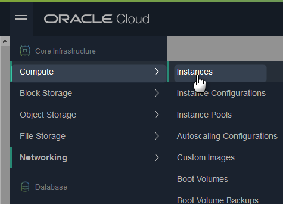

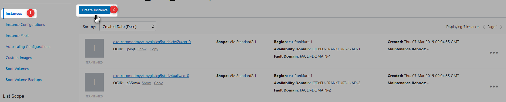

### Step 2 : Provide Name

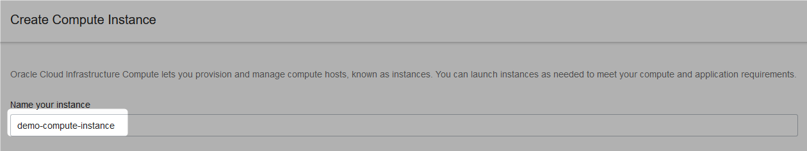

### Step 3 : Select Availability Doamin

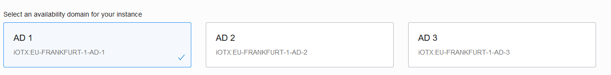

### Step 4 : Select Image Source

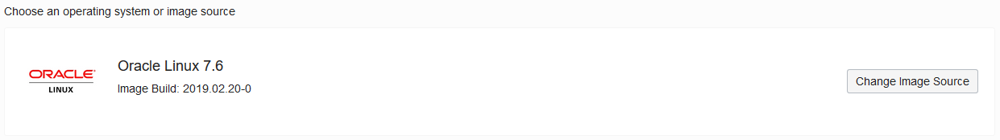

Available images

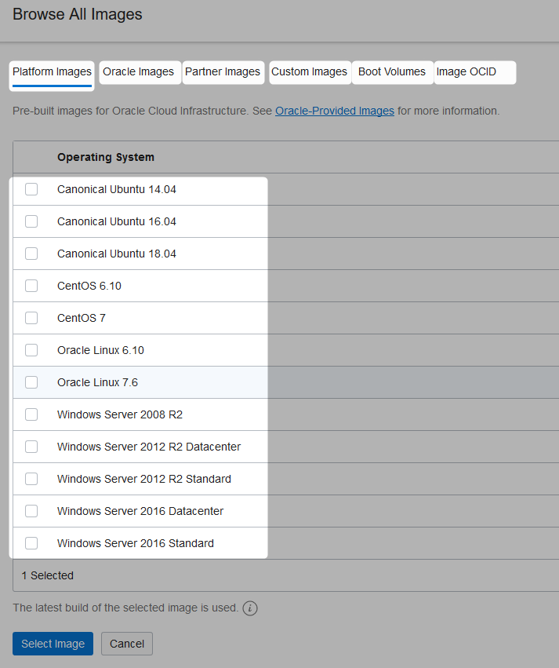

### Step 5 : Select Instance Type

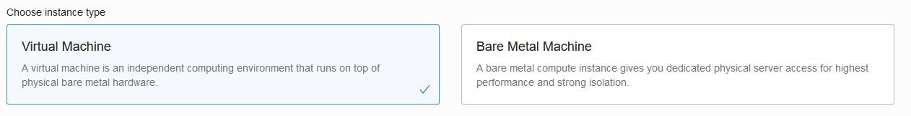


### Step 6 : Select Instance Shape

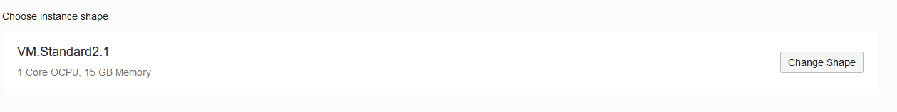

Available Shapes

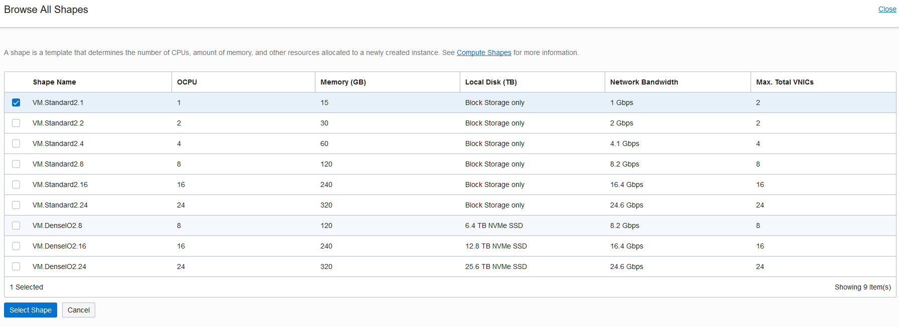

### Step 7 : Add SSH Key

Copy the ssh public key

```Powershell
nadeem@NADEEM-LAP MINGW64 ~
$ clip < ~/.ssh/id_rsa.pub
 
nadeem@NADEEM-LAP MINGW64 ~
$
```
Paste it

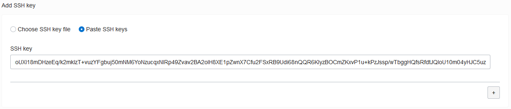

### Step 8: Configure Networking

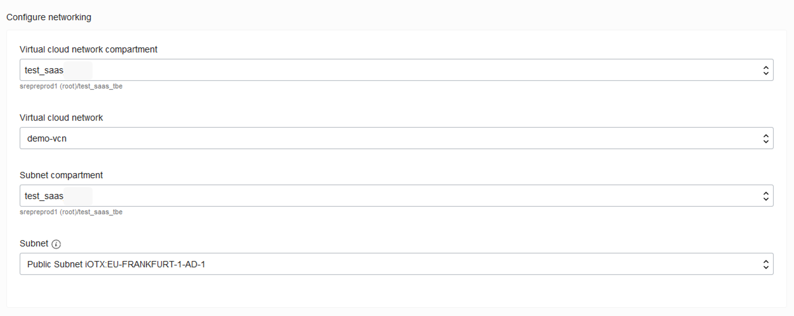

### Step 9 : Configure Advance Options

provide cloud init script

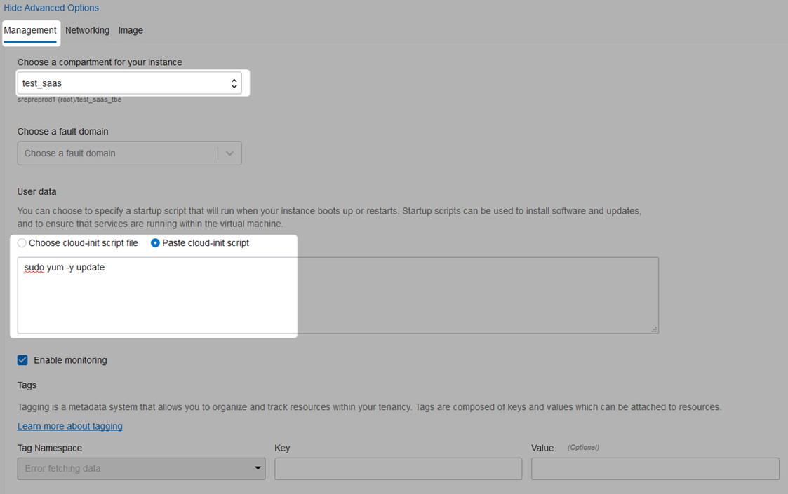

### Step 10 : Wait For Instance to be provisioned

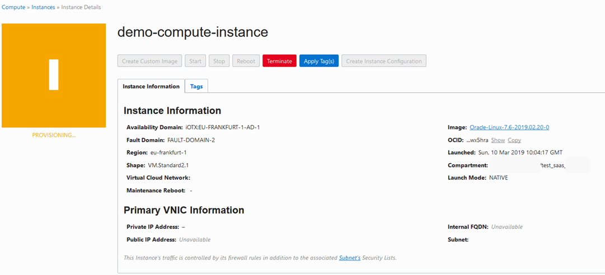

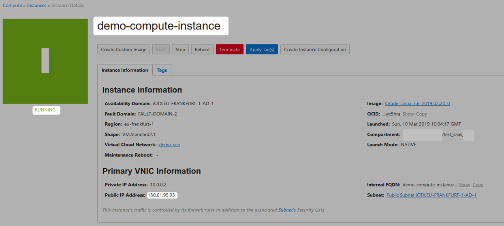

## Connecting To Provisioned Instance 


### Step 1 : 

### Step 2 : 

### Step 3 : 

## Termination 


### Step 1 : 

### Step 2 : 

### Step 3 : 

### Step 4 : 

### Step 5 : 

## References
*
*
