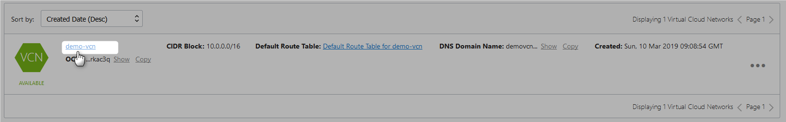
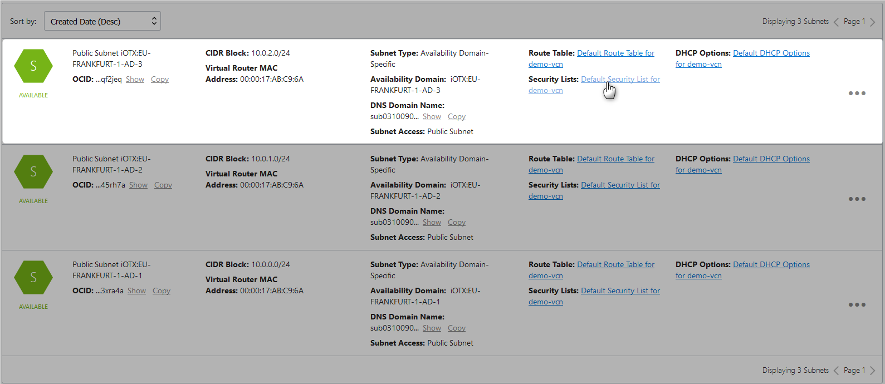
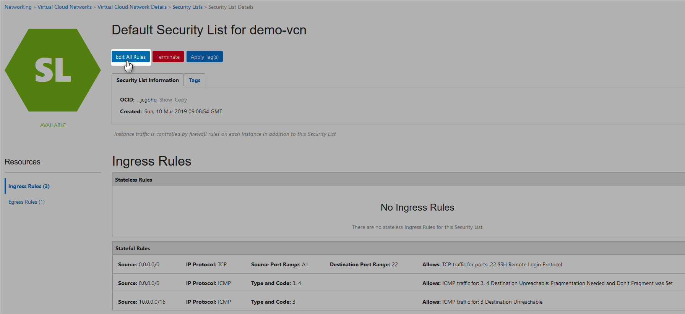
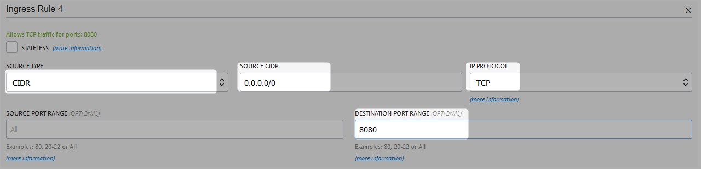
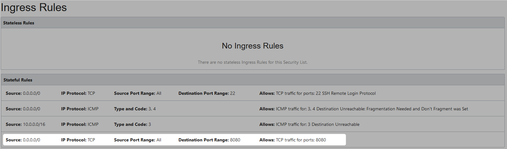
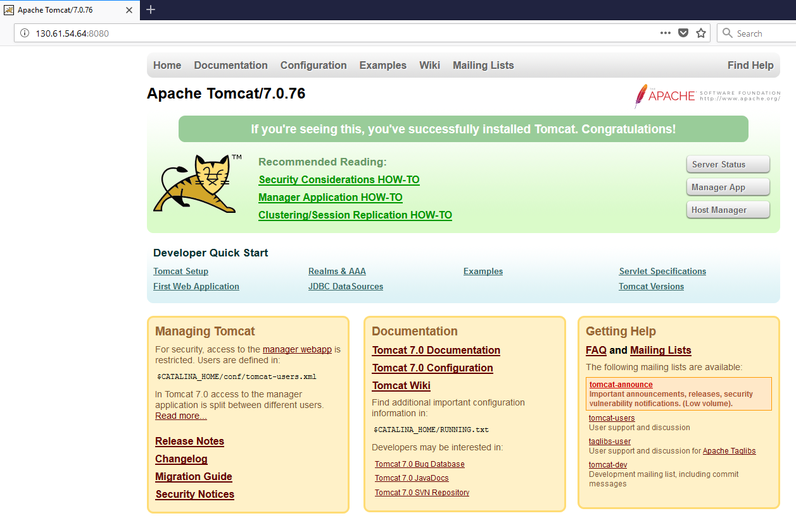

# Tomcat Up And Running On OCI Instance

## Prerequisites

### SSH

[Generating a Secure Shell (SSH) Public/Private Key Pair](GeneratingSshKey.md)

### VNC

[Creating VCN](CreatingVCN.md)

### Compute Instance

[Create Compute Instance](CreatingComputeInstance.md)


## Installation

```Powershell
[opc@tomcat-instance ~]$ sudo yum install -y tomcat tomcat-webapps tomcat-admin-webapps
```

```Powershell
[opc@tomcat-instance ~]$  sudo systemctl enable tomcat
Created symlink from /etc/systemd/system/multi-user.target.wants/tomcat.service to /usr/lib/systemd/system/tomcat.service.

```

```Powershell
[opc@tomcat-instance ~]$  sudo systemctl start tomcat
```

```Powershell
[opc@tomcat-instance ~]$ sudo systemctl status tomcat
● tomcat.service - Apache Tomcat Web Application Container
   Loaded: loaded (/usr/lib/systemd/system/tomcat.service; enabled; vendor preset: disabled)
   Active: active (running) since Sun 2019-03-10 11:54:53 GMT; 16s ago
 Main PID: 15663 (java)
   CGroup: /system.slice/tomcat.service
           └─15663 /usr/lib/jvm/jre/bin/java -classpath /usr/share/tomcat/bin/bootstrap.jar:/usr/share/tomcat/bin/tomcat-juli.jar:/usr/share/java/commons-daemon.jar -Dcatalina.base=/usr/share...

Mar 10 11:54:56 tomcat-instance server[15663]: Mar 10, 2019 11:54:56 AM org.apache.catalina.startup.TldConfig execute
Mar 10 11:54:56 tomcat-instance server[15663]: INFO: At least one JAR was scanned for TLDs yet contained no TLDs. Enable debug logging for this logger for a complete list of JARs ...lation time.
Mar 10 11:54:56 tomcat-instance server[15663]: Mar 10, 2019 11:54:56 AM org.apache.catalina.startup.HostConfig deployDirectory
Mar 10 11:54:56 tomcat-instance server[15663]: INFO: Deployment of web application directory /var/lib/tomcat/webapps/sample has finished in 263 ms
Mar 10 11:54:56 tomcat-instance server[15663]: Mar 10, 2019 11:54:56 AM org.apache.coyote.AbstractProtocol start
Mar 10 11:54:56 tomcat-instance server[15663]: INFO: Starting ProtocolHandler ["http-bio-8080"]
Mar 10 11:54:56 tomcat-instance server[15663]: Mar 10, 2019 11:54:56 AM org.apache.coyote.AbstractProtocol start
Mar 10 11:54:56 tomcat-instance server[15663]: INFO: Starting ProtocolHandler ["ajp-bio-8009"]
Mar 10 11:54:56 tomcat-instance server[15663]: Mar 10, 2019 11:54:56 AM org.apache.catalina.startup.Catalina start
Mar 10 11:54:56 tomcat-instance server[15663]: INFO: Server startup in 2177 ms
Hint: Some lines were ellipsized, use -l to show in full.
[opc@tomcat-instance ~]$

```

punch a hole in the local firewall running on the VM to allow traffic through to port 8080

```Powershell
[opc@tomcat-instance ~]$ sudo firewall-cmd --permanent --zone=public --add-port=8080/tcp
success

```
Reload the firewall

```Powershell
[opc@tomcat-instance ~]$ sudo firewall-cmd --reload
success
[opc@tomcat-instance ~]$
```
## Amend Security List














## Testing

goto compute-instance public ip address : tomcat port



## Clean Up 

### Compute Instance

Refer [this](CreatingComputeInstance.md#termincation) for more details

### VCN

Refer [this](CreatingVCN.md#terminating-vcn) for more details

# References
* 

