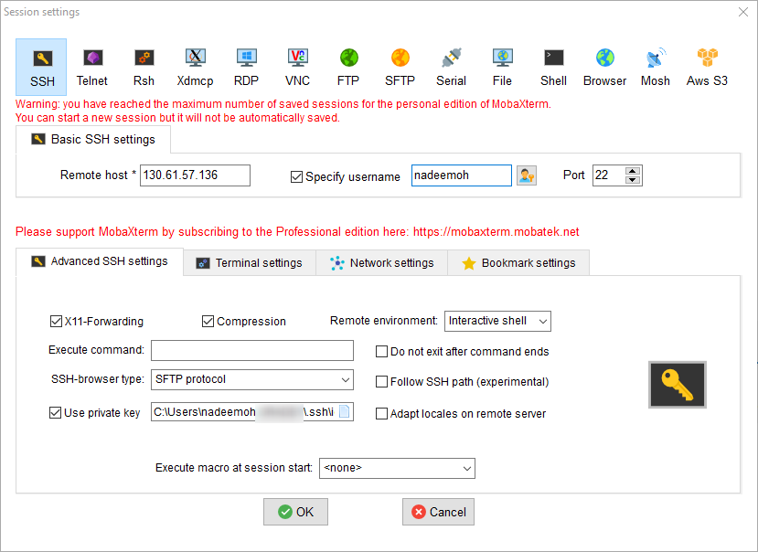
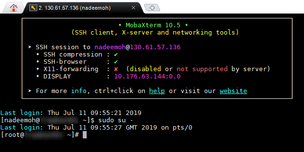

[Home](../README.md)

# Adding Another SSH enabled User to OCI Host


## Prerequisites 

Make sure to generate the [SSH key Pair](GeneratingSshKey.md), ignore if already done


## Adding Another SSH enabled User

First login as initial user (opc) to the instance

```Powershell
login as: opc
Authenticating with public key "" from agent
Last login: Thu Jul 11 09:50:56 2019 from xyz.com
```
Become the root user

```Powershell
[opc@bastion ~]$ sudo su -
Last login: Thu Jul 11 08:49:01 GMT 2019 on pts/0
```

We are adding new user **nadeemoh**

```Powershell
[root@frqabas001 ~]# useradd -m -d /home/nadeemoh -s /bin/bash nadeemoh
```

```Powershell
[root@frqabas001 ~]# mkdir -p /home/nadeemoh/.ssh
[root@frqabas001 ~]# touch /home/nadeemoh/.ssh/authorized_keys
```

```Powershell
[root@frqabas001 ~]# chown -R nadeemoh:nadeemoh /home/nadeemoh/
[root@frqabas001 ~]# chmod 700 /home/nadeemoh/.ssh
[root@frqabas001 ~]# chmod 600 /home/nadeemoh/.ssh/authorized_keys

```

copy your public key

```Powershell
nadeemoh@NADEEMOH-LAP MINGW64 ~
$ cd .ssh

nadeemoh@NADEEMOH-LAP MINGW64 ~/.ssh
$ ls
backup/  id_rsa  id_rsa.pub  known_hosts

nadeemoh@NADEEMOH-LAP MINGW64 ~/.ssh
$ clip < id_rsa.pub

nadeemoh@NADEEMOH-LAP MINGW64 ~/.ssh
$

```

And add to the following file

```Powershell
[root@frqabas001 ~]# vim /home/nadeemoh/.ssh/authorized_keys
```


Testing

```Powershell
[opc@frqabas001 ~]$ sudo su - nadeemoh
[nadeemoh@frqabas001 ~]$ pwd
/home/nadeemoh
[nadeemoh@frqabas001 ~]$
```

Enable sudo privileges for new user

In /etc/sudoers, look for:

```Powershell
# %wheel        ALL=(ALL)       NOPASSWD: ALL
```

Add the following line immediately after above line

```Powershell
%nadeemoh  ALL=(ALL)       NOPASSWD: ALL
```
Verify
```Powershell
[root@frqabas001 ~]# sudo su - nadeemoh
Last login: Thu Jul 11 09:51:11 GMT 2019 on pts/0
[nadeemoh@frqabas001 ~]$ sudo su -
Last login: Thu Jul 11 09:52:32 GMT 2019 on pts/0
[root@frqabas001 ~]#
```

Now login to instance using new user and private key






All Commands
```Powershell
useradd -m -d /home/username -s /bin/bash username
mkdir -p /home/username/.ssh
touch /home/username/.ssh/authorized_keys
chown -R username:username /home/username/
chmod 700 /home/username/.ssh
chmod 600 /home/username/.ssh/authorized_keys
vim /home/username/.ssh/authorized_keys
```

