[](../README.md)

# Attaching a Block Volume to Oracle Cloud Infrastructure (OCI) Compute Instance

Lets provision the following infrastructure

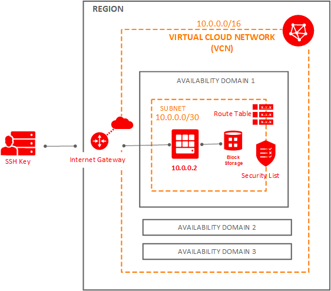

## Prerequisites

### SSH

Make sure to generate the [SSH key Pair](GeneratingSshKey.md), ignore if already done

### VNC

Make sure to [create VCN](CreatingVCN.md), ignore if already done.

### Compute Instance

Make sure to [Create Compute Instance](CreatingComputeInstance.md), ignore if already done.


## Creating Block Volume

### Step 1: Click Create

Navigate to Block volumes

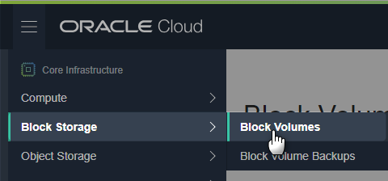

Click **Create Block Volume**

### Step 2: Provide Details

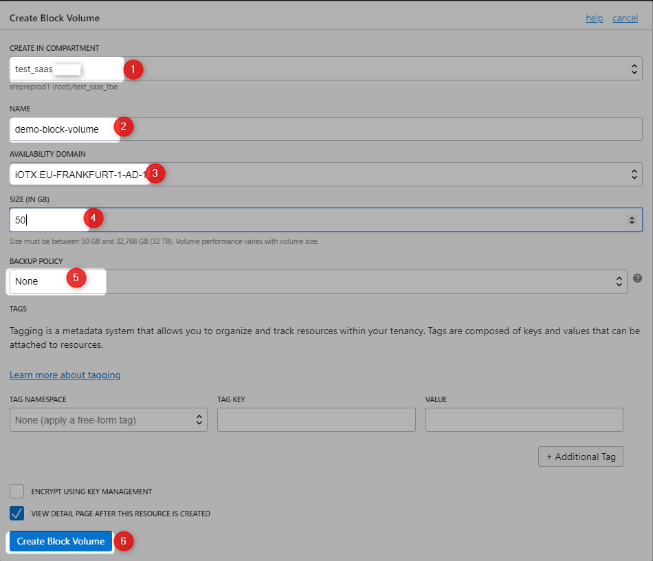

### Step 3: Wait for Volume to be provisioned

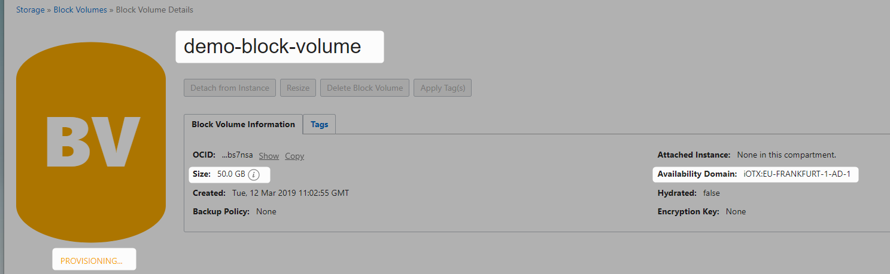

Successfully provisioned

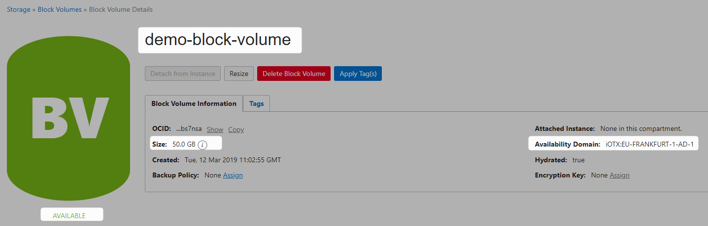

## Attaching Block Volume


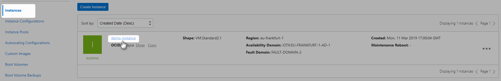

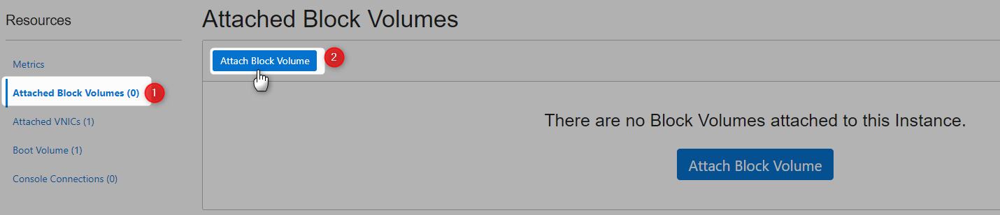

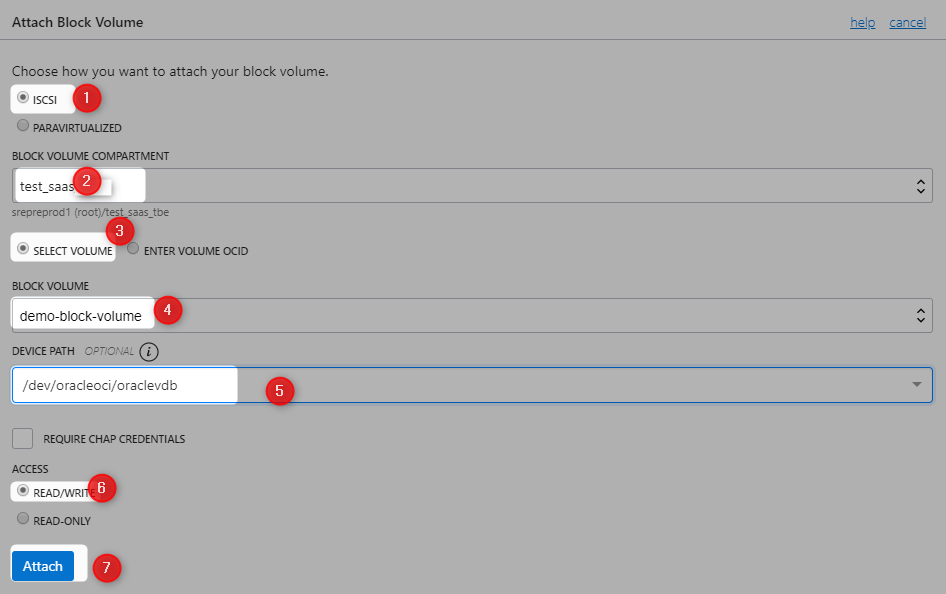

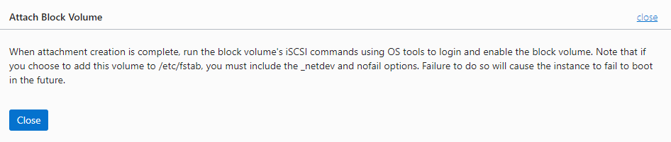

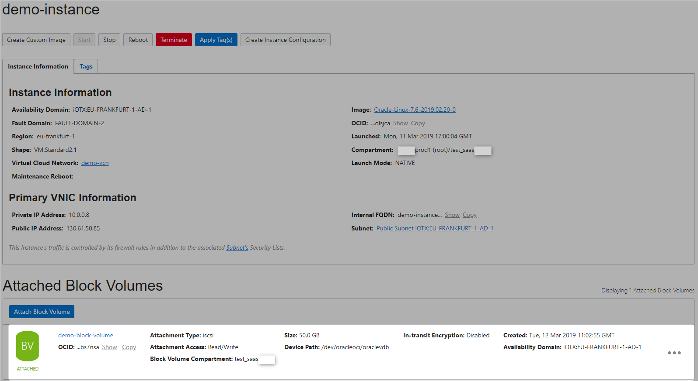


ssh into the demo instance

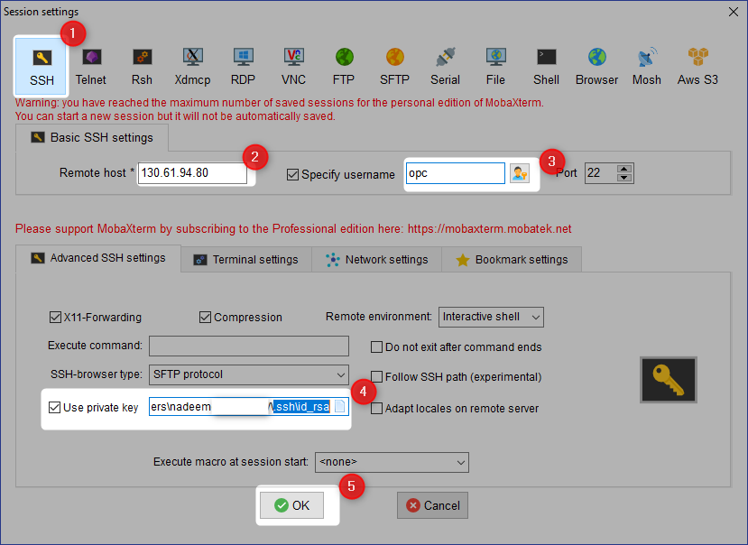

```Powershell
[opc@demo-instance ~]$ lsblk
NAME   MAJ:MIN RM  SIZE RO TYPE MOUNTPOINT
sda      8:0    0 46.6G  0 disk
├─sda2   8:2    0    8G  0 part [SWAP]
├─sda3   8:3    0 38.4G  0 part /
└─sda1   8:1    0  200M  0 part /boot/efi
[opc@demo-instance ~]$

```

```Powershell
[opc@demo-instance ~]$ sudo fdisk -l
WARNING: fdisk GPT support is currently new, and therefore in an experimental phase. Use at your own discretion.

Disk /dev/sda: 50.0 GB, 50010783744 bytes, 97677312 sectors
Units = sectors of 1 * 512 = 512 bytes
Sector size (logical/physical): 512 bytes / 4096 bytes
I/O size (minimum/optimal): 4096 bytes / 1048576 bytes
Disk label type: gpt
Disk identifier: 24B3008A-713C-4A61-9EF0-709312E028D4


#         Start          End    Size  Type            Name
 1         2048       411647    200M  EFI System      EFI System Partition
 2       411648     17188863      8G  Linux swap
 3     17188864     97675263   38.4G  Microsoft basic
[opc@demo-instance ~]$
```

```Powershell
[opc@demo-instance ~]$ ls -l /dev/oracleoci/oraclevd*
lrwxrwxrwx. 1 root root 6 Mar 12 14:17 /dev/oracleoci/oraclevda -> ../sda
lrwxrwxrwx. 1 root root 7 Mar 12 14:17 /dev/oracleoci/oraclevda1 -> ../sda1
lrwxrwxrwx. 1 root root 7 Mar 12 14:17 /dev/oracleoci/oraclevda2 -> ../sda2
lrwxrwxrwx. 1 root root 7 Mar 12 14:17 /dev/oracleoci/oraclevda3 -> ../sda3

```

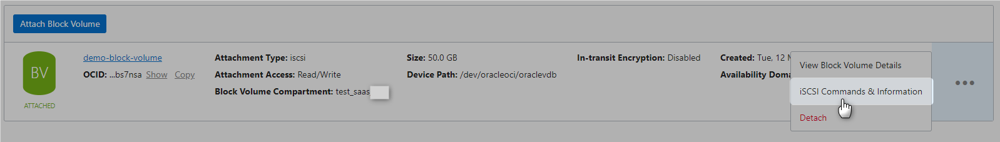

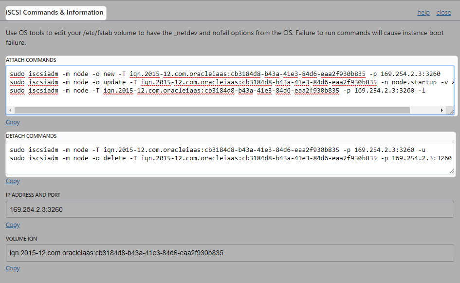

```Powershell
[opc@demo-instance ~]$ sudo iscsiadm -m node -o new -T iqn.2015-12.com.oracleiaas:cb3184d8-b43a-41e3-84d6-eaa2f930b835 -p 169.254.2.2:3260
New iSCSI node [tcp:[hw=,ip=,net_if=,iscsi_if=default] 169.254.2.2,3260,-1 iqn.2015-12.com.oracleiaas:cb3184d8-b43a-41e3-84d6-eaa2f930b835] added
[opc@demo-instance ~]$ sudo iscsiadm -m node -o update -T iqn.2015-12.com.oracleiaas:cb3184d8-b43a-41e3-84d6-eaa2f930b835 -n node.startup -v automatic
[opc@demo-instance ~]$ sudo iscsiadm -m node -T iqn.2015-12.com.oracleiaas:cb3184d8-b43a-41e3-84d6-eaa2f930b835 -p 169.254.2.2:3260 -l
Logging in to [iface: default, target: iqn.2015-12.com.oracleiaas:cb3184d8-b43a-41e3-84d6-eaa2f930b835, portal: 169.254.2.2,3260] (multiple)
Login to [iface: default, target: iqn.2015-12.com.oracleiaas:cb3184d8-b43a-41e3-84d6-eaa2f930b835, portal: 169.254.2.2,3260] successful.
[opc@demo-instance ~]$

```

```Powershell
[opc@demo-instance ~]$ lsblk
NAME   MAJ:MIN RM  SIZE RO TYPE MOUNTPOINT
sdb      8:16   0   50G  0 disk
sda      8:0    0 46.6G  0 disk
├─sda2   8:2    0    8G  0 part [SWAP]
├─sda3   8:3    0 38.4G  0 part /
└─sda1   8:1    0  200M  0 part /boot/efi
[opc@demo-instance ~]$

```

```Powershell
[opc@demo-instance ~]$ ls -l /dev/oracleoci/oraclevd*
lrwxrwxrwx. 1 root root 6 Mar 12 14:17 /dev/oracleoci/oraclevda -> ../sda
lrwxrwxrwx. 1 root root 7 Mar 12 14:17 /dev/oracleoci/oraclevda1 -> ../sda1
lrwxrwxrwx. 1 root root 7 Mar 12 14:17 /dev/oracleoci/oraclevda2 -> ../sda2
lrwxrwxrwx. 1 root root 7 Mar 12 14:17 /dev/oracleoci/oraclevda3 -> ../sda3
lrwxrwxrwx. 1 root root 6 Mar 12 14:26 /dev/oracleoci/oraclevdb -> ../sdb
[opc@demo-instance ~]$

```

```Powershell
[opc@demo-instance ~]$ sudo fdisk -l
WARNING: fdisk GPT support is currently new, and therefore in an experimental phase. Use at your own discretion.

Disk /dev/sda: 50.0 GB, 50010783744 bytes, 97677312 sectors
Units = sectors of 1 * 512 = 512 bytes
Sector size (logical/physical): 512 bytes / 4096 bytes
I/O size (minimum/optimal): 4096 bytes / 1048576 bytes
Disk label type: gpt
Disk identifier: 24B3008A-713C-4A61-9EF0-709312E028D4


#         Start          End    Size  Type            Name
 1         2048       411647    200M  EFI System      EFI System Partition
 2       411648     17188863      8G  Linux swap
 3     17188864     97675263   38.4G  Microsoft basic

Disk /dev/sdb: 53.7 GB, 53687091200 bytes, 104857600 sectors
Units = sectors of 1 * 512 = 512 bytes
Sector size (logical/physical): 512 bytes / 4096 bytes
I/O size (minimum/optimal): 4096 bytes / 1048576 bytes

[opc@demo-instance ~]$
[opc@demo-instance ~]$ sudo mkfs -t ext4 /dev/oracleoci/oraclevdb
mke2fs 1.42.9 (28-Dec-2013)
/dev/oracleoci/oraclevdb is entire device, not just one partition!
Proceed anyway? (y,n) y
Filesystem label=
OS type: Linux
Block size=4096 (log=2)
Fragment size=4096 (log=2)
Stride=0 blocks, Stripe width=256 blocks
3276800 inodes, 13107200 blocks
655360 blocks (5.00%) reserved for the super user
First data block=0
Maximum filesystem blocks=2162163712
400 block groups
32768 blocks per group, 32768 fragments per group
8192 inodes per group
Superblock backups stored on blocks:
        32768, 98304, 163840, 229376, 294912, 819200, 884736, 1605632, 2654208,
        4096000, 7962624, 11239424

Allocating group tables: done
Writing inode tables: done
Creating journal (32768 blocks): done
Writing superblocks and filesystem accounting information: done

[opc@demo-instance ~]$
```


```Powershell
[opc@demo-instance ~]$ sudo mkdir /mnt/disk1
[opc@demo-instance ~]$ sudo mount /dev/oracleoci/oraclevdb /mnt/disk1

```

```Powershell
[opc@demo-instance ~]$ df -h
Filesystem      Size  Used Avail Use% Mounted on
devtmpfs        7.2G     0  7.2G   0% /dev
tmpfs           7.3G     0  7.3G   0% /dev/shm
tmpfs           7.3G  8.6M  7.3G   1% /run
tmpfs           7.3G     0  7.3G   0% /sys/fs/cgroup
/dev/sda3        39G  1.8G   37G   5% /
/dev/sda1       200M  9.7M  191M   5% /boot/efi
tmpfs           1.5G     0  1.5G   0% /run/user/1000
/dev/sdb         50G   53M   47G   1% /mnt/disk1
```

```Powershell
[opc@demo-instance dev]$ cd /mnt/disk1/
```


```Powershell
[opc@demo-instance disk1]$ ls
lost+found
[opc@demo-instance disk1]$  vi demo.txt
[opc@demo-instance disk1]$ sudo  vi demo.txt
[opc@demo-instance disk1]$ cat demo.txt
This is block volume storage
[opc@demo-instance disk1]$

```


# Clean Up 

### Detach Volume

Click on **Detach**

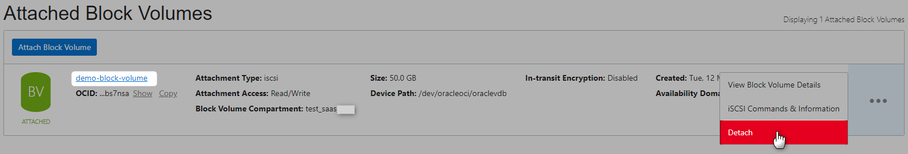

Execute the commands 

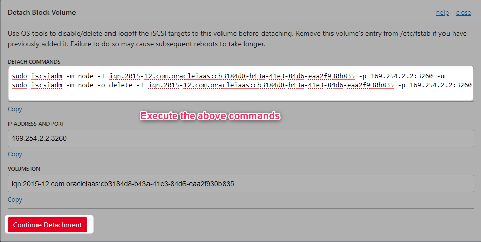

```Powershell
[opc@demo-instance ~]$ sudo iscsiadm -m node -T iqn.2015-12.com.oracleiaas:cb3184d8-b43a-41e3-84d6-eaa2f930b835 -p 169.254.2.2:3260 -u

[opc@demo-instance ~]$ sudo iscsiadm -m node -T iqn.2015-12.com.oracleiaas:cb3184d8-b43a-41e3-84d6-eaa2f930b835 -p 169.254.2.2:3260 -u

```

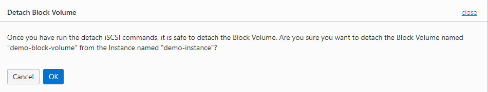

Wait for Block volume to be detached.

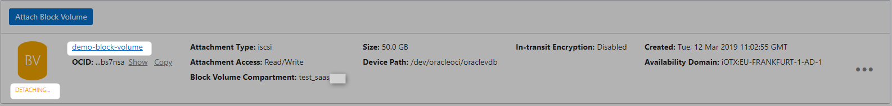


### Compute Instance

Refer [this](CreatingComputeInstance.md#termination) for more details on how to terminate Compute instance.

### VCN

Refer [this](CreatingVCN.md#terminating-vcn) for more details on how to terminate VCN.


# References
* [Creating A Block Volume](https://docs.cloud.oracle.com/iaas/Content/Block/Tasks/creatingavolume.htm)
* [OCI Block Volume FAQ](https://cloud.oracle.com/storage/block-volume/faq)