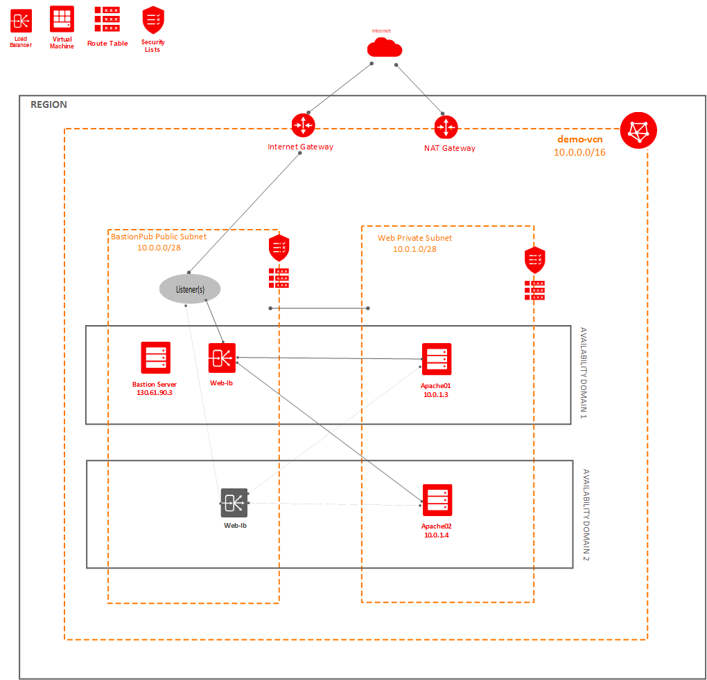
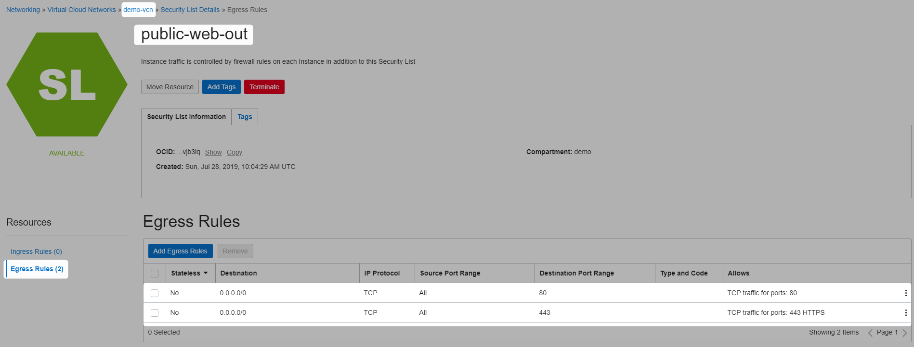
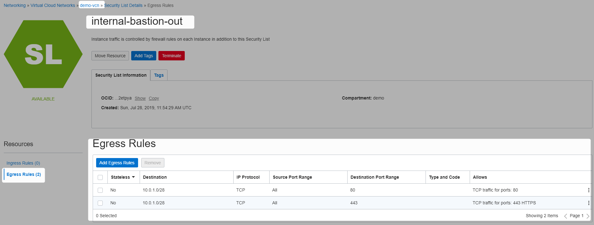
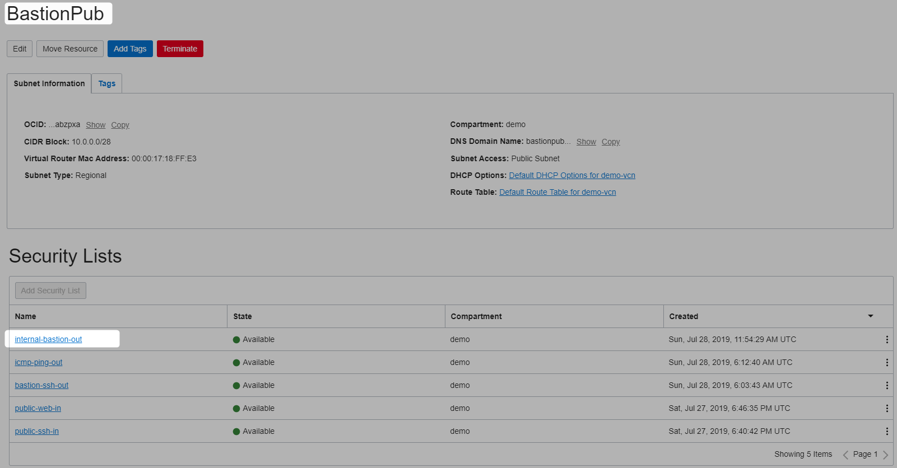
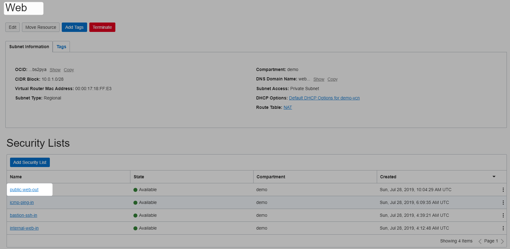
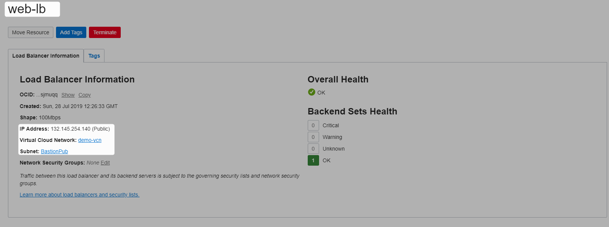
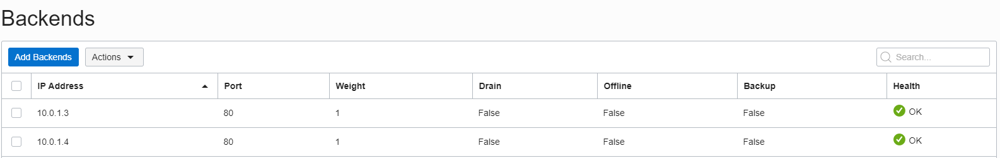
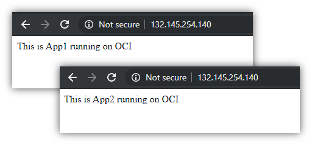
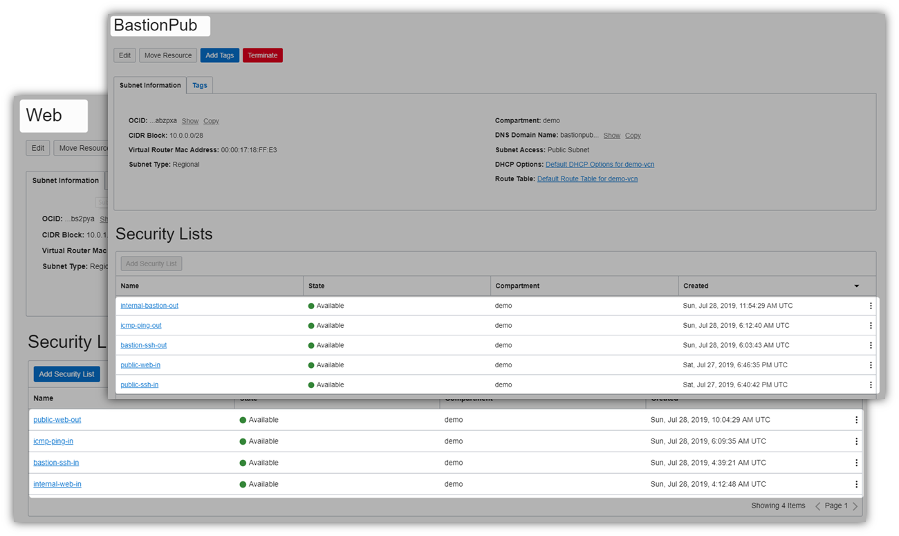

[Home](../README.md)

# Bastion With Load Balanced Apache Instances on Oracle Cloud Infrastructure (OCI)

# Prerequisites

[Public Private Subnet Communication](PublicPrivateSubnetCommOCI.md)

# Design


# Implementation

## Add SecurityLists












## Install Apache on Both Instances
### apache01


```Powershell
[opc@bastion01-4772 ~]$ ssh opc@10.0.1.3
Last login: Sun Jul 28 09:55:17 2019 from bastion01-4772.bastionpub.demovcn.oraclevcn.com
[opc@apache01 ~]$ sudo yum install httpd -y
```

```Powershell
[opc@apache01 ~]$ sudo systemctl enable httpd
Created symlink from /etc/systemd/system/multi-user.target.wants/httpd.service to /usr/lib/systemd/system/httpd.service.
[opc@apache01 ~]$ sudo apachectl configtest
Syntax OK
```

```Powershell
[opc@apache01 ~]$ sudo firewall-cmd --permanent --zone=public --add-service=http
success
[opc@apache01 ~]$ sudo firewall-cmd --reload
success
```

```Powershell
[opc@apache01 ~]$ sudo bash -c 'echo This is App1 running on OCI >> /var/www/html/index.html'
[opc@apache01 ~]$ sudo apachectl start
[opc@apache01 ~]$ curl localhost
This is App1 running on OCI
[opc@apache01 ~]$
```

```Powershell
[opc@bastion01-4772 ~]$ curl 10.0.1.3
This is App1 running on OCI
[opc@bastion01-4772 ~]$

```
### apache02

```Powershell
[opc@bastion01-4772 ~]$ ssh opc@10.0.1.4
Last login: Sun Jul 28 06:15:22 2019 from bastion01-4772.bastionpub.demovcn.oraclevcn.com
[opc@apache02 ~]$ sudo yum install httpd -y
```


```Powershell
[opc@apache02 ~]$ sudo systemctl enable httpd
Created symlink from /etc/systemd/system/multi-user.target.wants/httpd.service to /usr/lib/systemd/system/httpd.service.
[opc@apache02 ~]$ sudo apachectl configtest
Syntax OK
```

```Powershell
[opc@apache02 ~]$ sudo firewall-cmd --permanent --zone=public --add-service=http
success
[opc@apache02 ~]$ sudo firewall-cmd --reload
success
```

```Powershell
[opc@apache02 ~]$ sudo bash -c 'echo This is App2 running on OCI >> /var/www/html/index.html'
```

```Powershell
[opc@apache02 ~]$ sudo apachectl start
```


```Powershell
[opc@apache02 ~]$ curl localhost
This is App2 running on OCI
[opc@apache02 ~]$
```

```Powershell
[opc@bastion01-4772 ~]$ curl 10.0.1.4
This is App2 running on OCI
[opc@bastion01-4772 ~]$
```


## Create Loadbalancer








## Final Subnets




```Powershell

```


```Powershell

```


# References

* [Installing Apache](https://docs.oracle.com/cd/E52668_01/E54669/html/ol7-s1-websvc.html)
