[Home](../README.md)

# Clustered Tomcat With Apache on Oracle Cloud Infrastructure (OCI)

# Prerequisites

[Bastion With Load balanced Apache instances](http://wiki-tbe.us.oracle.com/display/DEV/Bastion+With+Loadbalanced+Apache+Instances)

# Design

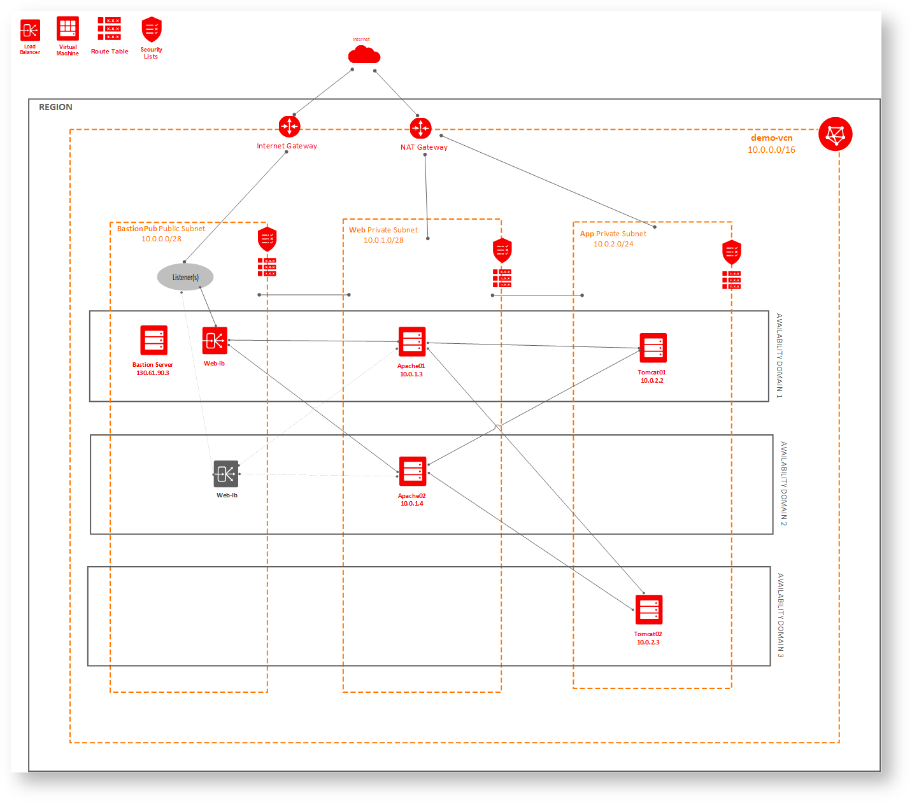

# Implementation


## Add Security List

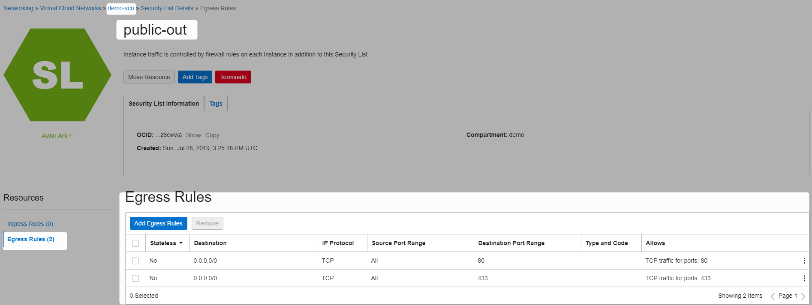

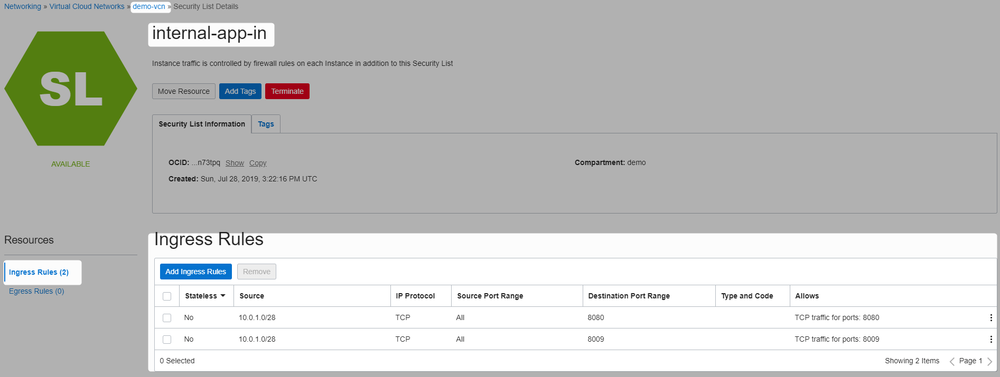

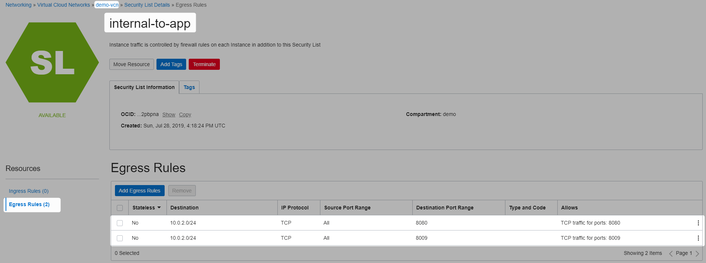


## Add Private Subnet for Tomcat

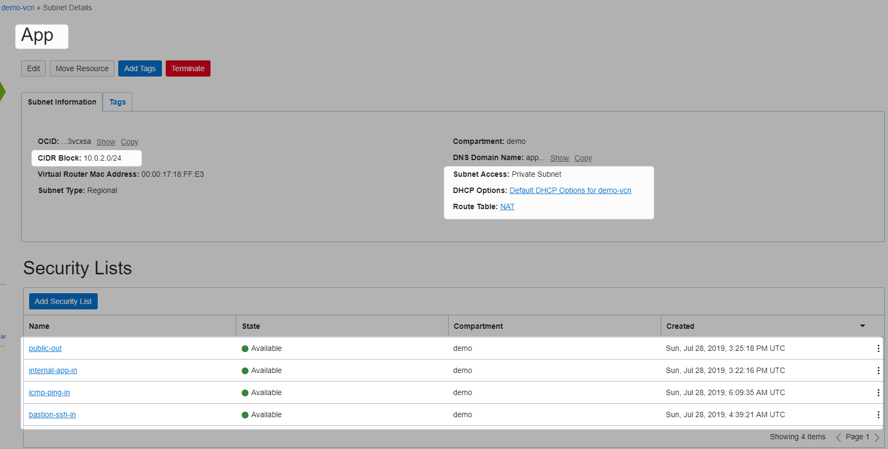

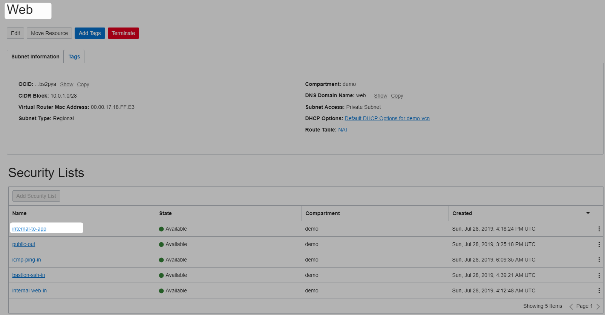

## Tomcat App Instances
We have to use bastion public key


```Powershell
[opc@bastion01-4772 .ssh]$ ls
authorized_keys  id_rsa  id_rsa.pub
[opc@bastion01-4772 .ssh]$ cat id_rsa.pub
ssh-rsa AAAAB3NzaC1yc2EAAAADAQABAAABAQDFieY/QY/ujUH/jGN9SqkyYNFn43x1C99/XMM6SUxnYnKcWwXqhWXmUhZv9Vdlr26azpimeJ3Px1+RnA1EqwrmTTEJZfXF/bnVlfcHzvoMxlCeGGq4VFQug1IUkwbKX1koKwTyUPf4kmZR4B0nqufN2pKJvTrO6/f7Tyzbzz6T4T6gj05WmSTl73nag07yszkMHwNDhaMDvxGZ+eobS+PLAUSGbrzJrWswGtjdZ2EqshKvpyHFGbgdoP/6r2fZveK5PUOJziuMDhRRuBXfSRKSp/F4AQq2clhlnodWDrm5r8klDlIYdCQOV3YNt0fU58JDEVsFQj70foONv6WF0zjF opc@bastion01-4772
[opc@bastion01-4772 .ssh]$
```

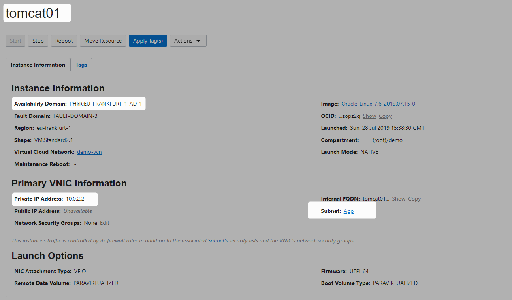


```Powershell
[opc@bastion01-4772 ~]$ ping 10.0.2.2
PING 10.0.2.2 (10.0.2.2) 56(84) bytes of data.
64 bytes from 10.0.2.2: icmp_seq=1 ttl=64 time=0.222 ms
64 bytes from 10.0.2.2: icmp_seq=2 ttl=64 time=0.165 ms
64 bytes from 10.0.2.2: icmp_seq=3 ttl=64 time=0.171 ms
```

```Powershell
[opc@bastion01-4772 ~]$ ssh opc@10.0.2.2
The authenticity of host '10.0.2.2 (10.0.2.2)' can't be established.
ECDSA key fingerprint is SHA256:tYbBAVoxCMc+Z4koE9vd7iDX1idXuHrbTFQMEnj+1sk.
ECDSA key fingerprint is MD5:4d:b8:64:a7:e4:96:09:a3:31:3d:e2:38:ea:ee:24:1e.
Are you sure you want to continue connecting (yes/no)? yes
Warning: Permanently added '10.0.2.2' (ECDSA) to the list of known hosts.
[opc@tomcat01 ~]$ exit
logout
Connection to 10.0.2.2 closed.
```
Lets connect to Tomcat instance from bastion, and install tomcat

```Powershell
[opc@bastion01-4772 ~]$ ssh opc@10.0.2.2
Last login: Sun Jul 28 15:51:19 2019 from bastion01-4772.bastionpub.demovcn.oraclevcn.com
[opc@tomcat01 ~]$
```

```Powershell
[opc@tomcat01 ~]$ sudo yum install tomcat-webapps tomcat-docs-webapps -y
```


```Powershell
[opc@tomcat01 ~]$ sudo systemctl enable tomcat
Created symlink from /etc/systemd/system/multi-user.target.wants/tomcat.service to /usr/lib/systemd/system/tomcat.service.
```

```Powershell
[opc@tomcat01 ~]$ sudo firewall-cmd --permanent --add-port=8009/tcp
success
[opc@tomcat01 ~]$ sudo firewall-cmd --reload
success
[opc@tomcat01 ~]$ sudo  firewall-cmd --list-ports
8080/tcp 8009/tcp
[opc@tomcat01 ~]$ sudo firewall-cmd --list-services
ssh dhcpv6-client
[opc@tomcat01 ~]$ sudo firewall-cmd --get-active-zones
public
  interfaces: ens3
[opc@tomcat01 ~]$ sudo firewall-cmd --list-all
public (active)
  target: default
  icmp-block-inversion: no
  interfaces: ens3
  sources:
  services: ssh dhcpv6-client
  ports: 8080/tcp 8009/tcp
  protocols:
  masquerade: no
  forward-ports:
  source-ports:
  icmp-blocks:
  rich rules:
 
[opc@tomcat01 ~]$
```

```Powershell
[opc@tomcat01 ~]$ sudo systemctl start tomcat
```


```Powershell
[opc@tomcat01 ~]$ sudo systemctl status tomcat
● tomcat.service - Apache Tomcat Web Application Container
   Loaded: loaded (/usr/lib/systemd/system/tomcat.service; enabled; vendor preset: disabled)
   Active: active (running) since Sun 2019-07-28 15:59:45 GMT; 20s ago
 Main PID: 13656 (java)
   CGroup: /system.slice/tomcat.service
           └─13656 /usr/lib/jvm/jre/bin/java -classpath /usr/share/tomcat/bin/bootstrap.jar:/usr/share/tomcat/bin/tomcat-juli.jar:/usr/share/java/commons-daemon.jar -Dcatalina.base=/usr/share/tomcat ...
 
Jul 28 15:59:48 tomcat01 server[13656]: Jul 28, 2019 3:59:48 PM org.apache.catalina.startup.TldConfig execute
Jul 28 15:59:48 tomcat01 server[13656]: INFO: At least one JAR was scanned for TLDs yet contained no TLDs. Enable debug logging for this logger for a complete list of JARs that were sca...pilation time.
Jul 28 15:59:48 tomcat01 server[13656]: Jul 28, 2019 3:59:48 PM org.apache.catalina.startup.HostConfig deployDirectory
Jul 28 15:59:48 tomcat01 server[13656]: INFO: Deployment of web application directory /var/lib/tomcat/webapps/sample has finished in 312 ms
Jul 28 15:59:48 tomcat01 server[13656]: Jul 28, 2019 3:59:48 PM org.apache.coyote.AbstractProtocol start
Jul 28 15:59:48 tomcat01 server[13656]: INFO: Starting ProtocolHandler ["http-bio-8080"]
Jul 28 15:59:48 tomcat01 server[13656]: Jul 28, 2019 3:59:48 PM org.apache.coyote.AbstractProtocol start
Jul 28 15:59:48 tomcat01 server[13656]: INFO: Starting ProtocolHandler ["ajp-bio-8009"]
Jul 28 15:59:48 tomcat01 server[13656]: Jul 28, 2019 3:59:48 PM org.apache.catalina.startup.Catalina start
Jul 28 15:59:48 tomcat01 server[13656]: INFO: Server startup in 1735 ms
Hint: Some lines were ellipsized, use -l to show in full.
[opc@tomcat01 ~]$
```

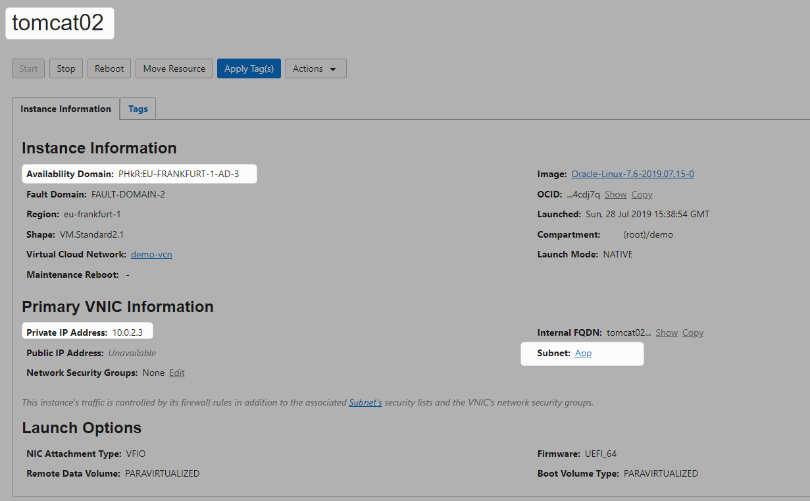


```Powershell
[opc@bastion01-4772 ~]$ ping 10.0.2.3
PING 10.0.2.3 (10.0.2.3) 56(84) bytes of data.
64 bytes from 10.0.2.3: icmp_seq=1 ttl=64 time=0.395 ms
64 bytes from 10.0.2.3: icmp_seq=2 ttl=64 time=0.361 ms
64 bytes from 10.0.2.3: icmp_seq=3 ttl=64 time=0.362 ms
```

```Powershell
[opc@bastion01-4772 ~]$ ssh opc@10.0.2.3
The authenticity of host '10.0.2.3 (10.0.2.3)' can't be established.
ECDSA key fingerprint is SHA256:tJ0ZSJFDr3Y+5HDZaf/HMBHaj0Uq3EJgKQhqiOwK4D4.
ECDSA key fingerprint is MD5:71:a1:ac:78:51:10:91:0e:e2:a8:7a:73:b0:7c:0b:35.
Are you sure you want to continue connecting (yes/no)? yes
Warning: Permanently added '10.0.2.3' (ECDSA) to the list of known hosts.
[opc@tomcat02 ~]$
```


```Powershell
[opc@bastion01-4772 ~]$ ssh opc@10.0.2.3
Last login: Sun Jul 28 15:52:03 2019 from bastion01-4772.bastionpub.demovcn.oraclevcn.com
[opc@tomcat02 ~]$ sudo yum install tomcat-webapps tomcat-docs-webapps -y
```

```Powershell
[opc@tomcat02 ~]$ sudo systemctl enable tomcat
Created symlink from /etc/systemd/system/multi-user.target.wants/tomcat.service to /usr/lib/systemd/system/tomcat.service.
```

```Powershell
[opc@tomcat02 ~]$ sudo firewall-cmd --permanent --add-port=8009/tcp
success
[opc@tomcat02 ~]$ sudo firewall-cmd --reload
success
[opc@tomcat02 ~]$ sudo  firewall-cmd --list-ports
8080/tcp 8009/tcp
[opc@tomcat01 ~]$ sudo firewall-cmd --list-services
ssh dhcpv6-client
[opc@tomcat02 ~]$ sudo firewall-cmd --get-active-zones
public
  interfaces: ens3
[opc@tomcat01 ~]$ sudo firewall-cmd --list-all
public (active)
  target: default
  icmp-block-inversion: no
  interfaces: ens3
  sources:
  services: ssh dhcpv6-client
  ports: 8080/tcp 8009/tcp
  protocols:
  masquerade: no
  forward-ports:
  source-ports:
  icmp-blocks:
  rich rules:
 
[opc@tomcat02 ~]$
```


```Powershell
[opc@tomcat02 ~]$ sudo systemctl start tomcat
```

```Powershell
[opc@tomcat02 ~]$ sudo systemctl status tomcat
● tomcat.service - Apache Tomcat Web Application Container
   Loaded: loaded (/usr/lib/systemd/system/tomcat.service; enabled; vendor preset: disabled)
   Active: active (running) since Sun 2019-07-28 16:09:35 GMT; 10s ago
 Main PID: 13710 (java)
   CGroup: /system.slice/tomcat.service
           └─13710 /usr/lib/jvm/jre/bin/java -classpath /usr/share/tomcat/bin/bootstrap.jar:/usr/share/tomcat/bin/tomcat-juli.jar:/usr/share/java/commons-daemon.jar -Dcatalina.base=/usr/share/tomcat ...
 
Jul 28 16:09:38 tomcat02 server[13710]: Jul 28, 2019 4:09:38 PM org.apache.catalina.startup.TldConfig execute
Jul 28 16:09:38 tomcat02 server[13710]: INFO: At least one JAR was scanned for TLDs yet contained no TLDs. Enable debug logging for this logger for a complete list of JARs that were sca...pilation time.
Jul 28 16:09:38 tomcat02 server[13710]: Jul 28, 2019 4:09:38 PM org.apache.catalina.startup.HostConfig deployDirectory
Jul 28 16:09:38 tomcat02 server[13710]: INFO: Deployment of web application directory /var/lib/tomcat/webapps/sample has finished in 325 ms
Jul 28 16:09:38 tomcat02 server[13710]: Jul 28, 2019 4:09:38 PM org.apache.coyote.AbstractProtocol start
Jul 28 16:09:38 tomcat02 server[13710]: INFO: Starting ProtocolHandler ["http-bio-8080"]
Jul 28 16:09:38 tomcat02 server[13710]: Jul 28, 2019 4:09:38 PM org.apache.coyote.AbstractProtocol start
Jul 28 16:09:38 tomcat02 server[13710]: INFO: Starting ProtocolHandler ["ajp-bio-8009"]
Jul 28 16:09:38 tomcat02 server[13710]: Jul 28, 2019 4:09:38 PM org.apache.catalina.startup.Catalina start
Jul 28 16:09:38 tomcat02 server[13710]: INFO: Server startup in 1754 ms
Hint: Some lines were ellipsized, use -l to show in full.
[opc@tomcat02 ~]$
```

## Install mod_jk connector in both Apache instances


connector download link (https://tomcat.apache.org/download-connectors.cgi)

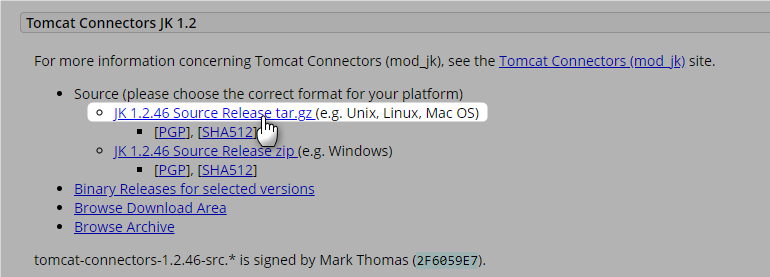

### apache01
httpd-devel ( source of apxs )

```Powershell
[opc@bastion01-4772 ~]$ ssh opc@10.0.1.3
Last login: Sun Jul 28 10:00:08 2019 from bastion01-4772.bastionpub.demovcn.oraclevcn.com
[opc@apache01 ~]$ sudo yum install httpd-devel gcc libtool -y
```


```Powershell
[opc@apache01 ~]$ wget http://mirrors.estointernet.in/apache/tomcat/tomcat-connectors/jk/tomcat-connectors-1.2.46-src.tar.gz
[opc@apache01 ~]$ tar -xvf tomcat-connectors-1.2.46-src.tar.gz
```

```Powershell
[opc@apache01 ~]$ cd tomcat-connectors-1.2.46-src/
[opc@apache01 tomcat-connectors-1.2.46-src]$ cd native/
[opc@apache01 native]$
```

```Powershell
[opc@apache01 native]$ ./configure --with-apxs=/usr/bin/apxs
```


```Powershell
[opc@apache01 native]$ make
```
Now use libtool to move the mod_jk.so to /etc/httpd/modules

```Powershell
[opc@apache01 native]$ libtool --finish /usr/lib64/httpd/modules
```

```Powershell
[opc@apache01 native]$ sudo make install
```

mod_jk.so library installed
```Powershell
[opc@apache01 modules]$ pwd
/etc/httpd/modules
[opc@apache01 modules]$ ls
mod_access_compat.so  mod_authz_core.so       mod_cgi.so           mod_expires.so              mod_lbmethod_heartbeat.so  mod_proxy_ajp.so       mod_remoteip.so          mod_substitute.so
mod_actions.so        mod_authz_dbd.so        mod_charset_lite.so  mod_ext_filter.so           mod_log_config.so          mod_proxy_balancer.so  mod_reqtimeout.so        mod_suexec.so
mod_alias.so          mod_authz_dbm.so        mod_data.so          mod_file_cache.so           mod_log_debug.so           mod_proxy_connect.so   mod_request.so           mod_systemd.so
mod_allowmethods.so   mod_authz_groupfile.so  mod_dav_fs.so        mod_filter.so               mod_log_forensic.so        mod_proxy_express.so   mod_rewrite.so           mod_unique_id.so
mod_asis.so           mod_authz_host.so       mod_dav_lock.so      mod_headers.so              mod_logio.so               mod_proxy_fcgi.so      mod_sed.so               mod_unixd.so
mod_auth_basic.so     mod_authz_owner.so      mod_dav.so           mod_heartbeat.so            mod_lua.so                 mod_proxy_fdpass.so    mod_setenvif.so          mod_userdir.so
mod_auth_digest.so    mod_authz_user.so       mod_dbd.so           mod_heartmonitor.so         mod_macro.so               mod_proxy_ftp.so       mod_slotmem_plain.so     mod_usertrack.so
mod_authn_anon.so     mod_autoindex.so        mod_deflate.so       mod_include.so              mod_mime_magic.so          mod_proxy_http.so      mod_slotmem_shm.so       mod_version.so
mod_authn_core.so     mod_buffer.so           mod_dialup.so        mod_info.so                 mod_mime.so                mod_proxy_scgi.so      mod_socache_dbm.so       mod_vhost_alias.so
mod_authn_dbd.so      mod_cache_disk.so       mod_dir.so           mod_jk.so                   mod_mpm_event.so           mod_proxy.so           mod_socache_memcache.so  mod_watchdog.so
mod_authn_dbm.so      mod_cache.so            mod_dumpio.so        mod_lbmethod_bybusyness.so  mod_mpm_prefork.so         mod_proxy_wstunnel.so  mod_socache_shmcb.so
mod_authn_file.so     mod_cache_socache.so    mod_echo.so          mod_lbmethod_byrequests.so  mod_mpm_worker.so          mod_ratelimit.so       mod_speling.so
mod_authn_socache.so  mod_cgid.so             mod_env.so           mod_lbmethod_bytraffic.so   mod_negotiation.so         mod_reflector.so       mod_status.so
[opc@apache01 modules]$
```

### apache02

```Powershell
[opc@bastion01-4772 ~]$ ssh opc@10.0.1.4
Last login: Sun Jul 28 16:22:43 2019 from bastion01-4772.bastionpub.demovcn.oraclevcn.com
[opc@apache02 ~]$
```

```Powershell
[opc@apache02 ~]$ sudo yum install httpd-devel gcc libtool -y
```


```Powershell
[opc@apache02 ~]$ wget http://mirrors.estointernet.in/apache/tomcat/tomcat-connectors/jk/tomcat-connectors-1.2.46-src.tar.gz
[opc@apache02 ~]$ tar -xvf tomcat-connectors-1.2.46-src.tar.gz
```


```Powershell
[opc@apache02 ~]$ cd tomcat-connectors-1.2.46-src/native/
[opc@apache02 native]$
```

```Powershell
[opc@apache02 native]$ ./configure --with-apxs=/usr/bin/apxs
```


```Powershell
[opc@apache02 native]$ make
```


```Powershell
[opc@apache02 native]$ libtool --finish /usr/lib64/httpd/modules
```

```Powershell
[opc@apache02 native]$ sudo  make install
```
mod_jk.so library installed
```Powershell
[opc@apache02 native]$ cd /etc/httpd/modules/
[opc@apache02 modules]$ ls
mod_access_compat.so  mod_authz_core.so       mod_cgi.so           mod_expires.so              mod_lbmethod_heartbeat.so  mod_proxy_ajp.so       mod_remoteip.so          mod_substitute.so
mod_actions.so        mod_authz_dbd.so        mod_charset_lite.so  mod_ext_filter.so           mod_log_config.so          mod_proxy_balancer.so  mod_reqtimeout.so        mod_suexec.so
mod_alias.so          mod_authz_dbm.so        mod_data.so          mod_file_cache.so           mod_log_debug.so           mod_proxy_connect.so   mod_request.so           mod_systemd.so
mod_allowmethods.so   mod_authz_groupfile.so  mod_dav_fs.so        mod_filter.so               mod_log_forensic.so        mod_proxy_express.so   mod_rewrite.so           mod_unique_id.so
mod_asis.so           mod_authz_host.so       mod_dav_lock.so      mod_headers.so              mod_logio.so               mod_proxy_fcgi.so      mod_sed.so               mod_unixd.so
mod_auth_basic.so     mod_authz_owner.so      mod_dav.so           mod_heartbeat.so            mod_lua.so                 mod_proxy_fdpass.so    mod_setenvif.so          mod_userdir.so
mod_auth_digest.so    mod_authz_user.so       mod_dbd.so           mod_heartmonitor.so         mod_macro.so               mod_proxy_ftp.so       mod_slotmem_plain.so     mod_usertrack.so
mod_authn_anon.so     mod_autoindex.so        mod_deflate.so       mod_include.so              mod_mime_magic.so          mod_proxy_http.so      mod_slotmem_shm.so       mod_version.so
mod_authn_core.so     mod_buffer.so           mod_dialup.so        mod_info.so                 mod_mime.so                mod_proxy_scgi.so      mod_socache_dbm.so       mod_vhost_alias.so
mod_authn_dbd.so      mod_cache_disk.so       mod_dir.so           mod_jk.so                   mod_mpm_event.so           mod_proxy.so           mod_socache_memcache.so  mod_watchdog.so
mod_authn_dbm.so      mod_cache.so            mod_dumpio.so        mod_lbmethod_bybusyness.so  mod_mpm_prefork.so         mod_proxy_wstunnel.so  mod_socache_shmcb.so
mod_authn_file.so     mod_cache_socache.so    mod_echo.so          mod_lbmethod_byrequests.so  mod_mpm_worker.so          mod_ratelimit.so       mod_speling.so
mod_authn_socache.so  mod_cgid.so             mod_env.so           mod_lbmethod_bytraffic.so   mod_negotiation.so         mod_reflector.so       mod_status.so
[opc@apache02 modules]$
```

## Configure mod_jk Connector
### apache01

```Powershell
[opc@apache01 ~]$ cd /etc/httpd/
[opc@apache01 httpd]$ ls
conf  conf.d  conf.modules.d  logs  modules  run
[opc@apache01 httpd]$ cd conf.modules.d/
[opc@apache01 conf.modules.d]$ sudo vi mod_jk.conf
```
mod_jk.conf

```Powershell
# Load mod_jk module
LoadModule    jk_module "/etc/httpd/modules/mod_jk.so"
# Add the module (activate this lne for Apache 1.3)
# AddModule     mod_jk.c
# Where to find workers.properties
JkWorkersFile /etc/httpd/conf/workers.properties
# Where to put jk shared memory
JkShmFile     /var/run/httpd/mod_jk.shm
# Where to put jk logs
JkLogFile     /var/log/httpd/mod_jk.log
# Set the jk log level [debug/error/info]
JkLogLevel    debug
 
JkLogStampFormat "[%a %b %d %H:%M:%S %Y]"
JkOptions +ForwardKeySize +ForwardURICompat -ForwardDirectories
JkRequestLogFormat "%w %V %T"
 
# Mounts
JkMount  /sample* tomcat1Worker
JkMount  /examples* tomcat2Worker
```

```Powershell
[opc@apache01 httpd]$ cd conf
[opc@apache01 conf]$ vi workers.properties
```

workers.properties
```Powershell
workers.apache_log=/var/log/httpd
 
worker.list=tomcat1Worker,tomcat2Worker
 
worker.tomcat1Worker.type=ajp13
worker.tomcat1Worker.host=10.0.2.2
worker.tomcat1Worker.port=8009
worker.tomcat1Worker.socket_keepalive=1
worker.tomcat1Worker.connection_pool_timeout=300
 
worker.tomcat2Worker.type=ajp13
worker.tomcat2Worker.host=10.0.2.3
worker.tomcat2Worker.port=8009
worker.tomcat2Worker.socket_keepalive=1
worker.tomcat2Worker.connection_pool_timeout=300
```


```Powershell
[opc@apache01 conf]$ sudo apachectl stop
[opc@apache01 conf]$ sudo apachectl start
```

### apache02
do the same for apache02

## Testing
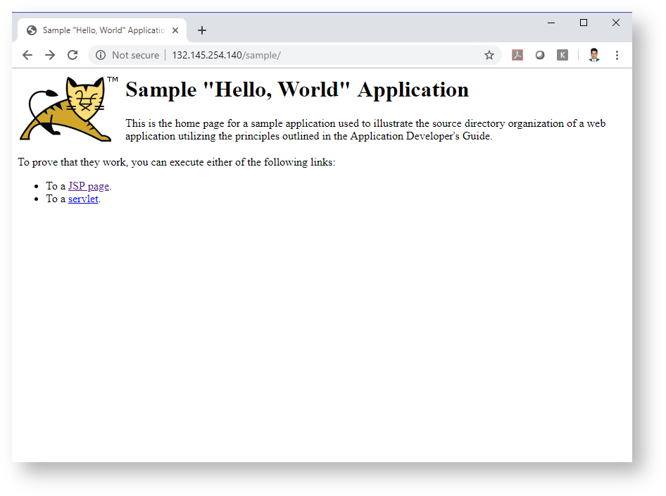

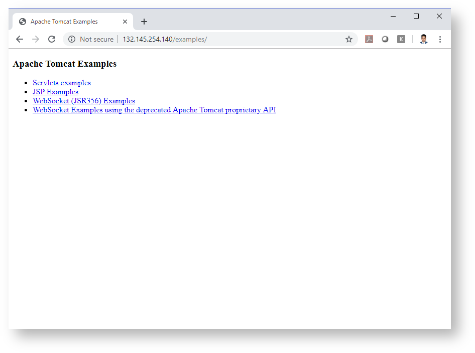


```Powershell

```

# References

* [Connector how to](https://tomcat.apache.org/connectors-doc/webserver_howto/apache.html)
