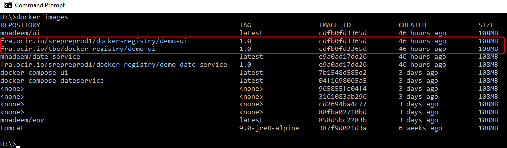
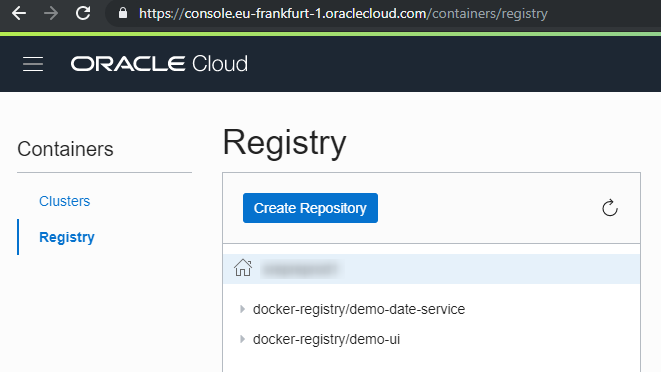
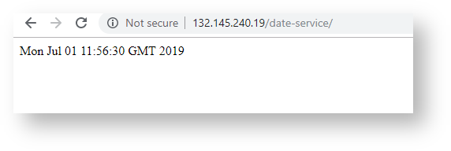
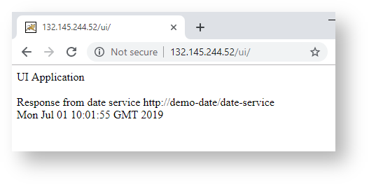

[Home](../README.md)

# Connecting Kubernetes Applications (Tomcat) With Services On Oracle Cloud Infrastructure (OCI)

This will demonstrate the following

* Communication between two services.
* Configuring services using environment entries.

## Design


## Create Docker images

Download [the project](https://github.com/enabling-cloud/docker-compose-svc-com) and execute the following commands on both projects to generate the docker images.


```Powershell
date-service> mvn clean package docker:build
ui> mvn clean package docker:build
```

## Upload Docker Images


Follow the [process](DeployCustomDockerImageIntoOKECluster.md) to upload the docker images to OKE registry 



Images uploaded to registry




## Create OKE Cluster

Follow [this](OracleContainerEngineForKubernetes.md) process

## Deploy the Services

### Create secret


```Powershell
kubectl create secret docker-registry ocirsecret --docker-server=fra.ocir.io --docker-username=demo-tenancy/nadeem.mohammad@abc.com --docker-password=sfdsfdf.(sfs[POx --docker-email=nadeem.mohammad@abc.com

```

```Powershell
D:\practices\kubernetes\svc-comm>kubectl get secret
NAME                  TYPE                                  DATA      AGE
default-token-sls6g   kubernetes.io/service-account-token   3         23h
ocirsecret            kubernetes.io/dockerconfigjson        1         10h

```

```Powershell
D:\practices\kubernetes\svc-comm>kubectl describe secret  ocirsecret
Name:         ocirsecret
Namespace:    default
Labels:       <none>
Annotations:  <none>
 
Type:  kubernetes.io/dockerconfigjson
 
Data
====
.dockerconfigjson:  240 bytes

```

## Create Configmap

**ui.xml**

```Powershell
<?xml version="1.0" encoding="UTF-8"?>
<Context path="/ui" debug="0" reloadable="false" useHttpOnly="true"
    clearReferencesHttpClientKeepAliveThread="true"
    clearReferencesStopThreads="true" clearReferencesStopTimerThreads="true">
 
 
    <Environment name="app" type="java.lang.String"
        value="${catalina.base}/webapps/echo-service" />
 
    <Environment name="url" type="java.lang.String"
        value="http://demo-date/date-service" />
 
</Context>
```

```Powershell
D:\workspaces\kubernetes\docker-compose\ui\src\main\webapp\META-INF>kubectl create configmap ui-config --from-file=ui.xml

```

```Powershell
D:\workspaces\kubernetes\docker-compose\ui\src\main\webapp\META-INF>kubectl get configmap
NAME        DATA      AGE
ui-config   1         1h

```


```Powershell
D:\workspaces\kubernetes\docker-compose\ui\src\main\webapp\META-INF>kubectl describe configmap ui-config
Name:         ui-config
Namespace:    default
Labels:       <none>
Annotations:  <none>
 
Data
====
ui.xml:
----
<?xml version="1.0" encoding="UTF-8"?>
<Context path="/ui" debug="0" reloadable="false" useHttpOnly="true"
  clearReferencesHttpClientKeepAliveThread="true"
  clearReferencesStopThreads="true" clearReferencesStopTimerThreads="true">
 
 
  <Environment name="app" type="java.lang.String"
    value="${catalina.base}/webapps/echo-service" />
 
  <Environment name="url" type="java.lang.String"
    value="http://demo-date/date-service" />
 
</Context>
Events:  <none>
 
D:\workspaces\kubernetes\docker-compose\ui\src\main\webapp\META-INF>

```

### Cluster detail

```Powershell
D:\practices\kubernetes\svc-comm>kubectl cluster-info
Kubernetes master is running at https://c4gcmzqhezd.eu-frankfurt-1.clusters.oci.oraclecloud.com:6443
KubeDNS is running at https://c4gcmzqhezd.eu-frankfurt-1.clusters.oci.oraclecloud.com:6443/api/v1/namespaces/kube-system/services/kube-dns:dns/proxy
 
To further debug and diagnose cluster problems, use 'kubectl cluster-info dump'.

```

```Powershell
D:\practices\kubernetes\svc-comm>kubectl get services kube-dns --namespace=kube-system
NAME       TYPE        CLUSTER-IP   EXTERNAL-IP   PORT(S)         AGE
kube-dns   ClusterIP   10.96.5.5    <none>        53/UDP,53/TCP   1d
 
D:\practices\kubernetes\svc-comm>

```

```Powershell
D:\practices\kubernetes\svc-comm>kubectl get nodes
NAME        STATUS    ROLES     AGE       VERSION
10.0.10.2   Ready     node      2h        v1.12.7
10.0.11.2   Ready     node      2h        v1.12.7
10.0.12.2   Ready     node      2h        v1.12.7

```

Delete existing services

```Powershell

D:\practices\kubernetes\svc-comm>kubectl delete -f demo-date-app-lb.yml
service "demo-date-app-service" deleted
deployment.apps "demo-date-app-deployment" deleted
 
D:\practices\kubernetes\svc-comm>kubectl delete -f ui-app-lb.yml
service "ui-app-service" deleted
deployment.apps "ui-app-deployment" deleted
```

Create services

**demo-date-app-lb.yml**

```Powershell
apiVersion: v1
kind: Service
metadata:
  name: demo-date
spec:
  type: LoadBalancer
  ports:
  - port: 80
    protocol: TCP
    targetPort: 8080
  selector:
    app: demo-date
---
apiVersion: apps/v1
kind: Deployment
metadata:
  name: demo-date
spec:
  selector:
    matchLabels:
     app: demo-date
  replicas: 1
  template:
    metadata:
      labels:
        app: demo-date
    spec:
      containers:
      - name: demo-date  
        image: fra.ocir.io/srepreprod1/docker-registry/demo-date-service:1.0
        ports:
        - containerPort: 8080
      imagePullSecrets:
      - name: ocirsecret

```

```Powershell
D:\practices\kubernetes\svc-comm>kubectl apply -f demo-date-app-lb.yml
service "demo-date-app-service" created
deployment.apps "demo-date-app-deployment" created

```

**ui-app-lb.yml**
```Powershell
apiVersion: v1
kind: Service
metadata:
  name: ui-app
spec:
  type: LoadBalancer
  ports:
  - port: 80
    protocol: TCP
    targetPort: 8080
  selector:
    app: ui-app
---
apiVersion: apps/v1
kind: Deployment
metadata:
  labels:
    service: ui-app
  name: ui-app
spec:
  selector:
    matchLabels:
      app: ui-app
  replicas: 1
  template:
    metadata:
      labels:
        app: ui-app
    spec:
      containers:
      - name: ui-app  
        image: fra.ocir.io/srepreprod1/docker-registry/demo-ui:1.0
        ports:
        - containerPort: 8080
        volumeMounts:
        - name: my-config
          mountPath: /usr/local/tomcat/conf/Catalina/localhost     
      imagePullSecrets:
      - name: ocirsecret
      volumes:
      - name: my-config
        configMap:
         name: ui-config

```


```Powershell
D:\practices\kubernetes\svc-comm>kubectl apply -f ui-app-lb.yml
service "ui-app-service" created
deployment.apps "ui-app-deployment" created

```

Cluster Details

```Powershell
D:\practices\kubernetes\svc-comm>kubectl get pods
NAME                                       READY     STATUS    RESTARTS   AGE
demo-date-app-deployment-94877df6f-gs72q   1/1       Running   0          23s
ui-app-deployment-c94f8d95-2ffbw           1/1       Running   0          11s

```

```Powershell
D:\practices\kubernetes\svc-comm>kubectl get services
NAME         TYPE           CLUSTER-IP     EXTERNAL-IP      PORT(S)        AGE
demo-date    LoadBalancer   10.96.43.136   132.145.240.19   80:31283/TCP   2h
kubernetes   ClusterIP      10.96.0.1      <none>           443/TCP        2h
ui-app       LoadBalancer   10.96.120.3    132.145.244.52   80:31811/TCP   1h
 
D:\practices\kubernetes\svc-comm>

```

ui-app service environment details

```Powershell
D:\workspaces\kubernetes\docker-compose\ui\src\main\webapp\META-INF>kubectl exec ui-app-c94f8d95-mqklf -- printenv
PATH=/usr/local/tomcat/bin:/usr/local/sbin:/usr/local/bin:/usr/sbin:/usr/bin:/sbin:/bin:/usr/lib/jvm/java-1.8-openjdk/jre/bin:/usr/lib/jvm/java-1.8-openjdk/bin
HOSTNAME=ui-app-c94f8d95-mqklf
UI_APP_SERVICE_HOST=10.96.120.3
UI_APP_SERVICE_PORT=80
UI_APP_PORT_80_TCP=tcp://10.96.120.3:80
UI_APP_PORT_80_TCP_ADDR=10.96.120.3
KUBERNETES_SERVICE_PORT=443
KUBERNETES_PORT_443_TCP_PROTO=tcp
DEMO_DATE_SERVICE_HOST=10.96.43.136
DEMO_DATE_PORT_80_TCP_PROTO=tcp
UI_APP_PORT_80_TCP_PROTO=tcp
UI_APP_PORT_80_TCP_PORT=80
KUBERNETES_SERVICE_HOST=10.96.0.1
KUBERNETES_SERVICE_PORT_HTTPS=443
KUBERNETES_PORT=tcp://10.96.0.1:443
KUBERNETES_PORT_443_TCP_ADDR=10.96.0.1
DEMO_DATE_PORT=tcp://10.96.43.136:80
DEMO_DATE_PORT_80_TCP=tcp://10.96.43.136:80
DEMO_DATE_PORT_80_TCP_PORT=80
DEMO_DATE_PORT_80_TCP_ADDR=10.96.43.136
KUBERNETES_PORT_443_TCP=tcp://10.96.0.1:443
KUBERNETES_PORT_443_TCP_PORT=443
DEMO_DATE_SERVICE_PORT=80
UI_APP_PORT=tcp://10.96.120.3:80
LANG=C.UTF-8
JAVA_HOME=/usr/lib/jvm/java-1.8-openjdk/jre
JAVA_VERSION=8u212
JAVA_ALPINE_VERSION=8.212.04-r0
CATALINA_HOME=/usr/local/tomcat
TOMCAT_NATIVE_LIBDIR=/usr/local/tomcat/native-jni-lib
LD_LIBRARY_PATH=/usr/local/tomcat/native-jni-lib
GPG_KEYS=05AB33110949707C93A279E3D3EFE6B686867BA6 07E48665A34DCAFAE522E5E6266191C37C037D42 47309207D818FFD8DCD3F83F1931D684307A10A5 541FBE7D8F78B25E055DDEE13C370389288584E7 61B832AC2F1C5A90F0F9B00A1C506407564C17A3 79F7026C690BAA50B92CD8B66A3AD3F4F22C4FED 9BA44C2621385CB966EBA586F72C284D731FABEE A27677289986DB50844682F8ACB77FC2E86E29AC A9C5DF4D22E99998D9875A5110C01C5A2F6059E7 DCFD35E0BF8CA7344752DE8B6FB21E8933C60243 F3A04C595DB5B6A5F1ECA43E3B7BBB100D811BBE F7DA48BB64BCB84ECBA7EE6935CD23C10D498E23
TOMCAT_MAJOR=9
TOMCAT_VERSION=9.0.20
TOMCAT_SHA512=6d2df51f0bfc6a90cfca61c86473b8843da4162c430ab06b8f66f364931f3d8a3ad399703acdd600ff4f633d7d6725edf05d5d5d19534716a2f3f9f5238a32a0
TOMCAT_TGZ_URLS=https://www.apache.org/dyn/closer.cgi?action=download&filename=tomcat/tomcat-9/v9.0.20/bin/apache-tomcat-9.0.20.tar.gz  https://www-us.apache.org/dist/tomcat/tomcat-9/v9.0.20/bin/apache-tomcat-9.0.20.tar.gz     https://www.apache.org/dist/tomcat/tomcat-9/v9.0.20/bin/apache-tomcat-9.0.20.tar.gz        https://archive.apache.org/dist/tomcat/tomcat-9/v9.0.20/bin/apache-tomcat-9.0.20.tar.gz
TOMCAT_ASC_URLS=https://www.apache.org/dyn/closer.cgi?action=download&filename=tomcat/tomcat-9/v9.0.20/bin/apache-tomcat-9.0.20.tar.gz.asc         https://www-us.apache.org/dist/tomcat/tomcat-9/v9.0.20/bin/apache-tomcat-9.0.20.tar.gz.asc      https://www.apache.org/dist/tomcat/tomcat-9/v9.0.20/bin/apache-tomcat-9.0.20.tar.gz.asc    https://archive.apache.org/dist/tomcat/tomcat-9/v9.0.20/bin/apache-tomcat-9.0.20.tar.gz.asc
HOME=/root

```

Lets connect to ui-app pod

```Powershell
D:\practices\kubernetes\svc-comm>kubectl exec -it ui-app-deployment-c94f8d95-2ffbw bash

```

ui context.xml is copied properly

```Powershell
bash-4.4# cd conf/Catalina/localhost/
bash-4.4# ls
ui.xml

```


```Powershell
D:\workspaces\kubernetes\docker-compose\ui\src\main\webapp\META-INF>kubectl -it exec ui-app-c94f8d95-mqklf bash
bash-4.4# wget http://demo-date/date-service
Connecting to demo-date (10.96.43.136:80)
date-service         100% |*****************************************************************************************************************************************************|    34  0:00:00 ETA
bash-4.4# cat date-service
 
 
Mon Jul 01 10:09:44 GMT 2019
bash-4.4#

```

date-service is up



ui app is up and able to communicate to date-service.




# References

* [Connecting Applications with Services](https://kubernetes.io/docs/concepts/services-networking/connect-applications-service/)
* [Connect a Front End to a Back End Using a Service](https://kubernetes.io/docs/tasks/access-application-cluster/connecting-frontend-backend/)
* [PHP guest book application](https://kubernetes.io/docs/tutorials/stateless-application/guestbook/)