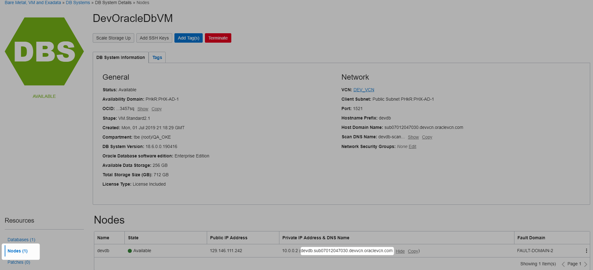

[Home](../README.md)

# Connecting to Services outside OKE Cluster On Oracle Cloud Infrastructure (OCI)

## Mapping by hostname (CNAME)

Get the host name




Service definition

oracle-dev-svc.yml
```Powershell
kind: Service
apiVersion: v1
metadata:
  name: oracle-dev
spec:
  type: ExternalName
  externalName: devdb.sub07012047030.devvcn.oraclevcn.com
```

Execute

```Powershell
D:\practices\kubernetes\tbe>kubectl apply -f oracle-dev-svc.yml
service "oracle-dev" created
```

Use

```Powershell
<Environment name="dbcp.url" type="java.lang.String"
                  value="jdbc:oracle:thin:@(DESCRIPTION=(ADDRESS=(PROTOCOL=TCP)(HOST=oracle-dev)(PORT=1521))(CONNECT_DATA=(SERVER=DEDICATED)(SERVICE_NAME=PDB.sub07012047030.devvcn.oraclevcn.com)))"/>
```

Update the configmap
```Powershell
D:\practices\kubernetes\tbe>kubectl delete configmap qa-app-config
configmap "qa-app-config" deleted
 
D:\practices\kubernetes\tbe>kubectl create configmap qa-app-config --from-file=app.xml
configmap "qa-app-config" created
```

## Mapping a hostname to an ip address

TODO

# References 
* [Kubernetes Service Best practices](https://cloud.google.com/blog/products/gcp/kubernetes-best-practices-mapping-external-services)
* [Kubernetes Services](https://kubernetes.io/docs/concepts/services-networking/service/)