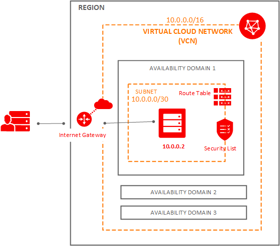
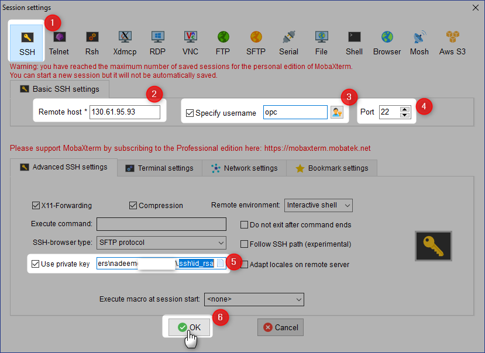
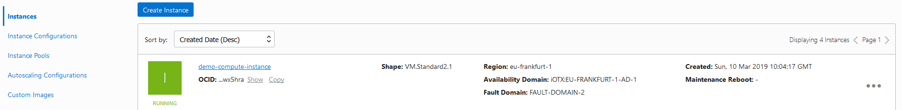
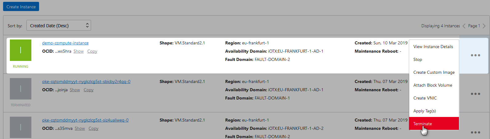
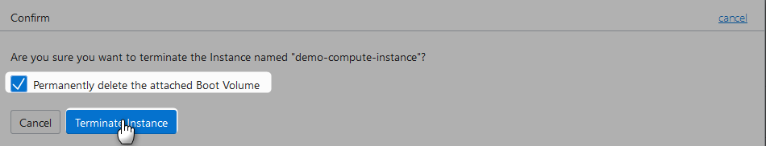
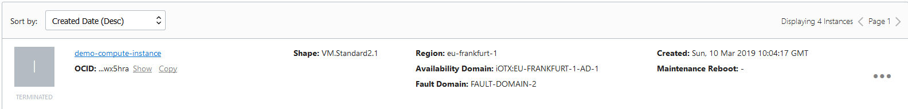

# Creating Compute Instance

Lets provision the following infrastructure



## Prerequisites

### SSH

Make sure to generate the [SSH key Pair](GeneratingSshKey.md), ignore if already done

### VNC

Make sure to [create VCN](CreatingVCN.md), ignore if already done.

## Creation 

### Step 1 : Navigate To Compute Instance


### Step 2 : Provide Name


### Step 3 : Select Availability Doamin


### Step 4 : Select Image Source


Available images


### Step 5 : Select Instance Type


### Step 6 : Select Instance Shape


Available Shapes


### Step 7 : Add SSH Key

Copy the ssh public key

```Powershell
nadeem@NADEEM-LAP MINGW64 ~
$ clip < ~/.ssh/id_rsa.pub
 
nadeem@NADEEM-LAP MINGW64 ~
$
```
Paste it


### Step 8: Configure Networking


### Step 9 : Configure Advance Options

provide cloud init script


### Step 10 : Wait For Instance to be provisioned


Instance provisioned


Make a note of public ip address

## Connecting To Provisioned Instance 


### Step 1 :  Connect Using SSH Tool

##### Note : _opc_ is the default user



### Step 2 : Instance Connected

```Powershell
Authenticating with public key "imported-openssh-key"
     ┌────────────────────────────────────────────────────────────────────┐
     │                        • MobaXterm 10.5 •                          │
     │            (SSH client, X-server and networking tools)             │
     │                                                                    │
     │ ➤ SSH session to opc@130.61.95.93                                  │
     │   • SSH compression : ✔                                            │
     │   • SSH-browser     : ✔                                            │
     │   • X11-forwarding  : ✘  (disabled or not supported by server)     │
     │   • DISPLAY         : 172.19.134.33:0.0                            │
     │                                                                    │
     │ ➤ For more info, ctrl+click on help or visit our website           │
     └────────────────────────────────────────────────────────────────────┘

[opc@demo-compute-instance ~]$ pwd
/home/opc
[opc@demo-compute-instance ~]$ ls -ltr
total 0
[opc@demo-compute-instance ~]$

```


## Termination 


### Step 1 : Navigate To Compute Instance

 



### Step 2 : Initiate Termination



Confirm



### Step 3 : Wait for Instance being terminated


Terminated




## References

* [Launching your first linux instance](https://docs.cloud.oracle.com/iaas/Content/GSG/Reference/overviewworkflow.htm)
* [Bastion Host](http://wiki-tbe.us.oracle.com/download/attachments/64660285/Bastion.vsdx?version=2&modificationDate=1551638194000&api=v2)
* [Graphics for Topologies and Diagrams](https://docs.cloud.oracle.com/iaas/Content/General/Reference/graphicsfordiagrams.htm)
