[Home](../README.md)

# Creating Virtual Cloud Network (VCN)

### Step 1 : Navigate to VCNs

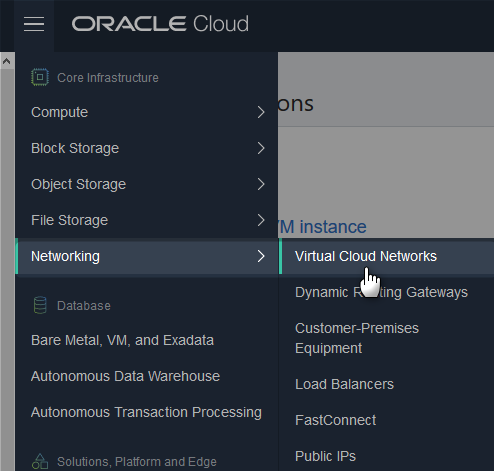

Click to create

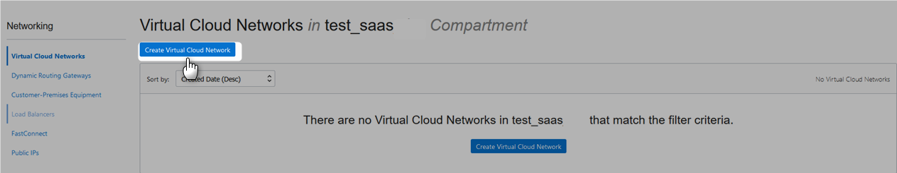

### Step 2 : Create VCN

Enter name and compartment, select "Create VCN plus related resources"

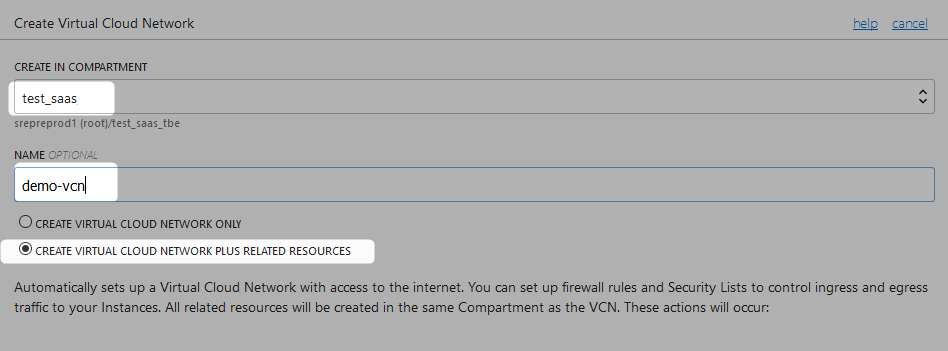

Select "Use DNC hostnames in this VCN"

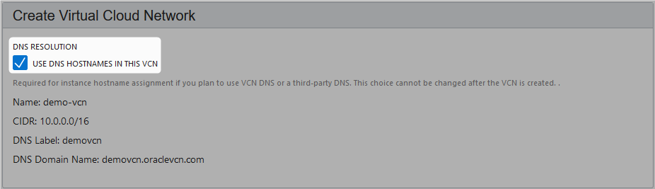

Internet Gateway and Route Table Would be created as well.

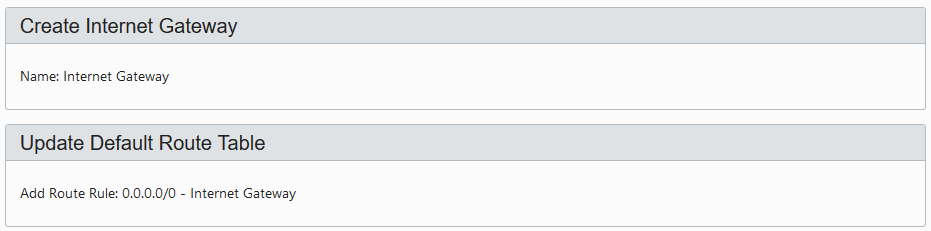

Three subnets would be created

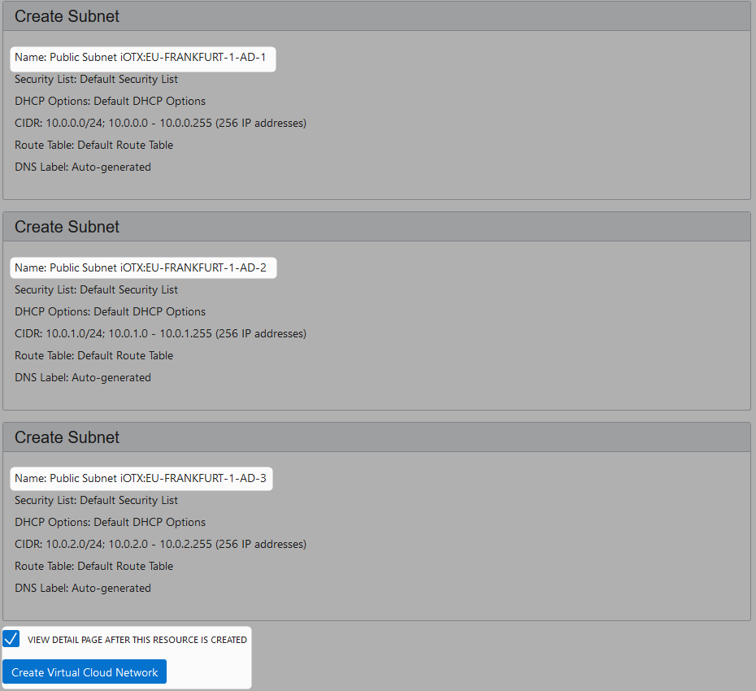

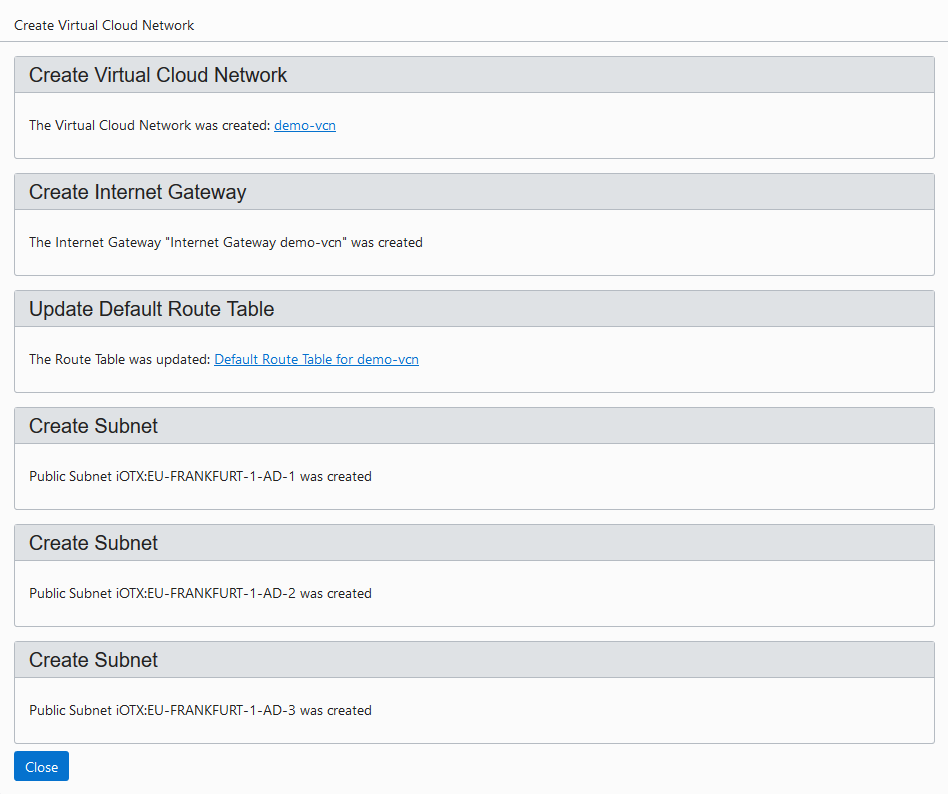

VCN Created

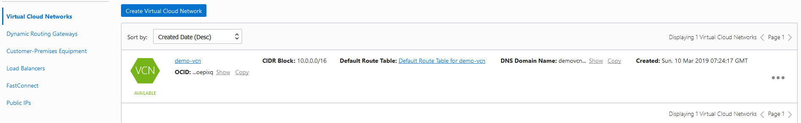

# Terminating VCN

### Step 1 : Navigate to VCNs

### Step 2 : Initiate Termination

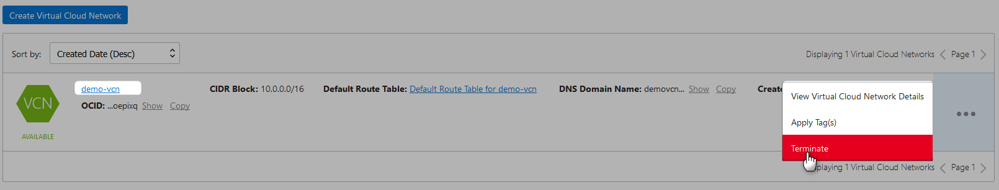

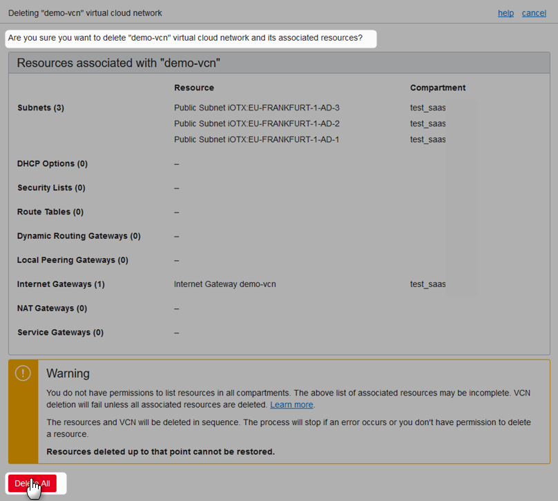

VCN Deleted

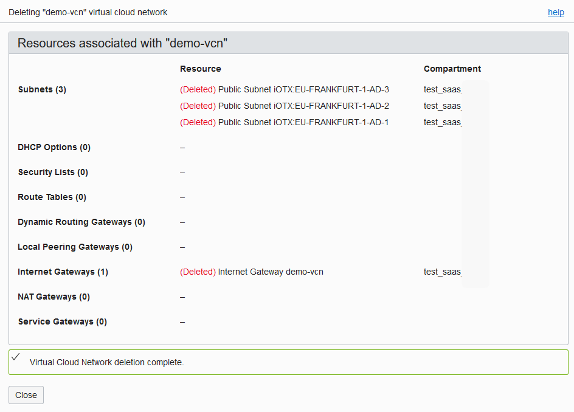

# References
* [Over View Of Networking](https://docs.cloud.oracle.com/iaas/Content/Network/Concepts/overview.htm)
* [Networking Scenarios](https://docs.cloud.oracle.com/iaas/Content/Network/Concepts/scenarios.htm)
* [VCNs And Subnets](https://docs.cloud.oracle.com/iaas/Content/Network/Tasks/managingVCNs.htm)
* [VCN Deployment Guide](https://cloud.oracle.com/iaas/whitepapers/vcn-deployment-guide.pdf)
* [Access to Internet](https://docs.cloud.oracle.com/iaas/Content/Network/Concepts/internetaccess.htm)
* [Route Table](https://docs.cloud.oracle.com/iaas/Content/Network/Tasks/managingroutetables.htm)
* [DHCP Options](https://docs.cloud.oracle.com/iaas/Content/Network/Tasks/managingDHCP.htm)
* [VCN FAQ](https://cloud.oracle.com/en_US/bare-metal-network/vcn/faq)