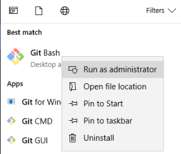

# Generating a Secure Shell (SSH) Public/Private Key Pair

Run **Git Bash** as Administrator



```Powershell
$ ssh-keygen -b 2048 -t rsa
```
**Output**
```Powershell
nadeem@NADEEM-LAP MINGW64 ~
$ ssh-keygen -b 2048 -t rsa
Generating public/private rsa key pair.
Enter file in which to save the key (/c/Users/nadeem/.ssh/id_rsa):
Enter passphrase (empty for no passphrase):
Enter same passphrase again:
Your identification has been saved in /c/Users/nadeem/.ssh/id_rsa.
Your public key has been saved in /c/Users/nadeem/.ssh/id_rsa.pub.
The key fingerprint is:
SHA256:2mlv6t1/L6PiqG5sHnf39+LewhAuw+RUwaVM6OhZnJI nadeem@NADEEM-LAP
The key's randomart image is:
+---[RSA 2048]----+
|           ooo.  |
|          .oo.   |
|         = oo    |
|        E B .    |
|       .SO . .   |
|       oo.= o    |
|     .o = .o.o   |
|      ++ =oo .*.o|
|     =+o+++.o==B*|
+----[SHA256]-----+
 
nadeem@NADEEM-LAP MINGW64 ~
$
```


```Powershell
nadeem@nadeem-LAP MINGW64 ~/.ssh
$ ls -la
total 45
drwxr-xr-x 1 nadeem 1049089    0 Feb 24 17:51 ./
drwxr-xr-x 1 nadeem 1049089    0 Feb 22 23:50 ../
drwxr-xr-x 1 nadeem 1049089    0 Feb 24 17:50 backup/
-rw-r--r-- 1 nadeem 1049089 1675 Feb 24 17:51 id_rsa
-rw-r--r-- 1 nadeem 1049089  403 Feb 24 17:51 id_rsa.pub
 
nadeem@nadeem-LAP MINGW64 ~/.ssh
$
```
Copy **Public Key**

```Powershell
nadeem@nadeem-LAP MINGW64 ~
$ clip < ~/.ssh/id_rsa.pub
  
nadeem@nadeem-LAP MINGW64 ~
$
```

# References
* [Generating SSH Key pair](https://docs.oracle.com/en/cloud/paas/database-dbaas-cloud/csdbi/generate-ssh-key-pair.html#GUID-4285B8CF-A228-4B89-9552-FE6446B5A673)