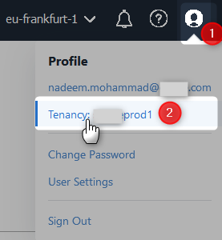
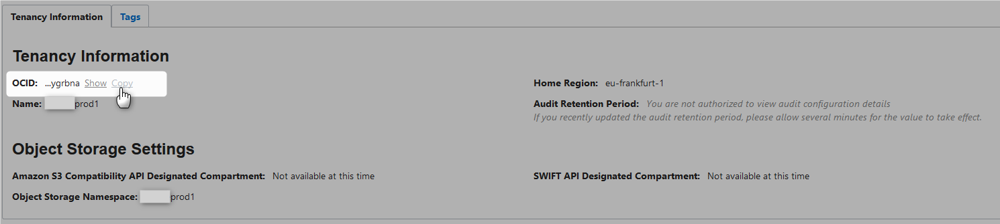
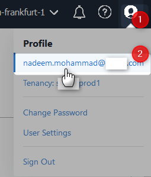
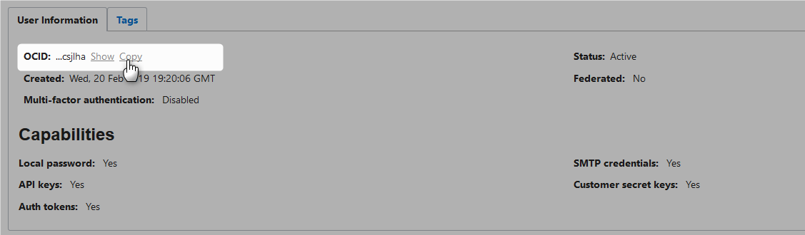
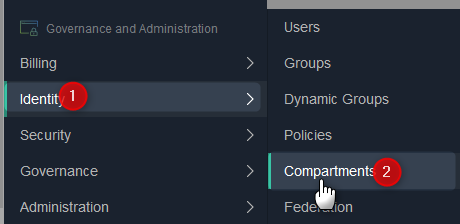
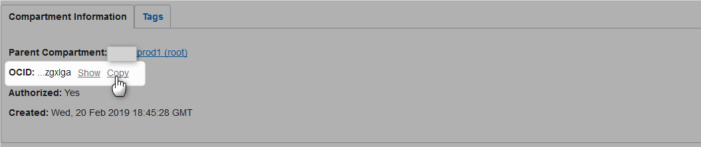

# Getting OCIDs

## Tenancy OCID

## User OCID

## Compartment OCID

Click on your compartment and then

# References
* [Required Keys and OCIDs](https://docs.cloud.oracle.com/iaas/Content/API/Concepts/apisigningkey.htm)