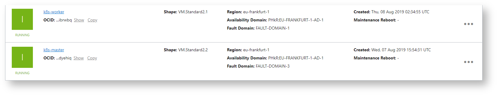
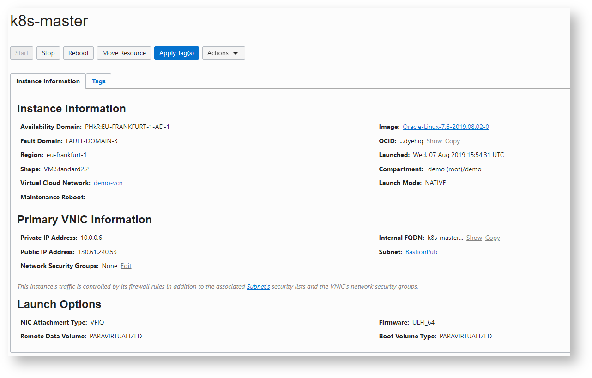
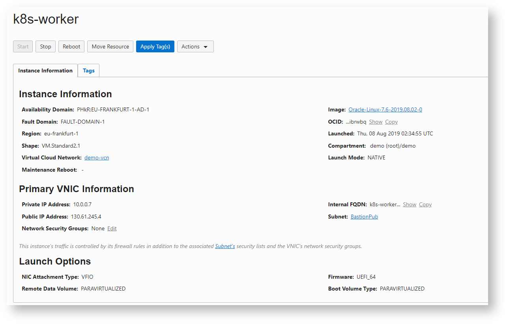

[Home](../README.md)

# Single control-plane Kubernetes cluster with kubeadm on Oracle Cloud Infrastructure (OCI)


> Not For Production Use

> Just for Practice Purpose

> In Production either Use [OKE](https://docs.cloud.oracle.com/iaas/Content/ContEng/Concepts/contengoverview.htm) or [Setup HA Cluster](https://cloud.oracle.com/iaas/whitepapers/kubernetes_on_oci.pdf)

## Step 1 : Create Two Public Compute Instances

Follow [this](manual/CreatingComputeInstance.md) to create compute instances









## Step 2 : Configure Master Node
### Disable SELinux

**Temporary**

```Powershell
[opc@k8s-master ~]$ sudo su -
[root@k8s-master ~]# setenforce 0
[root@k8s-master ~]# getenforce
Permissive
```

**Permanent**

Edit the **/etc/selinux/config** file and change the *SELINUX=enforcing* line to *SELINUX=permissive*

```Powershell
[opc@k8s-master ~]$ cat /etc/selinux/config
 
# This file controls the state of SELinux on the system.
# SELINUX= can take one of these three values:
#     enforcing - SELinux security policy is enforced.
#     permissive - SELinux prints warnings instead of enforcing.
#     disabled - No SELinux policy is loaded.
SELINUX=permissive
# SELINUXTYPE= can take one of three values:
#     targeted - Targeted processes are protected,
#     minimum - Modification of targeted policy. Only selected processes are protected.
#     mls - Multi Level Security protection.
SELINUXTYPE=targeted
```

### Disable Firewall

```Powershell
[root@k8s-master ~]# systemctl disable firewalld && systemctl stop firewalld
Removed symlink /etc/systemd/system/multi-user.target.wants/firewalld.service.
Removed symlink /etc/systemd/system/dbus-org.fedoraproject.FirewallD1.service.
```

### Add Kubernetes Repo

```Powershell
[root@k8s-master ~]# cat <<EOF > /etc/yum.repos.d/kubernetes.repo
[kubernetes]
name=Kubernetes
baseurl=http://yum.kubernetes.io/repos/kubernetes-el7-x86_64
enabled=1
gpgcheck=1
repo_gpgcheck=1
gpgkey=https://packages.cloud.google.com/yum/doc/yum-key.gpg
        https://packages.cloud.google.com/yum/doc/rpm-package-key.gpg
EOF
```

### Ensure net.bridge.bridge-nf-call-iptables is set to 1 

```Powershell
[root@k8s-master ~]# sysctl -w net.bridge.bridge-nf-call-iptables=1
net.bridge.bridge-nf-call-iptables = 1
[root@k8s-master ~]# echo "net.bridge.bridge-nf-call-iptables=1" > /etc/sysctl.d/k8s.conf
```

**Alternatively**

```Powershell
# cat <<EOF >  /etc/sysctl.d/k8s.conf
net.bridge.bridge-nf-call-ip6tables = 1
net.bridge.bridge-nf-call-iptables = 1
EOF
sysctl --system
```

### Install Docker and Kubernetes

```Powershell
[root@k8s-master ~]# yum install -y docker-engine kubelet kubeadm kubectl kubernetes-cni
```

### Enable the docker and the kubelet services

```Powershell
[root@k8s-master ~]# systemctl enable docker && systemctl start docker
Created symlink from /etc/systemd/system/multi-user.target.wants/docker.service to /usr/lib/systemd/system/docker.service.
```

```Powershell
[root@k8s-master ~]# systemctl enable kubelet && systemctl start kubelet
Created symlink from /etc/systemd/system/multi-user.target.wants/kubelet.service to /usr/lib/systemd/system/kubelet.service.
```

### Disable Swap

```Powershell
[root@k8s-worker ~]# swapoff -a &&  sed -i '/ swap / s/^/#/' /etc/fstab
```

### Initialize Master

Wipe your current cluster installation (If any)

```Powershell
[root@k8s-master ~]# kubeadm reset -f && rm -rf /etc/kubernetes/
```

**Reset Output**

```Powershell
[root@k8s-master ~]# kubeadm reset -f && rm -rf /etc/kubernetes/
[reset] Reading configuration from the cluster...
[reset] FYI: You can look at this config file with 'kubectl -n kube-system get cm kubeadm-config -oyaml'
[preflight] Running pre-flight checks
[reset] Removing info for node "k8s-master" from the ConfigMap "kubeadm-config" in the "kube-system" Namespace
W0807 17:52:28.097752   17828 removeetcdmember.go:61] [reset] failed to remove etcd member: error syncing endpoints with etc: etcdclient: no available endpoints
.Please manually remove this etcd member using etcdctl
[reset] Stopping the kubelet service
[reset] Unmounting mounted directories in "/var/lib/kubelet"
[reset] Deleting contents of config directories: [/etc/kubernetes/manifests /etc/kubernetes/pki]
[reset] Deleting files: [/etc/kubernetes/admin.conf /etc/kubernetes/kubelet.conf /etc/kubernetes/bootstrap-kubelet.conf /etc/kubernetes/controller-manager.conf /etc/kubernetes/scheduler.conf]
[reset] Deleting contents of stateful directories: [/var/lib/etcd /var/lib/kubelet /etc/cni/net.d /var/lib/dockershim /var/run/kubernetes]
 
The reset process does not reset or clean up iptables rules or IPVS tables.
If you wish to reset iptables, you must do so manually.
For example:
iptables -F && iptables -t nat -F && iptables -t mangle -F && iptables -X
 
If your cluster was setup to utilize IPVS, run ipvsadm --clear (or similar)
to reset your system's IPVS tables.
 
The reset process does not clean your kubeconfig files and you must remove them manually.
Please, check the contents of the $HOME/.kube/config file.
```

**Initialize cluster**

```Powershell
[root@k8s-master ~]# kubeadm init
```
`kubeadm init` output

```Powershell
[init] Using Kubernetes version: v1.15.2
[preflight] Running pre-flight checks
        [WARNING IsDockerSystemdCheck]: detected "cgroupfs" as the Docker cgroup driver. The recommended driver is "systemd". Please follow the guide at https://kubernetes.io/docs/setup/cri/
[preflight] Pulling images required for setting up a Kubernetes cluster
[preflight] This might take a minute or two, depending on the speed of your internet connection
[preflight] You can also perform this action in beforehand using 'kubeadm config images pull'
[kubelet-start] Writing kubelet environment file with flags to file "/var/lib/kubelet/kubeadm-flags.env"
[kubelet-start] Writing kubelet configuration to file "/var/lib/kubelet/config.yaml"
[kubelet-start] Activating the kubelet service
[certs] Using certificateDir folder "/etc/kubernetes/pki"
[certs] Generating "ca" certificate and key
[certs] Generating "apiserver-kubelet-client" certificate and key
[certs] Generating "apiserver" certificate and key
[certs] apiserver serving cert is signed for DNS names [k8s-master kubernetes kubernetes.default kubernetes.default.svc kubernetes.default.svc.cluster.local] and IPs [10.96.0.1 10.0.0.6]
[certs] Generating "front-proxy-ca" certificate and key
[certs] Generating "front-proxy-client" certificate and key
[certs] Generating "etcd/ca" certificate and key
[certs] Generating "etcd/healthcheck-client" certificate and key
[certs] Generating "apiserver-etcd-client" certificate and key
[certs] Generating "etcd/server" certificate and key
[certs] etcd/server serving cert is signed for DNS names [k8s-master localhost] and IPs [10.0.0.6 127.0.0.1 ::1]
[certs] Generating "etcd/peer" certificate and key
[certs] etcd/peer serving cert is signed for DNS names [k8s-master localhost] and IPs [10.0.0.6 127.0.0.1 ::1]
[certs] Generating "sa" key and public key
[kubeconfig] Using kubeconfig folder "/etc/kubernetes"
[kubeconfig] Writing "admin.conf" kubeconfig file
[kubeconfig] Writing "kubelet.conf" kubeconfig file
[kubeconfig] Writing "controller-manager.conf" kubeconfig file
[kubeconfig] Writing "scheduler.conf" kubeconfig file
[control-plane] Using manifest folder "/etc/kubernetes/manifests"
[control-plane] Creating static Pod manifest for "kube-apiserver"
[control-plane] Creating static Pod manifest for "kube-controller-manager"
[control-plane] Creating static Pod manifest for "kube-scheduler"
[etcd] Creating static Pod manifest for local etcd in "/etc/kubernetes/manifests"
[wait-control-plane] Waiting for the kubelet to boot up the control plane as static Pods from directory "/etc/kubernetes/manifests". This can take up to 4m0s
[apiclient] All control plane components are healthy after 16.503514 seconds
[upload-config] Storing the configuration used in ConfigMap "kubeadm-config" in the "kube-system" Namespace
[kubelet] Creating a ConfigMap "kubelet-config-1.15" in namespace kube-system with the configuration for the kubelets in the cluster
[upload-certs] Skipping phase. Please see --upload-certs
[mark-control-plane] Marking the node k8s-master as control-plane by adding the label "node-role.kubernetes.io/master=''"
[mark-control-plane] Marking the node k8s-master as control-plane by adding the taints [node-role.kubernetes.io/master:NoSchedule]
[bootstrap-token] Using token: 9f9xuf.su3t8exlnqejevtd
[bootstrap-token] Configuring bootstrap tokens, cluster-info ConfigMap, RBAC Roles
[bootstrap-token] configured RBAC rules to allow Node Bootstrap tokens to post CSRs in order for nodes to get long term certificate credentials
[bootstrap-token] configured RBAC rules to allow the csrapprover controller automatically approve CSRs from a Node Bootstrap Token
[bootstrap-token] configured RBAC rules to allow certificate rotation for all node client certificates in the cluster
[bootstrap-token] Creating the "cluster-info" ConfigMap in the "kube-public" namespace
[addons] Applied essential addon: CoreDNS
[addons] Applied essential addon: kube-proxy
 
Your Kubernetes control-plane has initialized successfully!
 
To start using your cluster, you need to run the following as a regular user:
 
  mkdir -p $HOME/.kube
  sudo cp -i /etc/kubernetes/admin.conf $HOME/.kube/config
  sudo chown $(id -u):$(id -g) $HOME/.kube/config
 
You should now deploy a pod network to the cluster.
Run "kubectl apply -f [podnetwork].yaml" with one of the options listed at:
  https://kubernetes.io/docs/concepts/cluster-administration/addons/
 
Then you can join any number of worker nodes by running the following on each as root:
 
kubeadm join 10.0.0.6:6443 --token 9f9xuf.su3t8exlnqejevtd \
    --discovery-token-ca-cert-hash sha256:6c61d0f6239d61af6de250abbce3f37122298be6a6cc27d05766128a0b844181
```


Copy the last two lines we need it later

Kubeadm has deployed all the necessary Control Plane components, including etcd, the API server, kube-proxy, Scheduler, and Controller Manager

```Powershell
[root@k8s-master ~]#  export KUBECONFIG=/etc/kubernetes/admin.conf
```

```Powershell
[root@k8s-master ~]# kubectl get po -n kube-system
NAME                                 READY   STATUS    RESTARTS   AGE
coredns-5c98db65d4-n2htv             0/1     Pending   0          64s
coredns-5c98db65d4-qnvxr             0/1     Pending   0          64s
etcd-k8s-master                      1/1     Running   0          15s
kube-apiserver-k8s-master            0/1     Pending   0          2s
kube-controller-manager-k8s-master   0/1     Pending   0          9s
kube-proxy-hllq2                     1/1     Running   0          64s
kube-scheduler-k8s-master            0/1     Pending   0          9s
 
[root@k8s-master ~]# kubectl get po -n kube-system
NAME                                 READY   STATUS    RESTARTS   AGE
coredns-5c98db65d4-n2htv             0/1     Pending   0          74s
coredns-5c98db65d4-qnvxr             0/1     Pending   0          74s
etcd-k8s-master                      1/1     Running   0          25s
kube-apiserver-k8s-master            1/1     Running   0          12s
kube-controller-manager-k8s-master   1/1     Running   0          19s
kube-proxy-hllq2                     1/1     Running   0          74s
kube-scheduler-k8s-master            1/1     Running   0          19s
```

```Powershell
[root@k8s-master ~]# kubectl describe pod coredns-5c98db65d4-n2htv -n kube-system
Name:                 coredns-5c98db65d4-n2htv
Namespace:            kube-system
Priority:             2000000000
Priority Class Name:  system-cluster-critical
Node:                 <none>
Labels:               k8s-app=kube-dns
                      pod-template-hash=5c98db65d4
Annotations:          <none>
Status:               Pending
IP:
Controlled By:        ReplicaSet/coredns-5c98db65d4
Containers:
  coredns:
    Image:       k8s.gcr.io/coredns:1.3.1
    Ports:       53/UDP, 53/TCP, 9153/TCP
    Host Ports:  0/UDP, 0/TCP, 0/TCP
    Args:
      -conf
      /etc/coredns/Corefile
    Limits:
      memory:  170Mi
    Requests:
      cpu:        100m
      memory:     70Mi
    Liveness:     http-get http://:8080/health delay=60s timeout=5s period=10s #success=1 #failure=5
    Readiness:    http-get http://:8080/health delay=0s timeout=1s period=10s #success=1 #failure=3
    Environment:  <none>
    Mounts:
      /etc/coredns from config-volume (ro)
      /var/run/secrets/kubernetes.io/serviceaccount from coredns-token-4jpfz (ro)
Conditions:
  Type           Status
  PodScheduled   False
Volumes:
  config-volume:
    Type:      ConfigMap (a volume populated by a ConfigMap)
    Name:      coredns
    Optional:  false
  coredns-token-4jpfz:
    Type:        Secret (a volume populated by a Secret)
    SecretName:  coredns-token-4jpfz
    Optional:    false
QoS Class:       Burstable
Node-Selectors:  beta.kubernetes.io/os=linux
Tolerations:     CriticalAddonsOnly
                 node-role.kubernetes.io/master:NoSchedule
                 node.kubernetes.io/not-ready:NoExecute for 300s
                 node.kubernetes.io/unreachable:NoExecute for 300s
Events:
  Type     Reason            Age                 From               Message
  ----     ------            ----                ----               -------
  Warning  FailedScheduling  6s (x19 over 106s)  default-scheduler  0/1 nodes are available: 1 node(s) had taints that the pod didn't tolerate.
```

```Powershell
[root@k8s-master ~]# kubectl get nodes
NAME         STATUS   ROLES    AGE     VERSION
k8s-master   NotReady    master   3m57s   v1.15.2
[root@k8s-master ~]#
```

Kubelet isn’t fully ready yet, because the container network (CNI) plugin isn’t installed yet. lets deploy Weave Net container networking plugin. Several [alternatives](http://kubernetes.io/docs/admin/addons/) are also available

```Powershell
[root@k8s-master ~]# kubectl apply -f "https://cloud.weave.works/k8s/net?k8s-version=$(kubectl  version | base64 | tr -d '\n')"
serviceaccount/weave-net created
clusterrole.rbac.authorization.k8s.io/weave-net created
clusterrolebinding.rbac.authorization.k8s.io/weave-net created
role.rbac.authorization.k8s.io/weave-net created
rolebinding.rbac.authorization.k8s.io/weave-net created
daemonset.extensions/weave-net created
```

```Powershell
[root@k8s-master ~]# kubectl get po -n kube-system
NAME                                 READY   STATUS              RESTARTS   AGE
coredns-5c98db65d4-n2htv             0/1     ContainerCreating   0          2m49s
coredns-5c98db65d4-qnvxr             0/1     ContainerCreating   0          2m49s
etcd-k8s-master                      1/1     Running             0          2m
kube-apiserver-k8s-master            1/1     Running             0          107s
kube-controller-manager-k8s-master   1/1     Running             0          114s
kube-proxy-hllq2                     1/1     Running             0          2m49s
kube-scheduler-k8s-master            1/1     Running             0          114s
weave-net-vl7pv                      2/2     Running             0          13s
[root@k8s-master ~]# kubectl get po -n kube-system
NAME                                 READY   STATUS    RESTARTS   AGE
coredns-5c98db65d4-n2htv             0/1     Running   0          2m52s
coredns-5c98db65d4-qnvxr             0/1     Running   0          2m52s
etcd-k8s-master                      1/1     Running   0          2m3s
kube-apiserver-k8s-master            1/1     Running   0          110s
kube-controller-manager-k8s-master   1/1     Running   0          117s
kube-proxy-hllq2                     1/1     Running   0          2m52s
kube-scheduler-k8s-master            1/1     Running   0          117s
weave-net-vl7pv                      2/2     Running   0          16s
```

```Powershell
[root@k8s-master ~]# kubectl get nodes
NAME         STATUS   ROLES    AGE     VERSION
k8s-master   Ready    master   3m57s   v1.15.2
[root@k8s-master ~]#
```

## Step 3 : Configure Worker Node
### Disable SELinux
**Temporary**

```Powershell
[opc@k8s-worker ~]$ sudo su -
[root@k8s-worker ~]# setenforce 0
[root@k8s-worker ~]# getenforce
Permissive
```

**Permanent**

Edit the **/etc/selinux/config** file and change the *SELINUX=enforcing* line to *SELINUX=permissive*

```Powershell
[opc@k8s-worker ~]$ cat /etc/selinux/config
  
# This file controls the state of SELinux on the system.
# SELINUX= can take one of these three values:
#     enforcing - SELinux security policy is enforced.
#     permissive - SELinux prints warnings instead of enforcing.
#     disabled - No SELinux policy is loaded.
SELINUX=permissive
# SELINUXTYPE= can take one of three values:
#     targeted - Targeted processes are protected,
#     minimum - Modification of targeted policy. Only selected processes are protected.
#     mls - Multi Level Security protection.
SELINUXTYPE=targeted
```
### Disable Firewall

```Powershell
[root@k8s-worker ~]# systemctl disable firewalld && systemctl stop firewalld
Removed symlink /etc/systemd/system/multi-user.target.wants/firewalld.service.
Removed symlink /etc/systemd/system/dbus-org.fedoraproject.FirewallD1.service.
```

### Add Kubernetes Repo

```Powershell
[root@k8s-worker ~]# cat <<EOF > /etc/yum.repos.d/kubernetes.repo
[kubernetes]
name=Kubernetes
baseurl=http://yum.kubernetes.io/repos/kubernetes-el7-x86_64
enabled=1
gpgcheck=1
repo_gpgcheck=1
gpgkey=https://packages.cloud.google.com/yum/doc/yum-key.gpg
        https://packages.cloud.google.com/yum/doc/rpm-package-key.gpg
EOF

```

```Powershell
[root@k8s-worker ~]# cat /etc/yum.repos.d/kubernetes.repo
[kubernetes]
name=Kubernetes
baseurl=http://yum.kubernetes.io/repos/kubernetes-el7-x86_64
enabled=1
gpgcheck=1
repo_gpgcheck=1
gpgkey=https://packages.cloud.google.com/yum/doc/yum-key.gpg
        https://packages.cloud.google.com/yum/doc/rpm-package-key.gpg
```

### Ensure net.bridge.bridge-nf-call-iptables is set to 1 

```Powershell
[root@k8s-worker ~]# sysctl -w net.bridge.bridge-nf-call-iptables=1
net.bridge.bridge-nf-call-iptables = 1
```

```Powershell
[root@k8s-worker ~]# echo "net.bridge.bridge-nf-call-iptables=1" > /etc/sysctl.d/k8s.conf
```

Following should also work

```Powershell
# cat <<EOF >  /etc/sysctl.d/k8s.conf
net.bridge.bridge-nf-call-ip6tables = 1
net.bridge.bridge-nf-call-iptables = 1
EOF
sysctl --system
```

### Disable Swap

```Powershell
[root@k8s-worker ~]# swapoff -a &&  sed -i '/ swap / s/^/#/' /etc/fstab
```

### Install Docker and Kubernetes

```Powershell
[root@k8s-worker ~]# yum install -y docker-engine  kubelet kubeadm kubectl kubernetes-cni
```

### Enable the docker and the kubelet services

```Powershell
[root@k8s-worker ~]# systemctl enable docker && systemctl start docker
Created symlink from /etc/systemd/system/multi-user.target.wants/docker.service to /usr/lib/systemd/system/docker.service.
```

```Powershell
[root@k8s-worker ~]# systemctl enable kubelet && systemctl start kubelet
Created symlink from /etc/systemd/system/multi-user.target.wants/kubelet.service to /usr/lib/systemd/system/kubelet.service.
```

**Join this node**

```Powershell
[root@k8s-worker ~]# kubeadm join 10.0.0.6:6443 --token 9f9xuf.su3t8exlnqejevtd \
>     --discovery-token-ca-cert-hash sha256:6c61d0f6239d61af6de250abbce3f37122298be6a6cc27d05766128a0b844181
[preflight] Running pre-flight checks
        [WARNING IsDockerSystemdCheck]: detected "cgroupfs" as the Docker cgroup driver. The recommended driver is "systemd". Please follow the guide at https://kubernetes.io/docs/setup/cri/
[preflight] Reading configuration from the cluster...
[preflight] FYI: You can look at this config file with 'kubectl -n kube-system get cm kubeadm-config -oyaml'
[kubelet-start] Downloading configuration for the kubelet from the "kubelet-config-1.15" ConfigMap in the kube-system namespace
[kubelet-start] Writing kubelet configuration to file "/var/lib/kubelet/config.yaml"
[kubelet-start] Writing kubelet environment file with flags to file "/var/lib/kubelet/kubeadm-flags.env"
[kubelet-start] Activating the kubelet service
[kubelet-start] Waiting for the kubelet to perform the TLS Bootstrap...
 
This node has joined the cluster:
* Certificate signing request was sent to apiserver and a response was received.
* The Kubelet was informed of the new secure connection details.
 
Run 'kubectl get nodes' on the control-plane to see this node join the cluster.
 
[root@k8s-worker ~]#
```

## Step 4 : Testing

```Powershell
[opc@k8s-master ~]$ sudo su -
Last login: Wed Aug  7 16:50:02 GMT 2019 on pts/0
[root@k8s-master ~]# export KUBECONFIG=/etc/kubernetes/admin.conf
```

```Powershell
[root@k8s-master ~]# kubectl get nodes
NAME         STATUS   ROLES    AGE   VERSION
k8s-master   Ready    master   8h    v1.15.2
k8s-worker   Ready    <none>   96s   v1.15.2
```

```Powershell
[root@k8s-master ~]# kubectl get po --all-namespaces
NAMESPACE     NAME                                 READY   STATUS    RESTARTS   AGE
kube-system   coredns-5c98db65d4-n2htv             1/1     Running   0          8h
kube-system   coredns-5c98db65d4-qnvxr             1/1     Running   0          8h
kube-system   etcd-k8s-master                      1/1     Running   0          8h
kube-system   kube-apiserver-k8s-master            1/1     Running   0          8h
kube-system   kube-controller-manager-k8s-master   1/1     Running   0          8h
kube-system   kube-proxy-hllq2                     1/1     Running   0          8h
kube-system   kube-proxy-rcm5k                     1/1     Running   0          2m3s
kube-system   kube-scheduler-k8s-master            1/1     Running   0          8h
kube-system   weave-net-p7md5                      2/2     Running   0          2m3s
kube-system   weave-net-vl7pv                      2/2     Running   0          8h
```

Create an nginx deployment

```Powershell
[root@k8s-master ~]# kubectl run nginx --image=nginx --port=80 --replicas=2
kubectl run --generator=deployment/apps.v1 is DEPRECATED and will be removed in a future version. Use kubectl run --generator=run-pod/v1 or kubectl create instead.
deployment.apps/nginx created
```

```Powershell
[root@k8s-master ~]# kubectl get pods -o wide
NAME                     READY   STATUS    RESTARTS   AGE   IP          NODE         NOMINATED NODE   READINESS GATES
nginx-7c45b84548-9lxn7   1/1     Running   0          25s   10.44.0.1   k8s-worker   <none>           <none>
nginx-7c45b84548-z5gwx   1/1     Running   0          25s   10.44.0.2   k8s-worker   <none>           <none>
```
Create a service to connect to your nginx deployment.


```Powershell
[root@k8s-master ~]# kubectl expose deployment nginx --type NodePort
service/nginx exposed
```

*--type=LoadBalancer* is not supported using this approach

You can manually create OCI load balancer that routes to the cluster or expose the node port publicly via Oracle Cloud Infrastructure’s security lists.


```Powershell
[root@k8s-master ~]# kubectl get services
NAME         TYPE        CLUSTER-IP     EXTERNAL-IP   PORT(S)        AGE
kubernetes   ClusterIP   10.96.0.1      <none>        443/TCP        8h
nginx        NodePort    10.102.90.50   <none>        80:30215/TCP   6s
```

```Powershell
[root@k8s-master ~]# NodePort=$(kubectl get svc nginx --output=jsonpath='{range.spec.ports[0]}{.nodePort}')
[root@k8s-master ~]# echo $NodePort
30215
```

```Powershell
[root@k8s-master ~]# curl 10.102.90.50:30215
curl: (7) Failed connect to 10.102.90.50:30215; Network is unreachable
```

curl http://${worker_node_public_ip}:${NodePort}

```Powershell
[root@k8s-master ~]# curl 10.0.0.7:30215
<!DOCTYPE html>
<html>
<head>
<title>Welcome to nginx!</title>
<style>
    body {
        width: 35em;
        margin: 0 auto;
        font-family: Tahoma, Verdana, Arial, sans-serif;
    }
</style>
</head>
<body>
<h1>Welcome to nginx!</h1>
<p>If you see this page, the nginx web server is successfully installed and
working. Further configuration is required.</p>
 
<p>For online documentation and support please refer to
<a href="http://nginx.org/">nginx.org</a>.<br/>
Commercial support is available at
<a href="http://nginx.com/">nginx.com</a>.</p>
 
<p><em>Thank you for using nginx.</em></p>
</body>
</html>
```

```Powershell
[root@k8s-master ~]# cat /etc/kubernetes/admin.conf
apiVersion: v1
clusters:
- cluster:
    certificate-authority-data: LS0tLS1CRUdJTiBDRVJUSUZJQ0FURS0tLS0tCk1JSUN5RENDQWJDZ0F3SUJBZ0lCQURBTkJna3Foa2lHOXcwQkFRc0ZBREFWTVJNd0VRWURWUVFERXdwcmRXSmwKY201bGRHVnpNQjRYRFRFNU1EZ3dOekUzTlRreU9Gb1hEVEk1TURnd05ERNQkVHQTFVRQpBeE1LYTNWaVpYSnVaWFJsY3pDQ0FTSXdEUVlKS29aSWh2Y05BUUVCQlFBRGdnRVBBRENDQVFvQ2dnRUJBSzdECis3WEd0cnhOYlhsaXVNMFdFWlErL09xRGZmMmRUUzhobUVRdk9oN3pLU3ZYbnhxRDA2YUxMcTRaVGJOaFBOT0oKWDdxejBMcmp3a2c1bzlpSGF6Y1VEp2b0daNDBkT2lCSXlVd08rWUhpMWNmU2FlblV2ZApNeEh5MWpCbHRuNkVpSFhWR29yM2NFM3dpZW1CZmlhUzR3Yy96ZWZJdExHSlFHd040ZzNqTW1CekxNNkYxOW5kCmxvVHBwdCtyMW5FbktzODhiSzBZK09oellGZXFXTGJBUGhzaTc0UzBjUFNwK0xKNEhIZnpZbjFlcXJqNTFONTMmYxK2xaWlJ4K0J0T3dlNlpIVDJoL3JiVjRiQUNUcEl0WENWZjhLbVdkNkx0R2g5LzNieQpxVVI2a0hmSHRUckw1Z0ViSmxzQ0F3RUFBYU1qTUNFd0RnWURWUjBQQVFIL0JBUURBZ0trTUE4R0ExVWRFd0VCCi93UUZNQU1CQWY4d0RRWUpLb1pJaHZjTkFRRUxCUUFEZ2dFQkFDMmbWVJd0dDQkU3aVoKVXArTHhlMVdLanFyMytoNW12cmZWcDFYeUtrUGJOTmFvWTVYSnRxYktYWVg5Q1FSb3JTT0crRzJ4N2NxcXRIVQpaeEY5ZnJ4QjVwVjhITWRYTUdteHpoSnFXZTB5Tnd4K0gweWV3dkIxMytYS3M4Zi9iY2VmNVhXOWhaMG5mMG9PCi9iM0cxcnJ6VTNEQzhKSElVQvQU1UbFRSZ1Nhd1pzcnNaemhsRFFkVlJxeUw2aWpHOVcKQU91VkhaSFhMVmhldUZhcFZtaGdqWFhqMEFWRGVTUUtlWmk4b3hqanZwbnp0Q3NwcGUyMlVPdEVLd0oxNVBlKwpyKzkvN2haTUpkK3RyM0k5WVZPdVZnVU8yd2ljaWVKUUlxU0wrZHN5RHdjSFpkR3M2QWtabDhuOE9CZzVElGSUNBVEUtLS0tLQo=
    server: https://10.0.0.6:6443
  name: kubernetes
contexts:
- context:
    cluster: kubernetes
    user: kubernetes-admin
  name: kubernetes-admin@kubernetes
current-context: kubernetes-admin@kubernetes
kind: Config
preferences: {}
users:
- name: kubernetes-admin
  user:
    client-certificate-data: LS0tLS1CRUdJTiBDRVJUSUZJQ0FURS0tLS0tCk1JSUM4akNDQWRxZ0F3SUJBZ0lJRUpjb210aTh3Q1l3RFFZSktvWklodmNOQVFFTEJRQXdGVEVUTUJFR0ExVUUKQXhNS2EzVmlaWEp1WlhSbGN6QWVGdzB4T1RBNE1EY3hOelU1TWpoYUZ3MHlkZhTURReApGekFWQmdOVkJBb1REbk41YzNSbGJUcHRZWE4wWlhKek1Sa3dGd1lEVlFRREV4QnJkV0psY201bGRHVnpMV0ZrCmJXbHVNSUlCSWpBTkJna3Foa2lHOXcwQkFRRUZBQU9DQVE4QU1JSUJDZ0tDQVFFQTBmcnZHVWw0L2Q5a2JxOTcKbWxjRGlFaVRYdWxrYUhHU29DbFlzN1TVVaemdhL1VYbWFiVEJENks5MUhWaktTbEdDMgo1Uzlndk5qV09yRjlWeG94TU1LVWJHQTEvSFFUd3puVk44TEE2WXFpUmdmV210dzhYbUtFUitKYmVkMkI3RllXCmh6V3MvbkZlK0lVMUNTNzRnZ1BkcHhLQ0hsei9aT2Fxb1RUWjBJblNsL2FudzMvTjh2TEV5aTVHNXhFU2NFSnoG9mOEx0ZUxHeHpLOHB3bysyek1GTUJZU2d0aXE1em5PWWhsRVREWDFWWkFucmlrcndRMwp2T1Z5Y01JZzR4dnU4cGpoeW5ZZUlIY3lnTnovZzBodE4xSHFNanZTQXlJMlMrZllKaERVRkg3NU9vVzlCeHR4CjcrUkQ2d0lEQVFBQm95Y3dKVEFPQmdOVkhROEJBZjhFQkFNQ0JhQXdFdJS3dZQkJRVUgKQXdJd0RRWUpLb1pJaHZjTkFRRUxCUUFEZ2dFQkFKSm10V3ZqMW1CTEJyWEF0MU5mT1FJbERndFc3d056d3dZcQpjaDRSQUxnOURUa2REemY5MlJqaXQrMkhCMzVDaEsyRTdDdHVYTE4xTG1QaEFxY0hXYjRPVVF3OGpYNEZoSy9rCnloand4Ly8wR2Z6VWpnQ1JwOU1FZUUHFVQ1JYQWxTcVp3NVNOWktZR2k4QytzQ09FaWwKK1JDTm5mZFd3Z0lSRG00VmVVUWZtc3VWQVoxZWk1c01CUmxlak5vSlFZRkpwMllYZjNFQXZneHFrVmhZVHFCOApkbEpxa2syWjhuMC8zOTVBVUQ3WU9uMThnb29sOUdoM3ZiNmx2blY0NW9VM3J5TDlhUGhSdUVyeUk4Slp5W6QjV3eHFVVEg1L1hVcDFIdjBwaS9IVnJKMWpoWFJWTGl0ZW55OEpvdz0KLS0tLS1FTkQgQ0VSVElGSUNBVEUtLS0tLQo=
    client-key-data: LS0tLS1CRUdJTiBSU0EgUFJJVkFURSBLRVktLS0tLQpNSUlFcGdJQkFBS0NBUUVBMGZydkdVbDQvZDlrYnE5N21sY0RpRWlUWHVsa2FIR1NvQ2xZczRQODRvVDZocVNpCmcrYzVNVVp6Z2EvVVhtYWJUQkQ2SzkxSFZqS1NsR0MyNVM5Z3ZOaldPckY5VnhHd6blYKTjhMQTZZcWlSZ2ZXbXR3OFhtS0VSK0piZWQyQjdGWVdoeldzL25GZStJVTFDUzc0Z2dQZHB4S0NIbHovWk9hcQpvVFRaMEluU2wvYW53My9OOHZMRXlpNUc1eEVTY0VKem16cTNCWVROMWd2bXhvZjhMdGVMR3h6Szhwd28rMnpNCkZNQllTZ3RpcTV6bk9ZaGxFVERYMVZaQNSWc0eHZ1OHBqaHluWWVJSGN5Z056L2cwaHQKTjFIcU1qdlNBeUkyUytmWUpoRFVGSDc1T29XOUJ4dHg3K1JENndJREFRQUJBb0lCQVFDUTRuaEFGbllwbGc2UwpZUHNFVDYzY1IxZUlVYm82WnNNcFI5NHdYNDRLTG44K2tES2ltTlRacnliY0FScWoyR0NuWjc5MnJNUWdNZHo2CkRmtzQ25vM3huU2ZjQkNaVVdObTBZSHA1VzhqeS9RNm0rbGd2a1VseDEzRERUYUxZRU0KTllwdDJSZDRxWGxDT1llU3dwb3QrOFRoRnVBNVdla0pXa1ppRk5HN2o1OVQ5UTV1amxmM2dGU0lBOTNOV3VhQQphbmZxWXhiRW02dnRVbE84MnI0Yy9jczlINlBuV1VkR1AzbVI5aHZjU3JrRhN2RTNU5uCjBGV0M1U2MxV0RHTU5hZEwwQ3pIRTNoYTZXMmtRQU43VHBOM0hRMXloVnVybnB1NmhnLzVJZ2xsN0dDYWV3SEcKR05zR01ZQ2hBb0dCQVBrRTN1OENBYURMUENTSFN1VkVoMTRlZ1FkOElJbzd0a1BIQ2xBU0tteGxVWklkZkQrSwpHK05DSkhRMGhKZXRYYzNVY3BNUWFnRXcmxrTnFVVUdOdjloajNuMWJyaWRaUnY1RVFNCjZSR3NVb3cxNlhTME9lVXFPOGlwMGh0aVNiTURNSU05WGo0YjVST0puK3hqOHZuVGlxYTNsU245QW9HQkFOZmQKNU9nWUpwYUU1a1JvR2J0MG85Z1RoL245dXVvY1UyMEZNbm5JNTdTVkxsRDZsS3luSEZrYUF5N1hyWXh0MFFNTRT0h4UXlNc3RUdHMySDJ6alY2bXBZMDFsTSsvd2oxOE5rUXh6SkdONDg0cElrblpKbjFtCmQxUmhZbGYvUjhCaVVyYXlPaHFxd2J5OUJRTGhnMUU1UWRqNGcvWUhBb0dCQU9xZFRqVTlYSzlVQy93V2c5ZnkKY3QrWU9kVUZlOXNCV3o0TVg0a0ZOSGNnRm5SbDExUStHUHhLcXZIWk1XN0WE5GcklBegpUNjFQRlhVcUY5bjhUMWVsU3o4MEdFaVZhRlpML1hLbi8wY3BaalMzN3BhSDN5d3NXRnM4dExvY0puZkVmNGFHCjRTMy9OaHJzUllLQXdNSGtMdlBZYjI4NUFvR0JBSkkxakFhYjNQOFVNdmJnWDVWMU1raDNLaUZyOXY3OGdwRVQKOVJWQnU1YTNlSENHMk01OFBabtMU9tT0JTZUlQTWsvdkZLUFVRRTB4ZlY2R2h6aGV3MwpDV2kwZ3YrWGpWT2gzd3VmZzBTUEMxNG14RCtxb2dSTHM4Vm1WSHJ2d0VTUkZCOEVacENMV2IraGMxUjVORDErCmY1Z2E4eDVmQW9HQkFJRVcyOXlYcTRFR3ZHTEdQTXNUUUt5a2NibFhMY2tYSDdMNTlFV0dJUnpkSnVUWkYWU3Wng0amtXMEJ4NkVibyszV3RERXIrd1V3U2ZuWW1pdXplQlFjd0Z2R2dQU1RrcmtrVzFHTwpPa0xlTzlQblNNRXNlWXNFTzh3elJhRk5iQmoycVZ5WFJxWmxtMmxhSlpLSzBkNW53YXNoc3BvRwotLS0tLUVORCBSU0EgUFJJVkFURSBLRVktLS0tLQo=

```

## Step 5 : Connect To Cluster from Local

Copy the **/etc/kubernetes/admin.conf** file from the master to your local machine

Replace the private IP with that of master Public IP. Then point the KUBECONFIG environment variable to the config file saved above

```Powershell
D:\practices\kubernetes\conf>set KUBECONFIG=D:\practices\kubernetes\conf\admin.conf
```

```Powershell
D:\practices\kubernetes\conf>echo %KUBECONFIG%
D:\practices\kubernetes\conf\admin.conf
```

```Powershell
D:\practices\kubernetes\conf>kubectl get nodes
Unable to connect to the server: x509: certificate is valid for 10.96.0.1, 10.0.0.6, not 130.61.240.53
 
D:\practices\kubernetes\conf>kubectl --insecure-skip-tls-verify get nodes
NAME         STATUS    ROLES     AGE       VERSION
k8s-master   Ready     master    9h        v1.15.2
k8s-worker   Ready     <none>    28m       v1.15.2
```

# References

* [Creating a single control-plane cluster with kubeadm](https://docs.cloud.oracle.com/iaas/Content/Network/Tasks/scenarioc.htm)
* [Create Kubernetes Cluster manually on OCI Classic](https://docs.bitnami.com/kubernetes/how-to/set-kubernetes-cluster-oracle/)

# Also See

* [Kuberenetes on OCI hardest way PDF](https://cloud.oracle.com/iaas/whitepapers/kubernetes_on_oci.pdf)
* [Creating Highly Available clusters with kubeadm](https://kubernetes.io/docs/setup/production-environment/tools/kubeadm/high-availability/)