[Home](../README.md)

# Loadbalanced Apache With OKE Tomcat Instances

## Prerequisites

[Clustering Tomcat With Loadbalanced Apache](ClusteringTomcatWithLbApache.md)

## Design

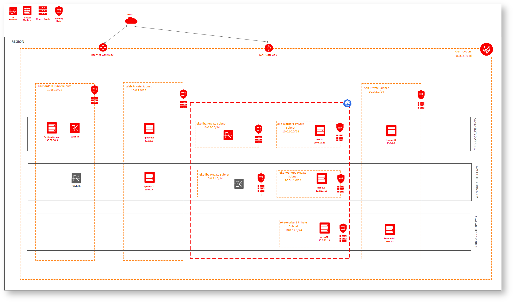

* OCI load balancer and bastion server in public subnet, everything else in private subnet
* Two apache web servers under two OCI loadbalancers
* Apache Web servers have access to Plain Tomcat host over AJP.
* Apache Web servers interact with OKE tomcat instaces through Kubernetes internal service over AJP
* There are two OKE private loadbalancer subnets and three oke private worker subnets.


## Implementation

Lets create 2 oke load balancer subnets and 3 oke worker subnets

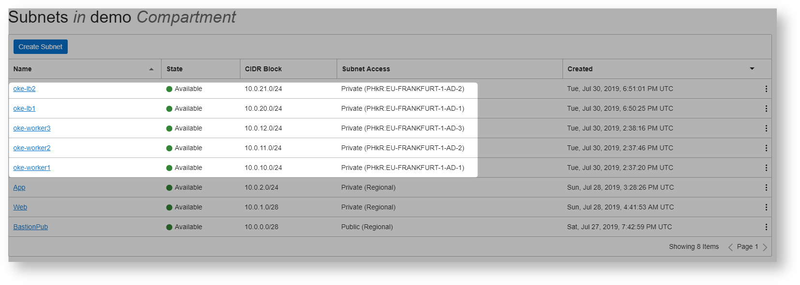

Lets create security lists

this is for loadbalancer to worker nodes

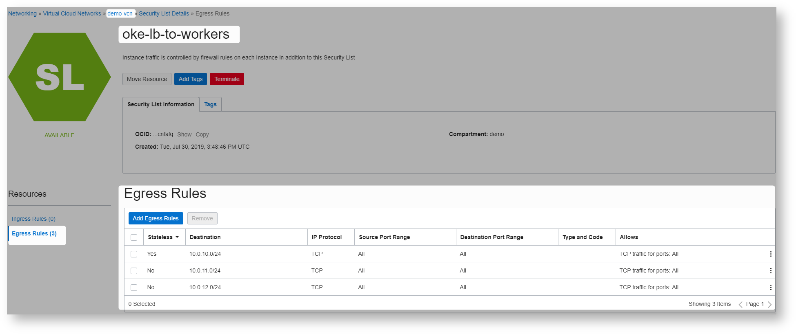


This is for worker nodes

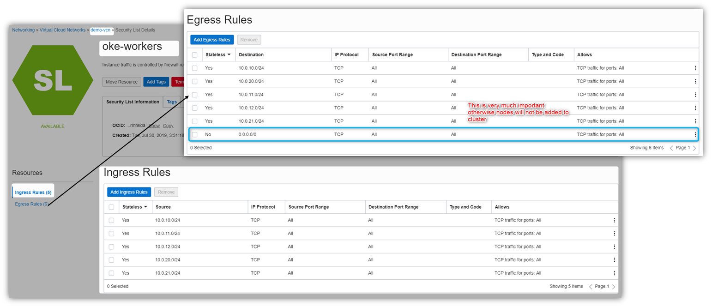

This is for apache to oke lbs

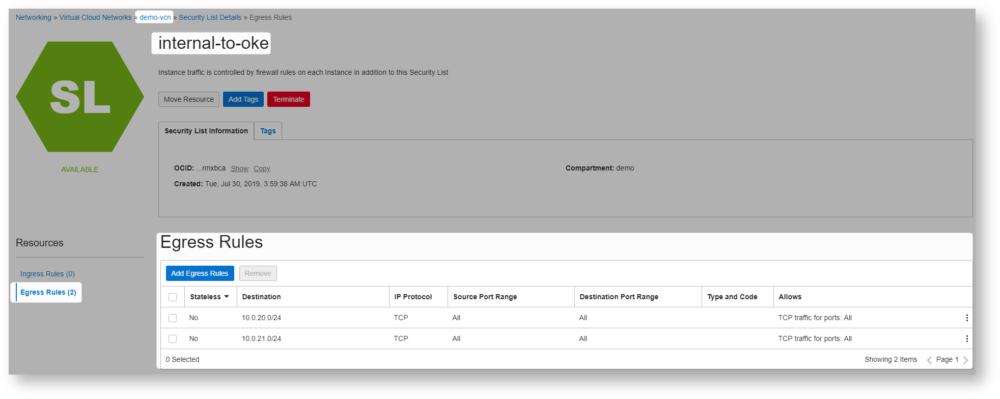

Here are the subnet details

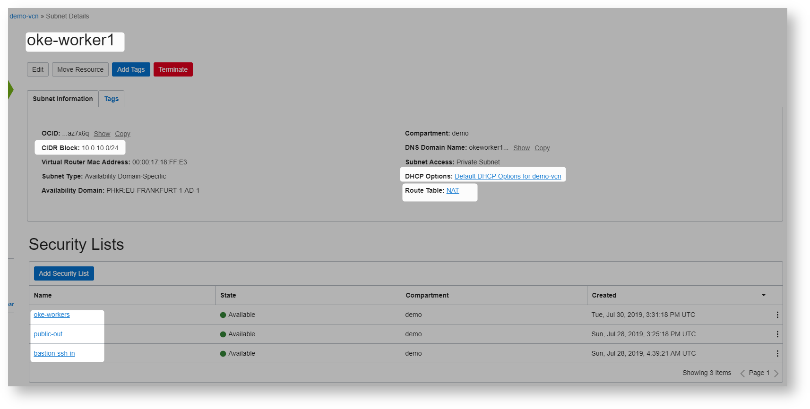

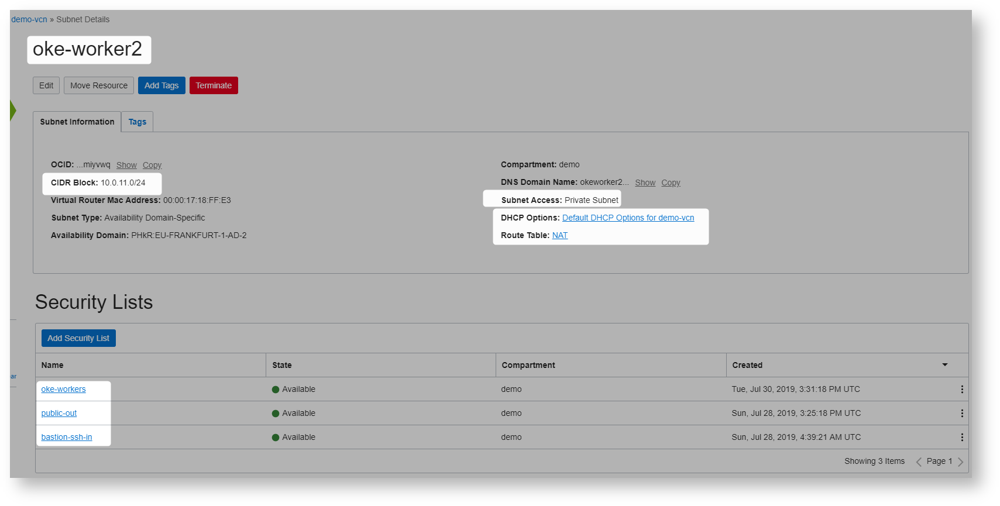

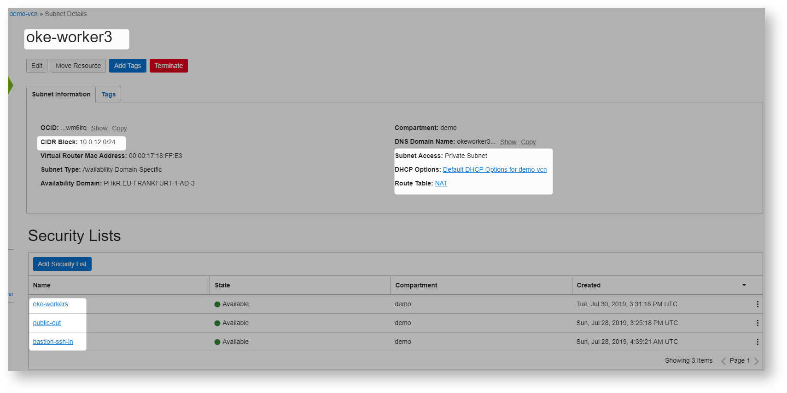


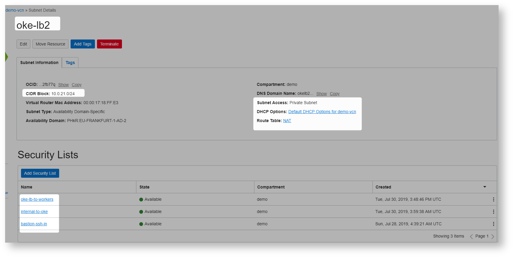

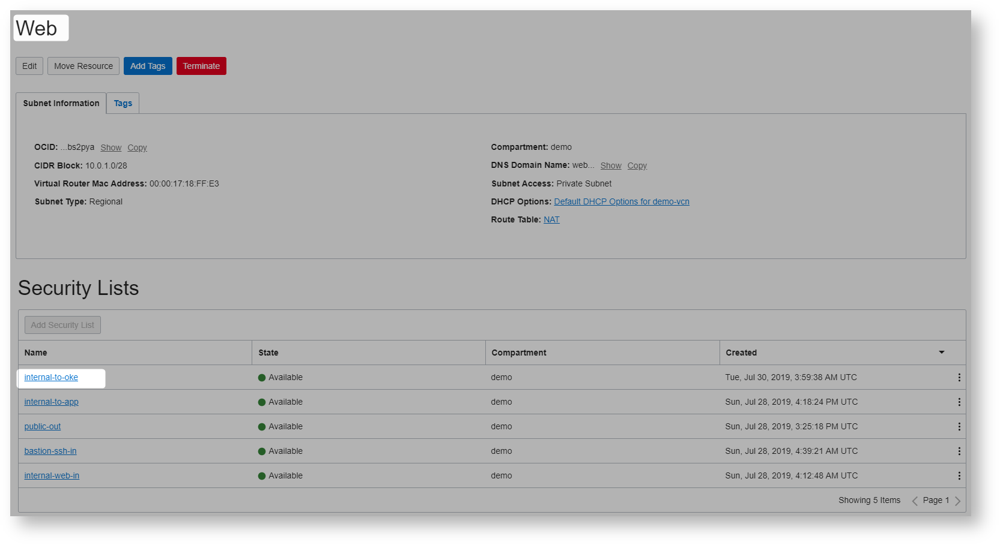

Lets create oke cluster

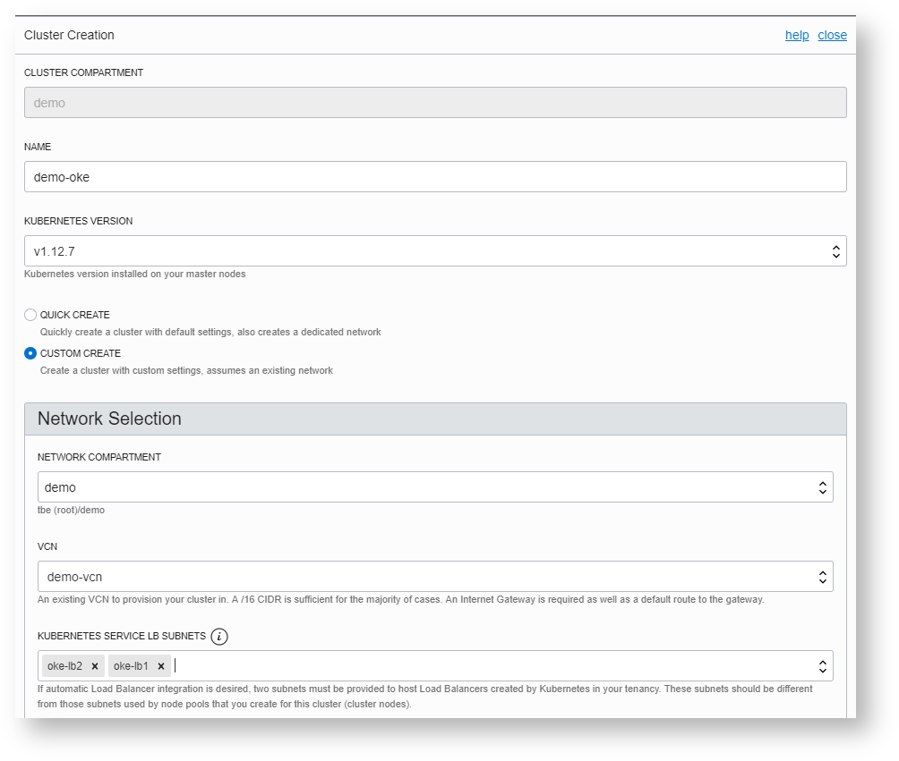

Lets use the bastion ssh key

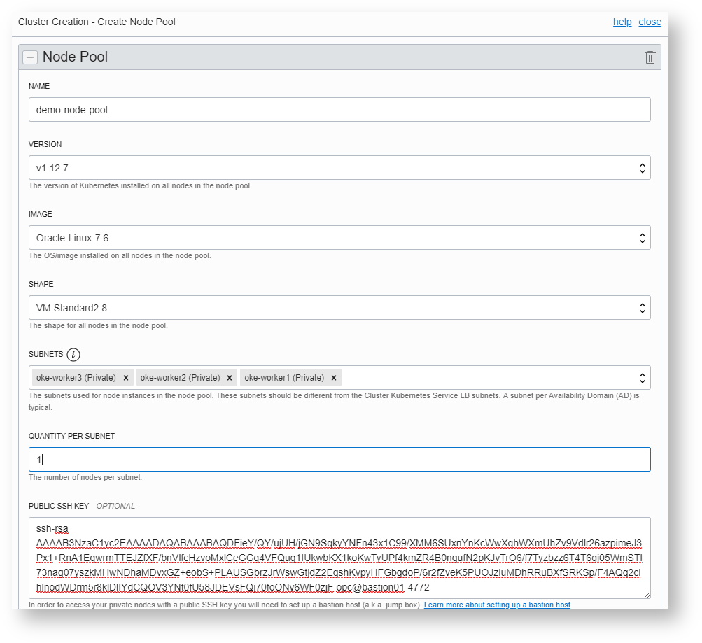

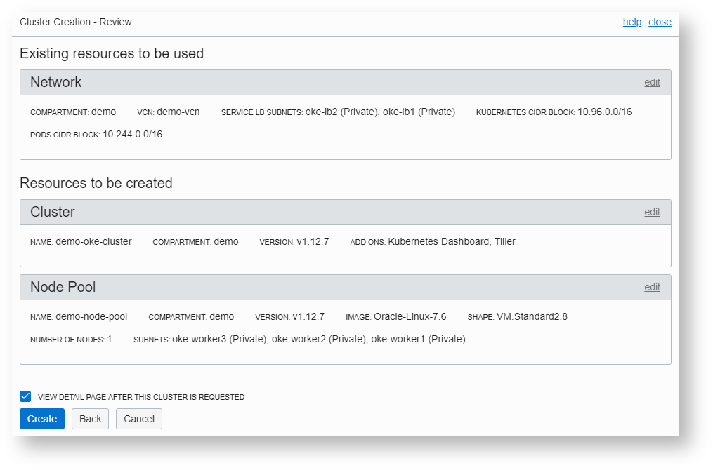

Cluster created

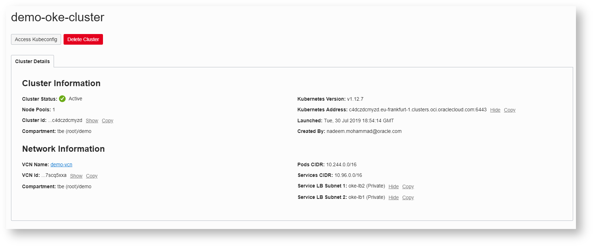

Node details

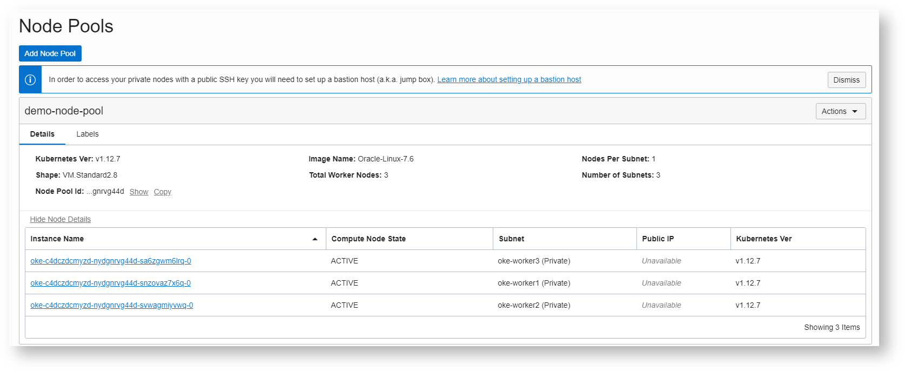

```Powershell
PS C:\WINDOWS\system32> kubectl get nodes -o=wide
NAME         STATUS    ROLES     AGE       VERSION   EXTERNAL-IP   OS-IMAGE                  KERNEL-VERSION                   CONTAINER-RUNTIME
10.0.10.11   Ready     node      7h        v1.12.7   <none>        Oracle Linux Server 7.6   4.14.35-1902.2.0.el7uek.x86_64   docker://18.9.1
10.0.11.10   Ready     node      7h        v1.12.7   <none>        Oracle Linux Server 7.6   4.14.35-1902.2.0.el7uek.x86_64   docker://18.9.1
10.0.12.13   Ready     node      7h        v1.12.7   <none>        Oracle Linux Server 7.6   4.14.35-1902.2.0.el7uek.x86_64   docker://18.9.1
PS C:\WINDOWS\system32>
```
able to ssh into nodes from bastion

```Powershell
[opc@bastion01-4772 ~]$ ssh opc@10.0.10.11
The authenticity of host '10.0.10.11 (10.0.10.11)' can't be established.
ECDSA key fingerprint is SHA256:AjoqfhDP/v1alWhfO6wkb4zNfSo6c6PI9hTmjy6n+cI.
ECDSA key fingerprint is MD5:65:56:a3:1a:c5:b8:e0:91:ea:59:60:df:e5:31:8d:87.
Are you sure you want to continue connecting (yes/no)? yes
Warning: Permanently added '10.0.10.11' (ECDSA) to the list of known hosts.
Oracle Linux Server 7.6
[opc@oke-c4dczdcmyzd-nydgnrvg44d-snzovaz7x6q-0 ~]$ exit
logout
Connection to 10.0.10.11 closed.
 
[opc@bastion01-4772 ~]$ ssh opc@10.0.11.10
The authenticity of host '10.0.11.10 (10.0.11.10)' can't be established.
ECDSA key fingerprint is SHA256:DFgXRe/cUha3luqY8NJKiTIfnSzndjUCxTydi2kQLjw.
ECDSA key fingerprint is MD5:96:8b:6e:08:c9:56:c9:7b:52:85:4b:1e:bf:e9:e3:5c.
Are you sure you want to continue connecting (yes/no)? yes
Warning: Permanently added '10.0.11.10' (ECDSA) to the list of known hosts.
Oracle Linux Server 7.6
[opc@oke-c4dczdcmyzd-nydgnrvg44d-svwagmiyvwq-0 ~]$ exit
logout
Connection to 10.0.11.10 closed.
 
[opc@bastion01-4772 ~]$ ssh opc@10.0.12.13
The authenticity of host '10.0.12.13 (10.0.12.13)' can't be established.
ECDSA key fingerprint is SHA256:1dMIxDQKxZ7mBCHKHTaCNuZ1bCIQmXikvLtFx6pEMFA.
ECDSA key fingerprint is MD5:27:b3:8d:b1:53:51:1e:25:11:be:22:83:a5:09:0f:61.
Are you sure you want to continue connecting (yes/no)? yes
Warning: Permanently added '10.0.12.13' (ECDSA) to the list of known hosts.
Oracle Linux Server 7.6
[opc@oke-c4dczdcmyzd-nydgnrvg44d-sa6zgwm6lrq-0 ~]$ exit
logout
Connection to 10.0.12.13 closed.
```

Lets create secret to be used in deployment descriptor

```Powershell
D:\practices\kubernetes\demo>docker login fra.ocir.io
Authenticating with existing credentials...
Login Succeeded
```


```Powershell
D:\practices\kubernetes\demo>kubectl create secret docker-registry ociregsecret --docker-server=fra.ocir.io --docker-username=demo/oracleidentitycloudservice/nadeem.mohammad@xyz.com --docker-email=nadeem.mohammad@xyz.com --docker-password=z{}ssfd-6LTIgtNGMG
secret "ociregsecret" created
```


```Powershell
D:\practices\kubernetes\demo>docker tag mnadeem/date-service:latest fra.ocir.io/demo/docker-registry/date-service:1.0
```


```Powershell
D:\practices\kubernetes\demo>docker push  fra.ocir.io/demo/docker-registry/date-service:1.0
The push refers to repository [fra.ocir.io/demo/docker-registry/date-service]
49932b8d1844: Pushed
fdb37f3a3522: Pushed
b7d850202de0: Pushed
d1d0b1719b96: Pushed
48988bb7b861: Pushed
edd61588d126: Pushed
9b9b7f3d56a0: Pushed
f1b5933fe4b5: Pushed
1.0: digest: sha256:2922633eec7e81183983e8f3654fa847da6feb4a1fafdf1b750c62d77714e62f size: 1989
```

```Powershell
apiVersion: v1
kind: Service
metadata:
  name: demo-date
  annotations:
   service.beta.kubernetes.io/oci-load-balancer-internal: "true"
spec:
  type: LoadBalancer
  ports:
  - name: http
    port: 8080
    targetPort: 8080
  - name: ajp
    port: 8009
    targetPort: 8009
  selector:
    app: demo-date
---
apiVersion: apps/v1
kind: Deployment
metadata:
  name: demo-date
spec:
  selector:
    matchLabels:
     app: demo-date
  replicas: 1
  template:
    metadata:
      labels:
        app: demo-date
    spec:
      containers:
      - name: demo-date 
        image: fra.ocir.io/demo/docker-registry/date-service:1.0
        ports:
        - containerPort: 8080
          name: http
        - containerPort: 8009
          name: ajp      
      imagePullSecrets:
      - name: ociregsecret
```
This would work as well
```Powershell
apiVersion: v1
kind: Service
metadata:
  name: demo-date
  annotations:
   service.beta.kubernetes.io/oci-load-balancer-internal: "true"
spec:
  type: LoadBalancer
  ports:
  - port: 8009
    targetPort: 8009
  selector:
    app: demo-date
---
apiVersion: apps/v1
kind: Deployment
metadata:
  name: demo-date
spec:
  selector:
    matchLabels:
     app: demo-date
  replicas: 1
  template:
    metadata:
      labels:
        app: demo-date
    spec:
      containers:
      - name: demo-date 
        image: fra.ocir.io/demo/docker-registry/date-service:1.0
        ports:
        - containerPort: 8080
          name: http
      imagePullSecrets:
      - name: ociregsecret 
```

```Powershell
D:\practices\kubernetes\demo>kubectl apply -f date-service.yml
service "demo-date" created
deployment.apps "demo-date" created
```

```Powershell
D:\practices\kubernetes\demo>kubectl get pods
NAME                         READY     STATUS    RESTARTS   AGE
demo-date-74fc5bf665-2gfwf   1/1       Running   0          16s
```

```Powershell
D:\practices\kubernetes\demo>kubectl get services
NAME         TYPE           CLUSTER-IP     EXTERNAL-IP   PORT(S)                         AGE
demo-date    LoadBalancer   10.96.226.54   10.0.21.4     8080:30386/TCP,8009:30569/TCP   2h
kubernetes   ClusterIP      10.96.0.1      <none>        443/TCP                         12h
 
D:\practices\kubernetes\demo>
```

Internal Load balancer automatically created.for service


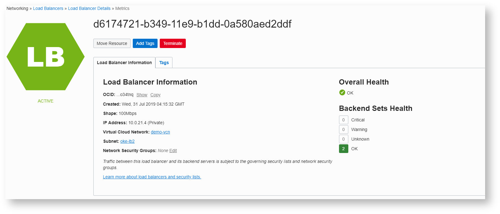

Add the following to apache instances (worker.properties under /etc/httpd/conf)


Here is the file
```Powershell
workers.apache_log=/var/log/httpd
 
worker.list=tomcat1Worker,tomcat2Worker,okeWorker
 
worker.tomcat1Worker.type=ajp13
worker.tomcat1Worker.host=10.0.2.2
worker.tomcat1Worker.port=8009
worker.tomcat1Worker.socket_keepalive=1
worker.tomcat1Worker.connection_pool_timeout=300
 
worker.tomcat2Worker.type=ajp13
worker.tomcat2Worker.host=10.0.2.3
worker.tomcat2Worker.port=8009
worker.tomcat2Worker.socket_keepalive=1
worker.tomcat2Worker.connection_pool_timeout=300
 
worker.okeWorker.type=ajp13
worker.okeWorker.host=10.0.21.4
worker.okeWorker.port=8009
worker.okeWorker.socket_keepalive=1
worker.okeWorker.connection_pool_timeout=300
```

Update the /etc/httpd/conf.modules.d/mod_jk.conf

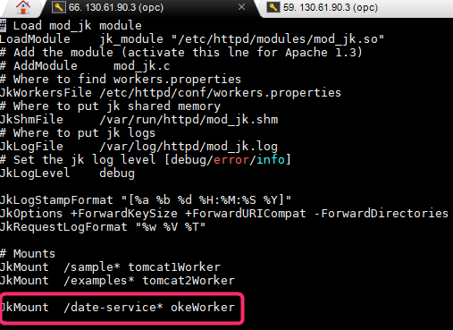

mod_jk.conf
```Powershell
# Load mod_jk module
LoadModule    jk_module "/etc/httpd/modules/mod_jk.so"
# Add the module (activate this lne for Apache 1.3)
# AddModule     mod_jk.c
# Where to find workers.properties
JkWorkersFile /etc/httpd/conf/workers.properties
# Where to put jk shared memory
JkShmFile     /var/run/httpd/mod_jk.shm
# Where to put jk logs
JkLogFile     /var/log/httpd/mod_jk.log
# Set the jk log level [debug/error/info]
JkLogLevel    debug
 
JkLogStampFormat "[%a %b %d %H:%M:%S %Y]"
JkOptions +ForwardKeySize +ForwardURICompat -ForwardDirectories
JkRequestLogFormat "%w %V %T"
 
# Mounts
JkMount  /sample* tomcat1Worker
JkMount  /examples* tomcat2Worker
 
JkMount  /date-service* okeWorker
```

Things are working like a charm.

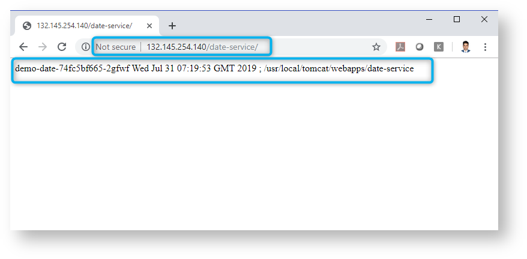

Final subnets

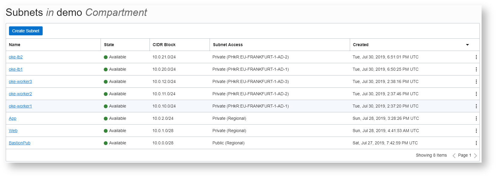


Final Security lists

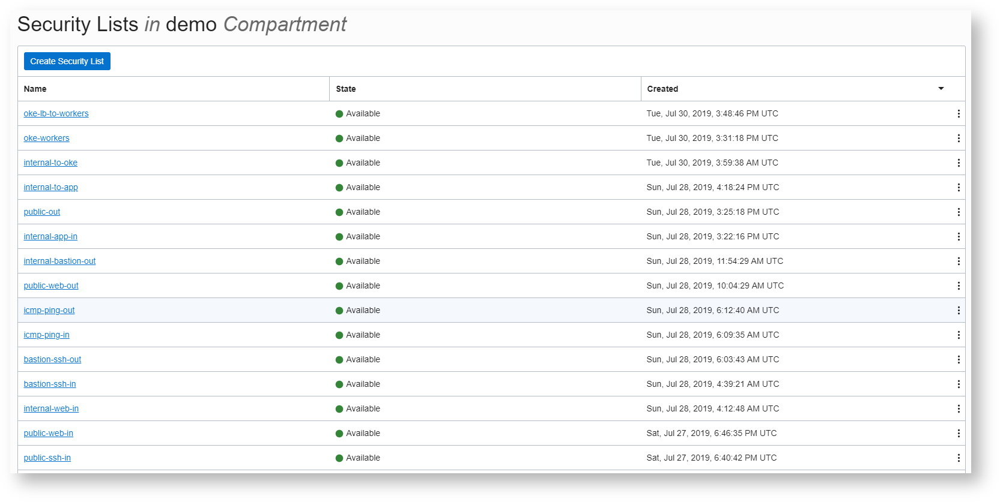


```Powershell

```

```Powershell

```

```Powershell

```

## References
* [Example Configuration](https://docs.cloud.oracle.com/iaas/Content/ContEng/Concepts/contengnetworkconfigexample.htm#ExampleSecurityListConfigurations-private)