[Home](../README.md)

# Attaching File Storage To Multiple Oracle Cloud Infrastructure (OCI) Compute Instances

Lets provision the following infrastructure

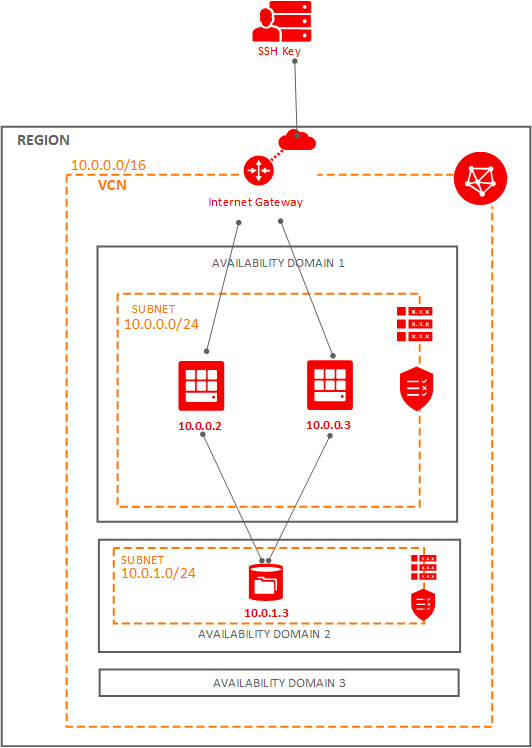

## Prerequisites

### SSH

Make sure to generate the [SSH key Pair](GeneratingSshKey.md), ignore if already done

### VNC

Make sure to [create VCN](CreatingVCN.md), ignore if already done.

### Compute Instance

Create 2 [compute instances](CreatingComputeInstance.md) in AD1


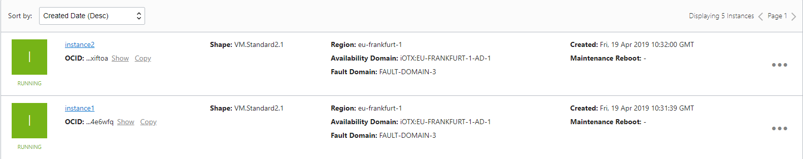


## Create File System

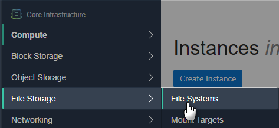


Click **Edit Details** on **File System Information**

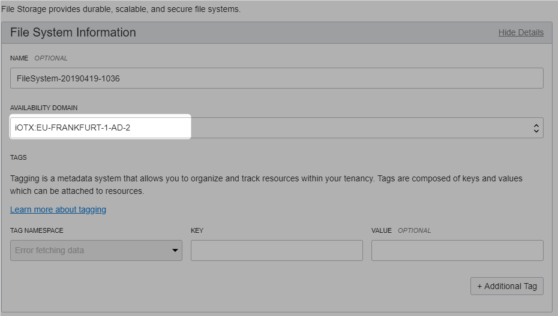

Click **Edit Details** on **Export Information**

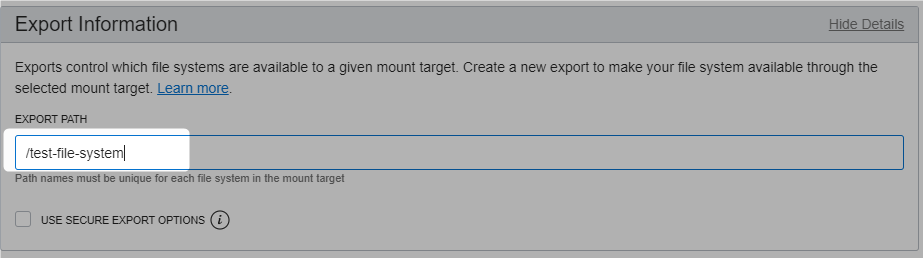

Here is the full information, **Click Create.**

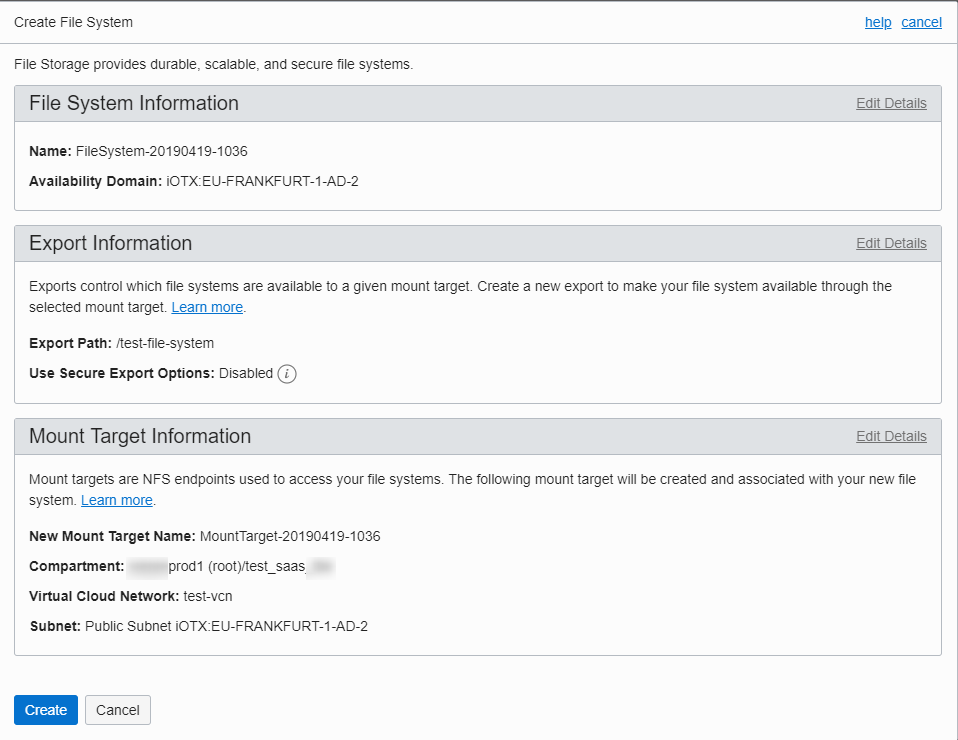


File System and Mount Target created in **AD2**

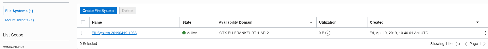


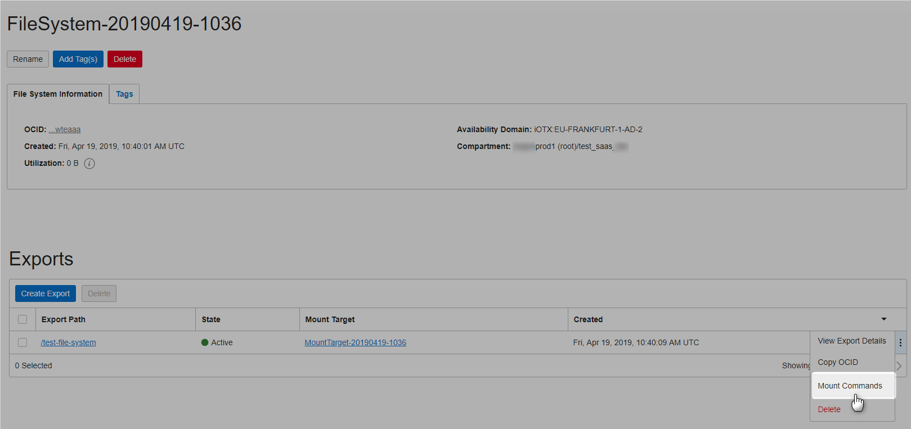


Will execute the following commands later on both instances after updating security list

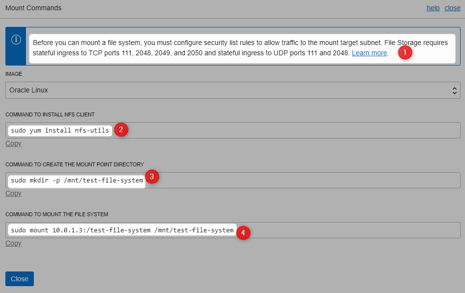


## Update VCN Security List

Refer [this](https://docs.cloud.oracle.com/iaas/Content/File/Tasks/securitylistsfilestorage.htm) for more detail, lets update the security list for AD2

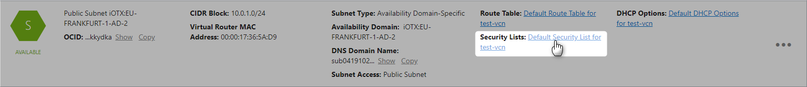

Click **Edit All Rules**

Add the following 4 Ingress Rules

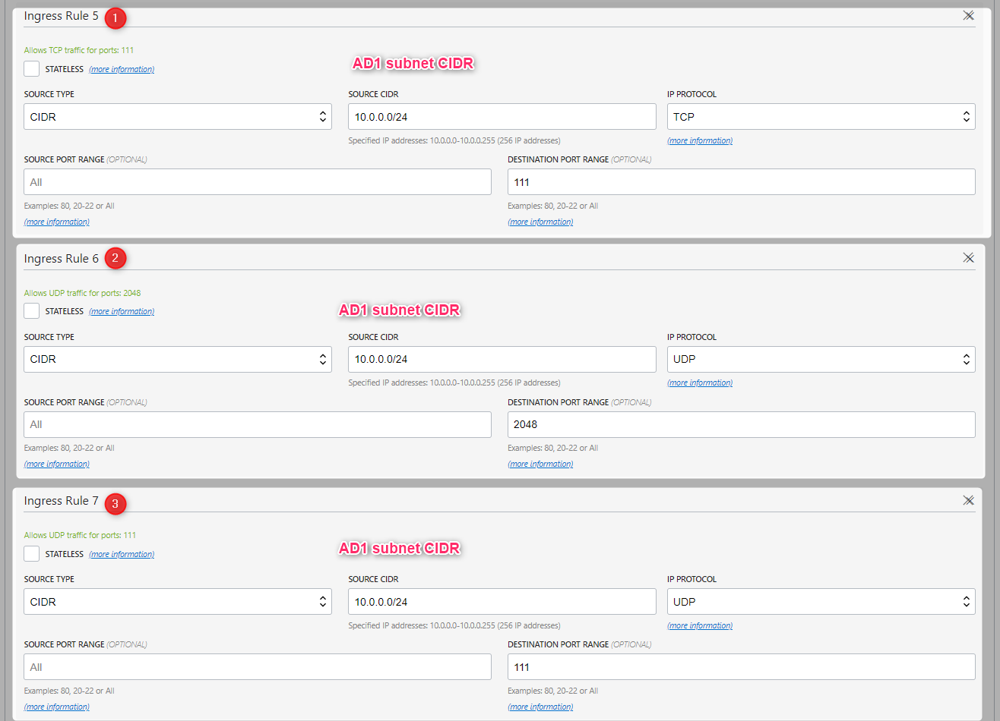

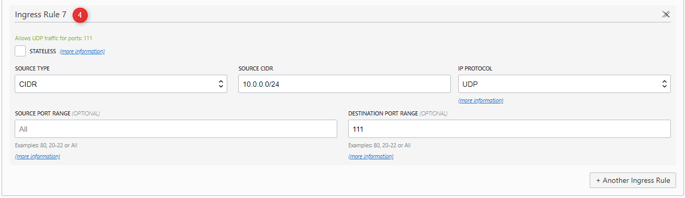

Add the following 3 egress rules

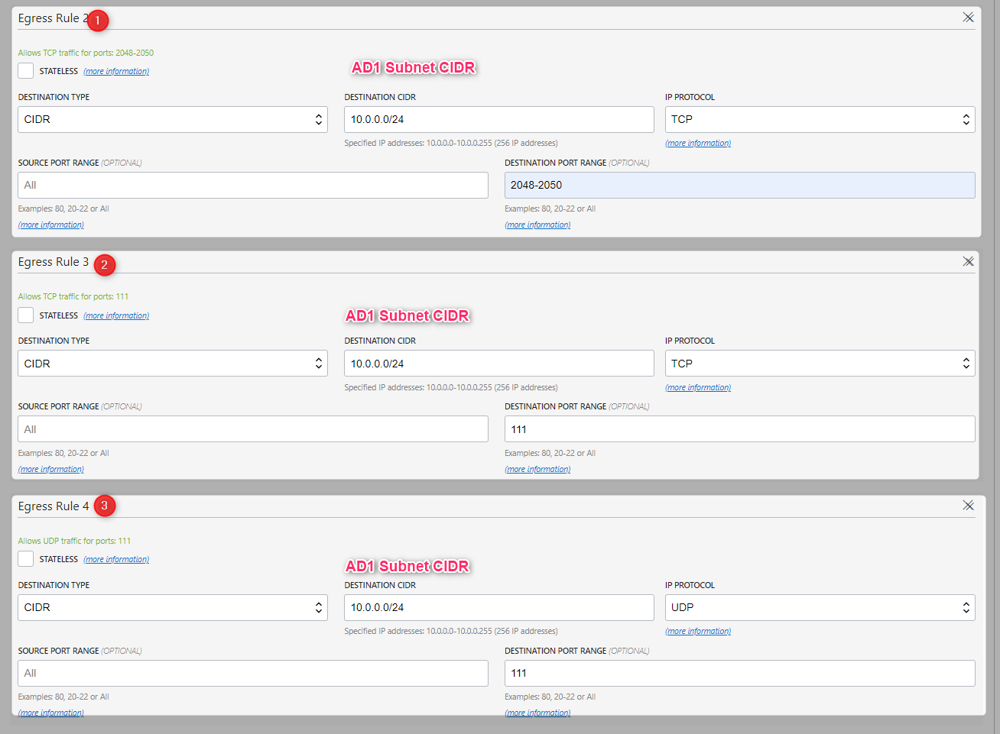


##Mount File Systems on Both instances

Lets now execute the mount commands

Refer [this](CreatingComputeInstance.md#connecting-to-provisioned-instance)  for more details on how to connect to compute instances


### Instance #1

```Powershell
[opc@instance1 ~]$ sudo yum install nfs-utils
Loaded plugins: langpacks, ulninfo
Package 1:nfs-utils-1.3.0-0.61.0.1.el7.x86_64 already installed and latest version
Nothing to do
```

```Powershell
[opc@instance1 ~]$ sudo mkdir -p /mnt/test-file-system
```

```Powershell
[opc@instance1 ~]$ sudo mount 10.0.1.3:/test-file-system /mnt/test-file-system
```

```Powershell
[opc@instance1 ~]$ cd  /mnt/test-file-system
[opc@instance1 test-file-system]$
```

```Powershell
[opc@instance1 test-file-system]$ sudo su -
[root@instance1 ~]# ls
[root@instance1 ~]# cd /mnt/test-file-system
```

### Instance #2

Repeat the above steps for Instance #2 as well.

```Powershell
[opc@instance2 ~]$ sudo yum install nfs-utils
Loaded plugins: langpacks, ulninfo
Package 1:nfs-utils-1.3.0-0.61.0.1.el7.x86_64 already installed and latest version
Nothing to do
```

```Powershell
[opc@instance2 ~]$ sudo mkdir -p /mnt/test-file-system
```

```Powershell
[opc@instance2 ~]$ sudo mount 10.0.1.3:/test-file-system /mnt/test-file-system
```

```Powershell
[opc@instance2 ~]$ cd  /mnt/test-file-system
[opc@instance2 test-file-system]$
```

```Powershell
[opc@instance2 test-file-system]$ sudo su -
[root@instance2 ~]# ls
[root@instance2 ~]# cd /mnt/test-file-system
```


Lets create a file in **instace#1**

```Powershell
[root@instance1 test-file-system]# echo "Hello" > sample.txt
[root@instance1 test-file-system]# cat sample.txt
Hello
[root@instance1 test-file-system]#
```

Available in **instance #2** as well.

```Powershell
[opc@instance2 ~]$ cd /mnt/test-file-system
[opc@instance2 test-file-system]$ ls
sample.txt
[opc@instance2 test-file-system]$ cat sample.txt
Hello
[opc@instance2 test-file-system]$
```


# Clean Up 

### Compute Instance

Refer [this](CreatingComputeInstance.md#termination) for more details on how to terminate Compute instances.

#### File Storage

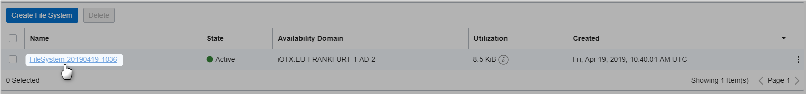


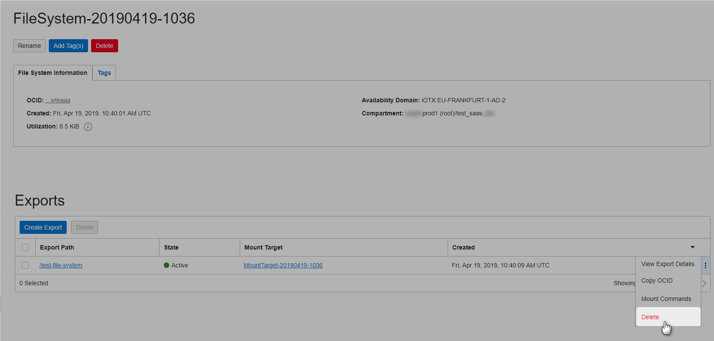

Confirm export delete


Delete filesystem

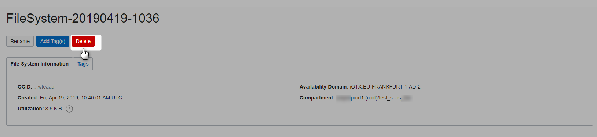

Confirm filesystem delete

Delete mount target

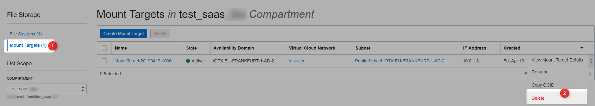

### VCN

Refer [this](CreatingVCN.md#terminating-vcn) for more details on how to terminate VCN.


# References
* [File Storage Overview](https://docs.cloud.oracle.com/iaas/Content/File/Concepts/filestorageoverview.htm)
