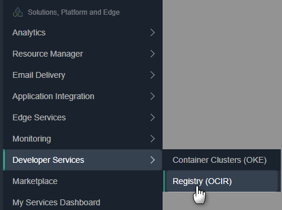
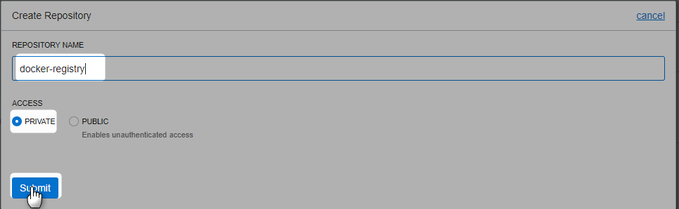
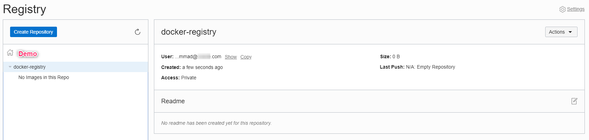
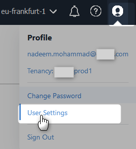
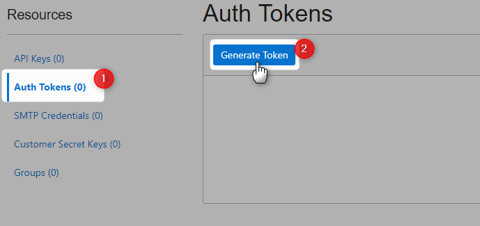
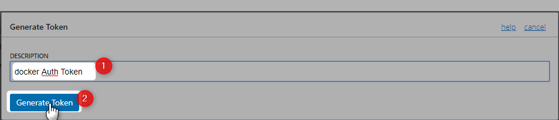
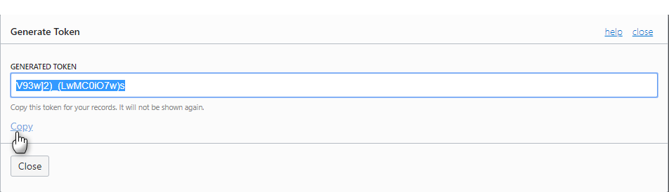
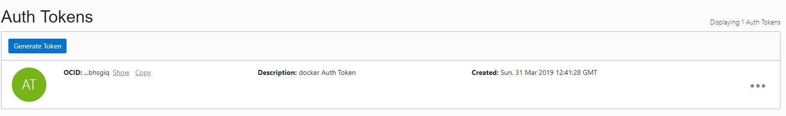
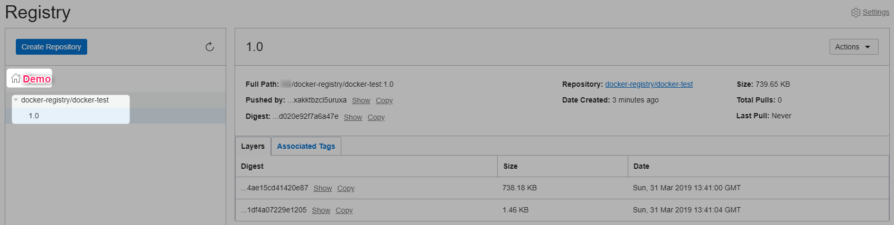
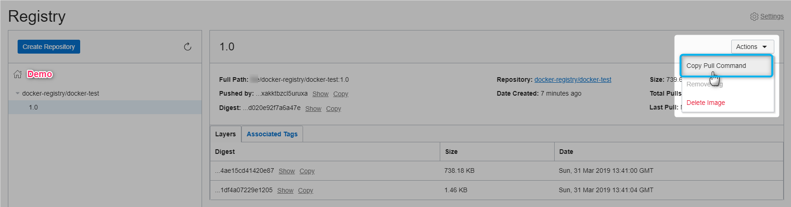

# Oracle Cloud Infrastructure (OCI) Container Registry

## Introduction

* OCI Registry makes it easy to store, share, and manage development artifacts like Docker images.
* It can be used as a private Docker registry for internal use, pushing and pulling Docker images to and from the Registry using the Docker V2 API and the standard Docker command line interface (CLI)
* It can be used as a public Docker registry, enabling any user with internet access and knowledge of the appropriate URL to pull images from public repositories in OCI Registry
 
## Create Registry (Optional)
It would be automatically created based on image tag (while pushing)






Registry created.



## Get Auth Token







Auth token created



paste the token in notepad.





## Docker login


`docker login <region-code>.ocir.io`

Ger region codes from [here](https://docs.cloud.oracle.com/iaas/Content/Registry/Concepts/registryprerequisites.htm)


When prompted, enter your username in the format <tenancy_name>/<username>. For example, demo/nadeem.mohammad@xyz.com.

If your tenancy is federated with Oracle Identity Cloud Service, use the format <tenancy-name>/oracleidentitycloudservice/<username>.

User name : demo/oracleidentitycloudservice/nadeem.mohammad@xyz.com

Password : enter the auth token you copied earlier 


## Docker Push
you might want to group together multiple versions of the **demo-web-app** image in the **demo** tenancy in the Frankfurt region into a repository called **docker-registry** as follows

`fra.ocir.io/demo/docker-registry/demo-web-app:4.6.3`

in the following format

<region-code>.ocir.io/<tenancy-name>/<repo-name>/<image-name>:<tag>

Refer [this](https://docs.cloud.oracle.com/iaas/Content/Registry/Concepts/registrywhatisarepository.htm) for more details

No Images

```Powershell
D:\>docker images
REPOSITORY          TAG                 IMAGE ID            CREATED             SIZE
D:\>
```

**Note**

* If you push an image that includes a repository in the image name and the repository doesn't already exist (for example, fra.ocir.io/demo/docker-registry/demo-web-app:7.5.2), a new private repository is created in Oracle Cloud Infrastructure Registry.
* If you push an image that doesn't explicitly include a repository in the image name (for example, fra.ocir.io/demo/demo-web-app:7.5.2), the image's name (demo-web-app) is used as the name of a private repository.


### Pull An Image
Lets create a docker image

```Powershell
D:\>docker pull busybox
Using default tag: latest
latest: Pulling from library/busybox
697743189b6d: Pull complete
Digest: sha256:061ca9704a714ee3e8b80523ec720c64f6209ad3f97c0ff7cb9ec7d19f15149f
Status: Downloaded newer image for busybox:latest

D:\>
```


```Powershell
D:\>docker images
REPOSITORY          TAG                 IMAGE ID            CREATED             SIZE
busybox             latest              d8233ab899d4        6 weeks ago         1.2MB

D:\>
```

### Tag it. 

To push an image to a private registry and not the central Docker registry you must tag it with the registry hostname and port (if needed). More on [tagging](https://docs.docker.com/engine/reference/commandline/tag/)

```Powershell
D:\>docker tag busybox:latest fra.ocir.io/demo/docker-registry/docker-test:1.0

D:\>
```
Image tagged

```Powershell
D:\>docker images
REPOSITORY                                    TAG                 IMAGE ID            CREATED             SIZE
busybox                                       latest              d8233ab899d4        6 weeks ago         1.2MB
fra.ocir.io/demo/docker-registry/docker-test   1.0                 d8233ab899d4        6 weeks ago         1.2MB

D:\>
```
### Push to OCI Registry


```Powershell
D:\>docker push fra.ocir.io/demo/docker-registry/docker-test:1.0
The push refers to repository [fra.ocir.io/demo/docker-registry/docker-test]
adab5d09ba79: Pushed
1.0: digest: sha256:4415a904b1aca178c2450fd54928ab362825e863c0ad5452fd020e92f7a6a47e size: 527

D:\>
```
Image pushed






If required you can execute the following command to pull the image

```Powershell
docker pull fra.ocir.io/demo/docker-registry/docker-test:1.0
```

# References
* [OCI Registry Overview](https://docs.cloud.oracle.com/iaas/Content/Registry/Concepts/registryoverview.htm)
* [Pulling Images from Registry during Kubernetes Deployment](https://docs.cloud.oracle.com/iaas/Content/Registry/Tasks/registrypullingimagesfromocir.htm)