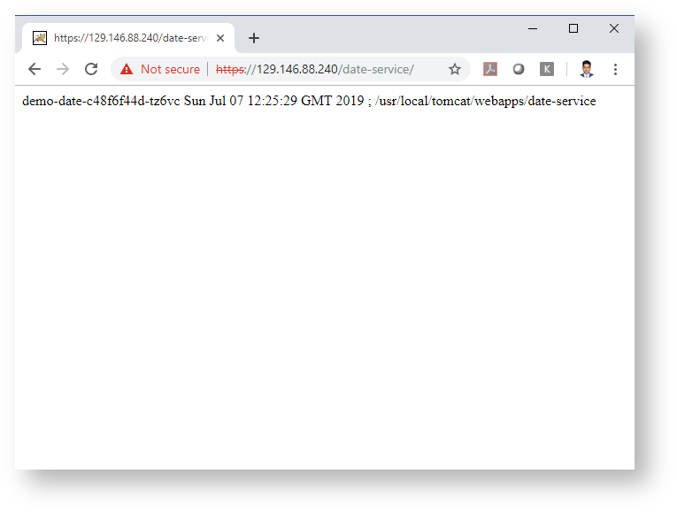

[Home](../README.md)

# OKE Ingress Controller

## Benifits

* Normally, a LoadBalancer service is created for each public system that has to be exposed, which exposes a public ip address as well, which can end up being expensive.
* Ingress gives a way to route requests to services based on the request host or path, decreasing the number of public ip address to just one.
* The Ingress Controller listens to the Kubernetes API for Ingress resources and routes these requests to the pods according to these rules.
* Essentially, an Ingress Controller is a system that is able to do reverse proxying.


# Prerequisites
Example Backend

Download the [project](https://github.com/enabling-cloud/docker-compose-svc-com) and build the the two images, 

```Powershell
date-service> mvn clean package docker:build
ui> mvn clean package docker:build
```

```Powershell
D:\practices\kubernetes\app>docker tag mnadeem/date-service:latest phx.ocir.io/demo-tenancy/docker-registry/date-service:1.0
```

```Powershell
PS D:\practices\kubernetes\app> docker push phx.ocir.io/demo-tenancy/docker-registry/date-service:1.0
The push refers to repository [phx.ocir.io/demo-tenancy/docker-registry/date-service]
49932b8d1844: Pushed
fdb37f3a3522: Pushed
b7d850202de0: Pushed
d1d0b1719b96: Pushed
48988bb7b861: Pushed
edd61588d126: Pushed
9b9b7f3d56a0: Pushed
f1b5933fe4b5: Pushed
1.0: digest: sha256:2922633eec7e81183983e8f3654fa847da6feb4a1fafdf1b750c62d77714e62f size: 1989
```

demo-date-svc-ngx.yml

```Powershell
apiVersion: v1
kind: Service
metadata:
  name: demo-date-svc
spec:
  type: LoadBalancer
  ports:
  - port: 8088
    protocol: TCP
    targetPort: 8080
  selector:
    app: demo-date
  type: ClusterIP
   
---
apiVersion: apps/v1
kind: Deployment
metadata:
  name: demo-date
spec:
  selector:
    matchLabels:
     app: demo-date
  replicas: 2
  template:
    metadata:
      labels:
        app: demo-date
    spec:
      containers:
      - name: demo-date  
        image: phx.ocir.io/demo-tenancy/docker-registry/date-service:1.0
        ports:
        - containerPort: 8080
      imagePullSecrets:
      - name: ocirsecret
```


```Powershell
PS D:\practices\kubernetes\app> kubectl apply -f .\demo-date-svc-ngx.yml
service "demo-date-svc" created
deployment.apps "demo-date" created
```

#Creating Resources


## Kubernetes RBAC


Grant the Kubernetes RBAC cluster-admin clusterrole to the user

```Powershell
kubectl create clusterrolebinding <my-cluster-admin-binding> --clusterrole=cluster-admin --user=<user_OCID>
```

where <my-cluster-admin-binding> is a string of your choice to be used as the name for the binding between the user and the Kubernetes RBAC cluster-admin clusterrole

```Powershell
PS D:\practices\kubernetes\app> kubectl create clusterrolebinding mnadeem_clst_adm --clusterrole=cluster-admin --user=ocid1.user.oc1..aaaaaaaaq3g4b42vj33h2p4iibye7xlpu7jnzzeosuzuwxakktbzcl5uruxa
clusterrolebinding.rbac.authorization.k8s.io "mnadeem_clst_adm" created
PS D:\practices\kubernetes\app>
```

## Create mandatory resources

```Powershell
PS D:\practices\kubernetes\app> kubectl apply -f https://raw.githubusercontent.com/kubernetes/ingress-nginx/master/deploy/static/mandatory.yaml
namespace "ingress-nginx" created
configmap "nginx-configuration" created
configmap "tcp-services" created
configmap "udp-services" created
serviceaccount "nginx-ingress-serviceaccount" created
clusterrole.rbac.authorization.k8s.io "nginx-ingress-clusterrole" created
role.rbac.authorization.k8s.io "nginx-ingress-role" created
rolebinding.rbac.authorization.k8s.io "nginx-ingress-role-nisa-binding" created
clusterrolebinding.rbac.authorization.k8s.io "nginx-ingress-clusterrole-nisa-binding" created
deployment.apps "nginx-ingress-controller" created
```

## Ingress Controller
 ingress controller service as a load balancer service

cloud-generic.yaml
```Powershell
kind: Service
apiVersion: v1
metadata:
  name: ingress-nginx
  namespace: ingress-nginx
  labels:
    app.kubernetes.io/name: ingress-nginx
    app.kubernetes.io/part-of: ingress-nginx
spec:
  type: LoadBalancer
  selector:
    app.kubernetes.io/name: ingress-nginx
    app.kubernetes.io/part-of: ingress-nginx
  ports:
    - name: http
      port: 80
      targetPort: http
    - name: https
      port: 443
      targetPort: https
```

```Powershell
PS D:\practices\kubernetes\app>  kubectl apply -f cloud-generic.yml
service "ingress-nginx" created
```

Verify the service

```Powershell
PS D:\practices\kubernetes\app>  kubectl get svc -n ingress-nginx
NAME            TYPE           CLUSTER-IP      EXTERNAL-IP   PORT(S)                      AGE
ingress-nginx   LoadBalancer   10.96.131.117   <pending>     80:31671/TCP,443:32739/TCP   11s
 
 
PS D:\practices\kubernetes\app>  kubectl get svc -n ingress-nginx
NAME            TYPE           CLUSTER-IP      EXTERNAL-IP      PORT(S)                      AGE
ingress-nginx   LoadBalancer   10.96.131.117   129.146.88.240   80:31671/TCP,443:32739/TCP   43s
```

```Powershell
PS D:\practices\kubernetes\app> kubectl get svc --all-namespaces
NAMESPACE       NAME                   TYPE           CLUSTER-IP      EXTERNAL-IP       PORT(S)                      AGE
default         demo-date-svc          ClusterIP      10.96.230.80    <none>            8088/TCP                     18s
default         kubernetes             ClusterIP      10.96.0.1       <none>            443/TCP                      1d
default         qa-crm                 LoadBalancer   10.96.166.129   129.146.158.251   80:31091/TCP                 22h
ingress-nginx   ingress-nginx          LoadBalancer   10.96.131.117   129.146.88.240    80:31671/TCP,443:32739/TCP   15m
kube-system     kube-dns               ClusterIP      10.96.5.5       <none>            53/UDP,53/TCP                1d
kube-system     kubernetes-dashboard   ClusterIP      10.96.90.38     <none>            443/TCP                      1d
kube-system     tiller-deploy          ClusterIP      10.96.134.35    <none>            44134/TCP                    1d
```

# Bind controller with backend

Create [TLS Secret](CreatingTLSSecrect.md)

**Bind Service**

demo-date-svc-ngx.yml

```Powershell
apiVersion: extensions/v1beta1
kind: Ingress
metadata:
  name: demo-date-ing
  annotations:
    kubernetes.io/ingress.class: "nginx"
spec:
  tls:
  - secretName: tls-secret
  rules:
  - http:
      paths:
      - backend:
          serviceName: demo-date-svc
          servicePort: 8088
```

```Powershell
PS D:\practices\kubernetes\app> kubectl apply -f .\ingress.yml
ingress.extensions "demo-date-ing" created
PS D:\practices\kubernetes\app>

```

Another way to define Ingress

```Powershell
apiVersion: extensions/v1beta1
kind: Ingress
metadata:
  name: demo-date-ing
  annotations:
    ingress.kubernetes.io/rewrite-target: /
spec:
  rules:
  - http:
      paths:
        - path: /date-service
          backend:
            serviceName: demo-date-svc
            servicePort: 8088
        - path: /ui
          backend:
            serviceName: ui-svc
            servicePort: 8088
```

# Testing

```Powershell
$ curl -I http://129.146.88.240
  % Total    % Received % Xferd  Average Speed   Time    Time     Time  Current
                                 Dload  Upload   Total   Spent    Left  Speed
  0   172    0     0    0     0      0      0 --:--:-- --:--:-- --:--:--     0HTTP/1.1 308 Permanent Redirect
Server: nginx/1.15.10
Date: Sun, 07 Jul 2019 12:23:57 GMT
Content-Type: text/html
Content-Length: 172
Connection: keep-alive
Location: https://129.146.88.240/
```

```Powershell
$ curl -ikL http://129.146.88.240/date-service
  % Total    % Received % Xferd  Average Speed   Time    Time     Time  Current
                                 Dload  Upload   Total   Spent    Left  Speed
100   172  100   172    0     0    297      0 --:--:-- --:--:-- --:--:--   305
  0     0    0     0    0     0      0      0 --:--:--  0:00:04 --:--:--     0
100   110  100   110    0     0     21      0  0:00:05  0:00:05 --:--:--     0HTTP/1.1 308 Permanent Redirect
Server: nginx/1.15.10
Date: Sun, 07 Jul 2019 12:25:54 GMT
Content-Type: text/html
Content-Length: 172
Connection: keep-alive
Location: https://129.146.88.240/date-service
 
HTTP/2 302
server: nginx/1.15.10
date: Sun, 07 Jul 2019 12:25:58 GMT
location: /date-service/
strict-transport-security: max-age=15724800; includeSubDomains
 
HTTP/2 200
server: nginx/1.15.10
date: Sun, 07 Jul 2019 12:25:58 GMT
content-type: text/html;charset=ISO-8859-1
content-length: 110
set-cookie: JSESSIONID=1FEB33B8AC00C7AA45B6EF8EA1938429; Path=/date-service; HttpOnly
strict-transport-security: max-age=15724800; includeSubDomains
 
 
 
 
 
 
demo-date-c48f6f44d-tz6vc Sun Jul 07 12:25:58 GMT 2019  ;  /usr/local/tomcat/webapps/date-service
```




# Editing

```Powershell
PS D:\practices\kubernetes\app> kubectl get ingress
NAME            HOSTS     ADDRESS          PORTS     AGE
demo-date-ing   *         129.146.88.240   80        2h
```


```PS 
D:\practices\kubernetes\app> kubectl edit ingress demo-date-ing
   ingress.extensions "demo-date-ing" editedPowershell

```

```Powershell
PS D:\practices\kubernetes\app> kubectl describe ingress demo-date-ing
Name:             demo-date-ing
Namespace:        default
Address:          129.146.88.240
Default backend:  default-http-backend:80 (<none>)
Rules:
  Host  Path  Backends
  ----  ----  --------
  *
        /date-service   demo-date-svc:8088 (<none>)
        /abc            demo-date-svc:8088 (<none>)
Annotations:
  ingress.kubernetes.io/rewrite-target:              /
  kubectl.kubernetes.io/last-applied-configuration:  {"apiVersion":"extensions/v1beta1","kind":"Ingress","metadata":{"annotations":{"ingress.kubernetes.io/rewrite-target":"/"},"name":"demo-date-ing","namespace":"default"},"spec":{"rules":[{"http":{"paths":[{"backend":{"serviceName":"demo-date-svc","servicePort":8088},"path":"/date-service"},{"backend":{"serviceName":"demo-date-svc","servicePort":8088},"path":"/pqr"}]}}]}}
 
Events:
  Type    Reason  Age               From                      Message
  ----    ------  ----              ----                      -------
  Normal  CREATE  2h                nginx-ingress-controller  Ingress default/demo-date-ing
  Normal  UPDATE  22s (x4 over 2h)  nginx-ingress-controller  Ingress default/demo-date-ing
PS D:\practices\kubernetes\app>
```
