# Oracle Database UP And Running On Oracle Cloud Infrastructure (OCI)

Lets provision the following infrastructure

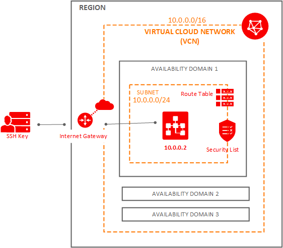

## Prerequisites

### SSH

Make sure to generate the [SSH key Pair](GeneratingSshKey.md), ignore if already done

### VNC

Make sure to [create VCN](CreatingVCN.md), ignore if already done.


## Create Database VM


### Step 1 : Navigate to Database Option

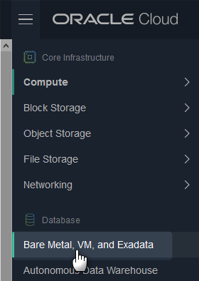

Click **Launch DB Systems**

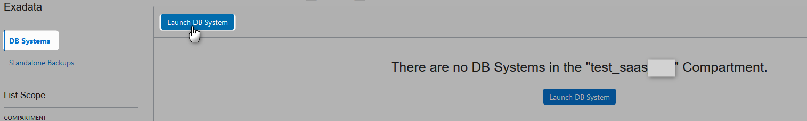


### Step 2 : Provide Database System Infromation


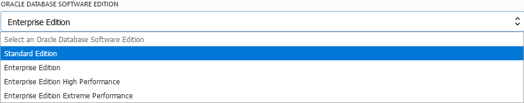

### Step 3 : Provide License Information


### Step 4 : Add SSH Key

Copy public key

```Powershell
nadeem@nadeem-LAP MINGW64 ~/.ssh
$ clip < id_rsa.pub

nadeem@nadeem-LAP MINGW64 ~/.ssh
$

```
Paste the SSH key

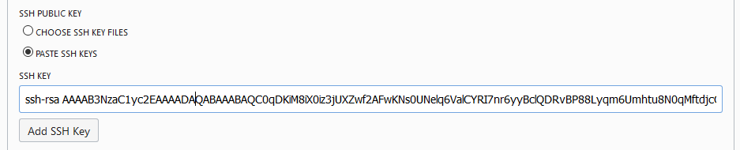

### Step 5 : Provide Network Infromation

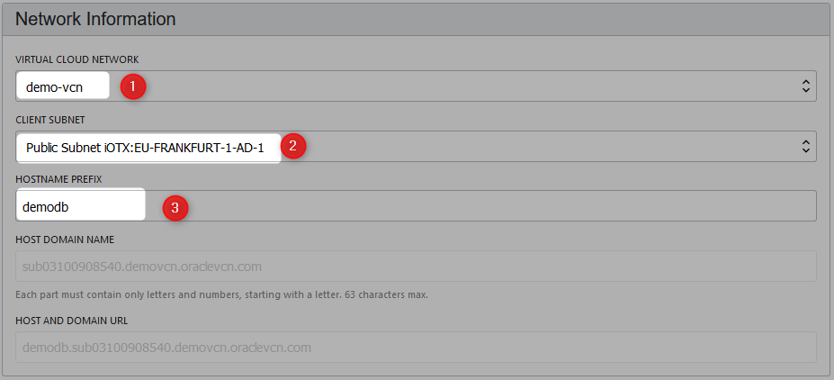


### Step 6 : Provide Database Information

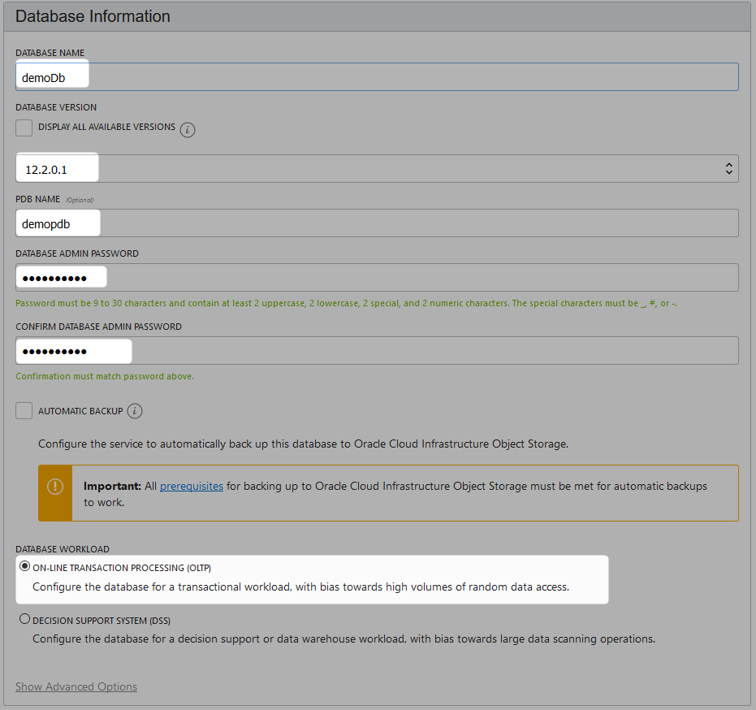

Click **Launch DB System**


### Step 7 : Wait For Instance Being Provisioned

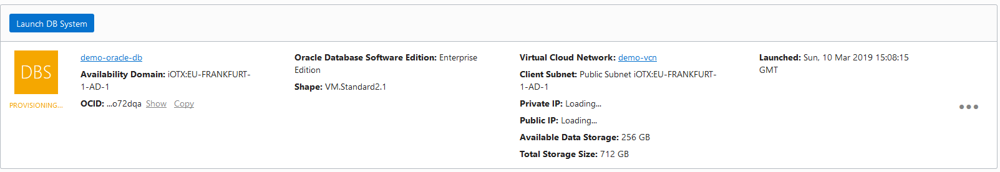

It takes more than 30 minutes.

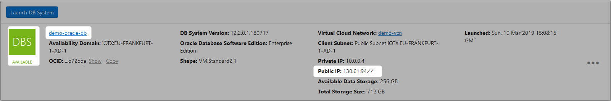

public ip address is **130.61.94.44**


## Connect From the DB Provisioned Machine

ssh into **130.61.94.44**

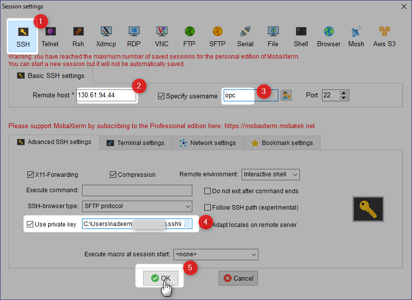


```Powershell
Authenticating with public key "imported-openssh-key"
     ┌────────────────────────────────────────────────────────────────────┐
     │                        • MobaXterm 10.5 •                          │
     │            (SSH client, X-server and networking tools)             │
     │                                                                    │
     │ ➤ SSH session to opc@130.61.94.44                                  │
     │   • SSH compression : ✔                                            │
     │   • SSH-browser     : ✔                                            │
     │   • X11-forwarding  : ✔  (remote display is forwarded through SSH) │
     │   • DISPLAY         : ✔  (automatically set on remote server)      │
     │                                                                    │
     │ ➤ For more info, ctrl+click on help or visit our website           │
     └────────────────────────────────────────────────────────────────────┘

/usr/bin/xauth:  file /home/opc/.Xauthority does not exist
[opc@demodb ~]$

```

```Powershell
[opc@demodb ~]$ sudo su - oracle
[oracle@demodb ~]$  . oraenv
ORACLE_SID = [demoDb] ? demoDb
The Oracle base has been set to /u01/app/oracle
[oracle@demodb ~]$
```

```Powershell
[oracle@demodb ~]$ sqlplus / as sysdba

SQL*Plus: Release 12.2.0.1.0 Production on Sun Mar 10 16:35:17 2019

Copyright (c) 1982, 2016, Oracle.  All rights reserved.


Connected to:
Oracle Database 12c Enterprise Edition Release 12.2.0.1.0 - 64bit Production

SQL> show pdbs;

    CON_ID CON_NAME                       OPEN MODE  RESTRICTED
---------- ------------------------------ ---------- ----------
         2 PDB$SEED                       READ ONLY  NO
         3 DEMOPDB                        READ WRITE NO
SQL> ALTER SESSION SET CONTAINER = DEMOPDB
  2  ;

Session altered.

SQL> exit
Disconnected from Oracle Database 12c Enterprise Edition Release 12.2.0.1.0 - 64bit Production
[oracle@demodb ~]$


```


## Connect from Other Machine

* [Connecting To DB](https://docs.cloud.oracle.com/iaas/Content/Database/Tasks/connectingDB.htm)
* [Youtbue : Connect SQL Developer](https://youtu.be/T0vN8m6yfao)
* [OCI Database](https://youtu.be/uwUvmAGk6gM)


## Clean Up 

### Database VM

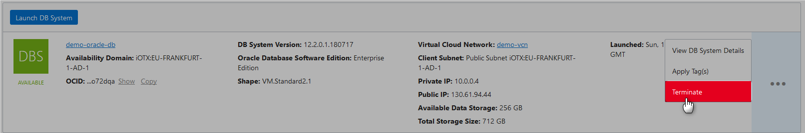

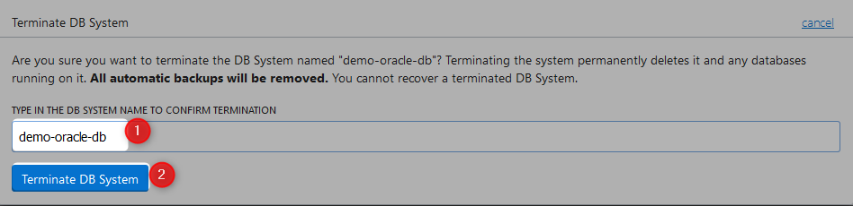

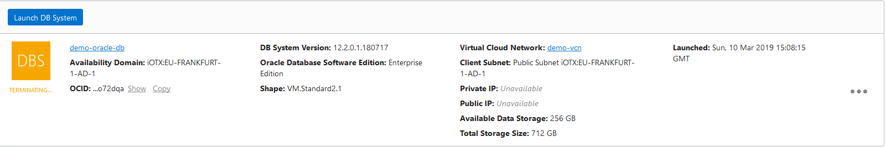

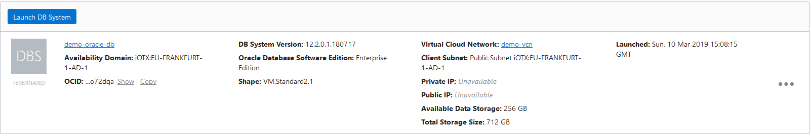


### VCN

Refer [this](CreatingVCN.md#terminating-vcn) for more details on how to terminate VCN.

