[Home](../README.md)

# Public Private Subnet Communication on Oracle Cloud Infrastructure (OCI)

# Design

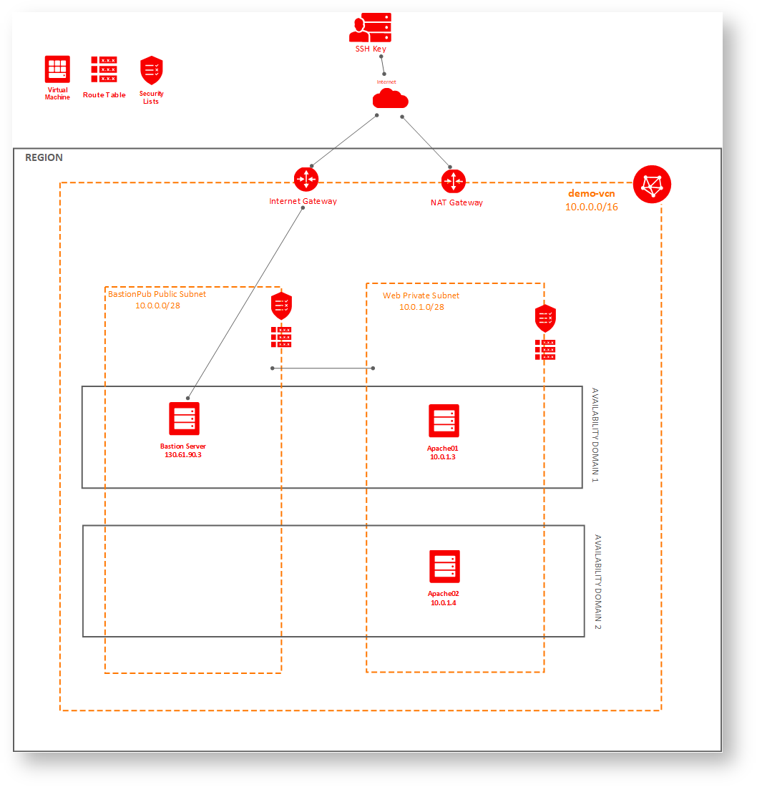

# Implementation

Will just create nodes, and not worry about software installation in this use case.

## Create Empty VCN
Don't use "plus related resources"

This will create default dhcp options and default route table.

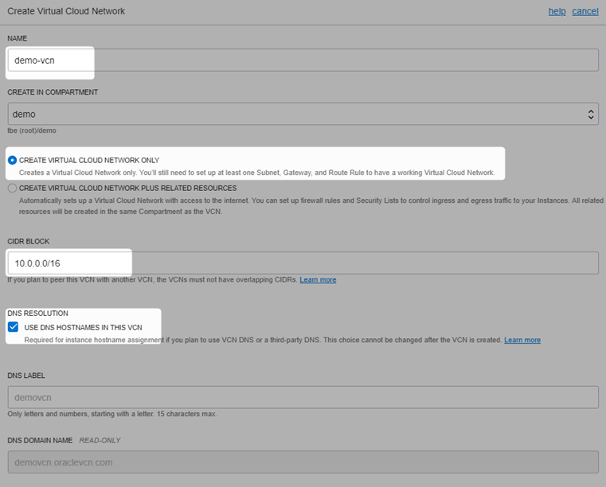

VCN created, without subnet

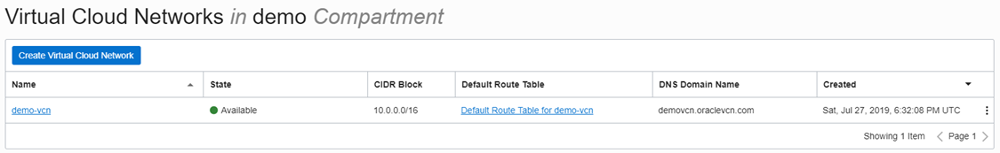

## Create Internet Gateway and tie to route table

This is required otherwise communication can't happen, refer [this](https://docs.cloud.oracle.com/iaas/Content/Network/Tasks/managingIGs.htm) for more detail

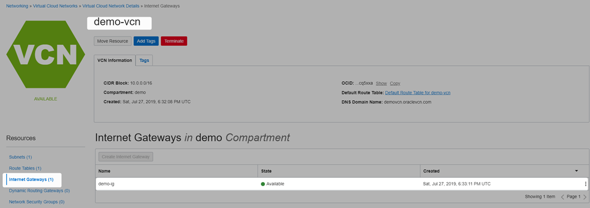

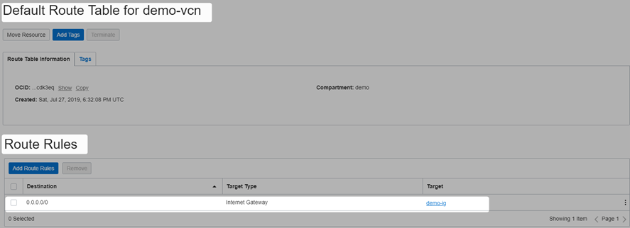

## Create security list
Here are all the security list for the vcn

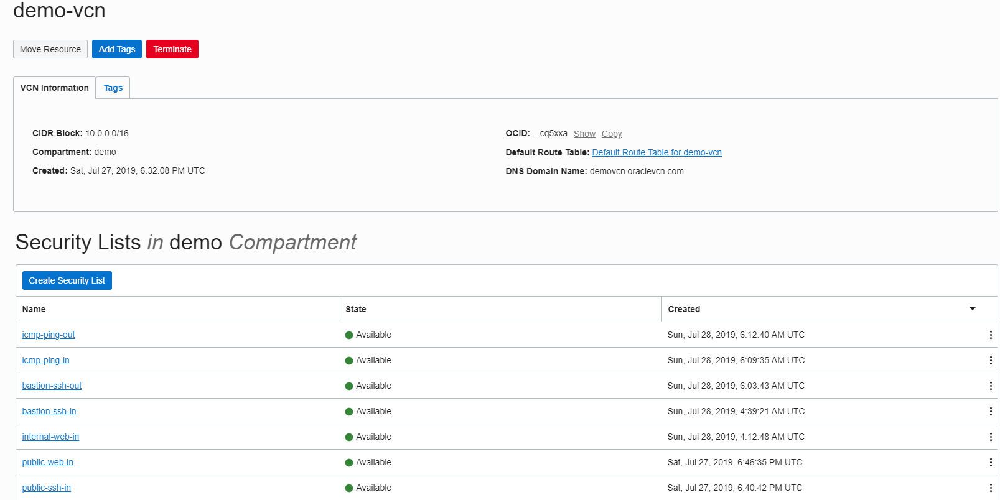

public-web-in with 2 ingress rules : so the http/https traffic is allowed in

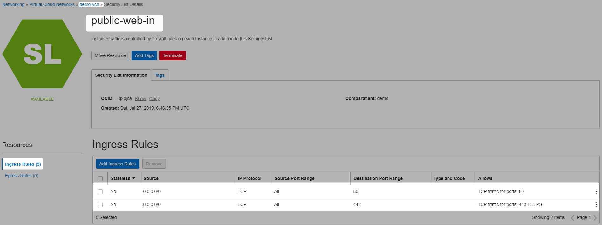

public-ssh-in with 1 ingress rule : to allow ssh communication

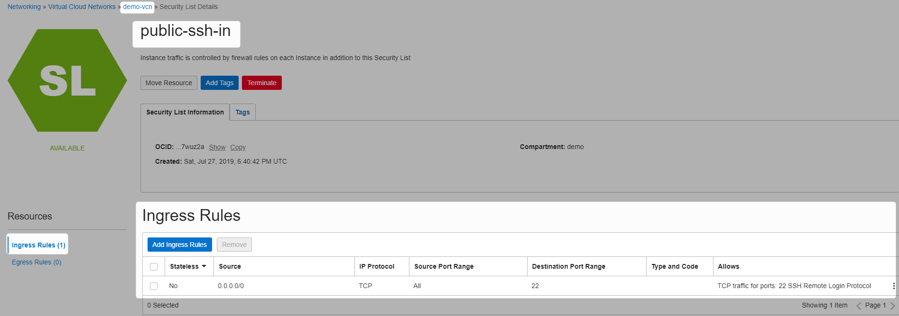

this is to be able to ping other hosts

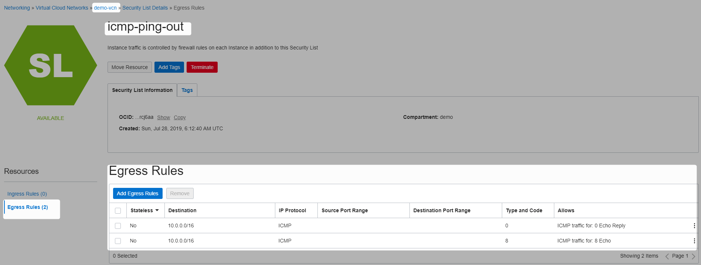

this is to be able to ssh into other hosts

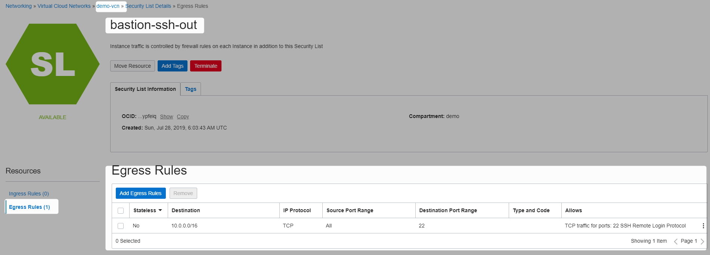

## Create Public subnet BastionPub
This is public subnet, and would host only jump server (bastion)

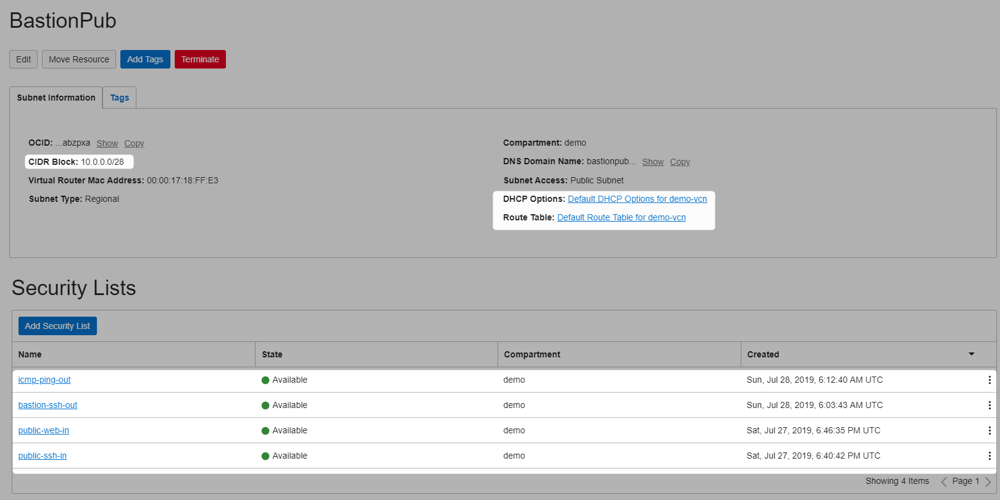

## Create Bastion in public subnet

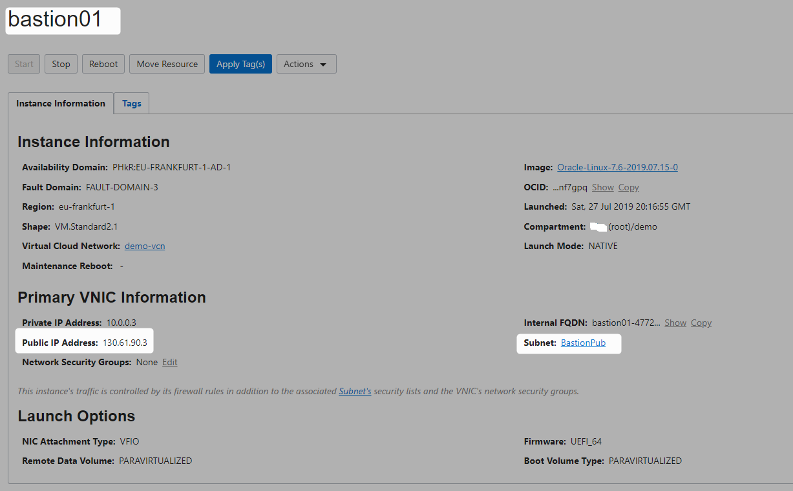

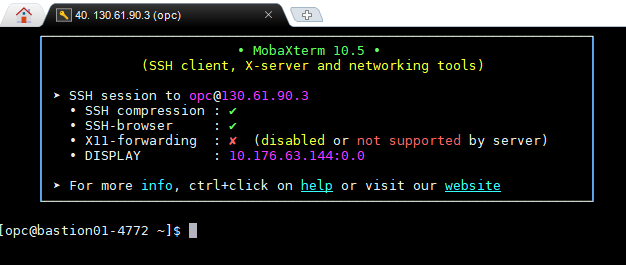

Generate SSH keys to communicate with private subnet hosts


```Powershell
[opc@bastion01-4772 ~]$ ssh-keygen
Generating public/private rsa key pair.
Enter file in which to save the key (/home/opc/.ssh/id_rsa):
Enter passphrase (empty for no passphrase):
Enter same passphrase again:
Your identification has been saved in /home/opc/.ssh/id_rsa.
Your public key has been saved in /home/opc/.ssh/id_rsa.pub.
The key fingerprint is:
SHA256:NQSZzEy8kgDFtOziCuNf3/Ij0ofDH8AdVI4PR6iZnIM opc@bastion01-4772
The key's randomart image is:
+---[RSA 2048]----+
|  .=o  *o=+o     |
|   .o.  Oo+      |
|    o.o.==oo     |
|   . E+Bo.=.     |
|  . .  +S. .     |
| . .    .        |
|o .  .o ..       |
|oo  ...B.o.      |
|....  ..B+.      |
+----[SHA256]-----+
[opc@bastion01-4772 ~]$
```
keep a note of public key, will use this while creating other hosts

```Powershell
[opc@bastion01-4772 ~]$ cd .ssh
[opc@bastion01-4772 .ssh]$ ls
authorized_keys  id_rsa  id_rsa.pub
[opc@bastion01-4772 .ssh]$
```


## Create NAT

This is required, so that hosts in private subnet can communicate outside, refer this for more details

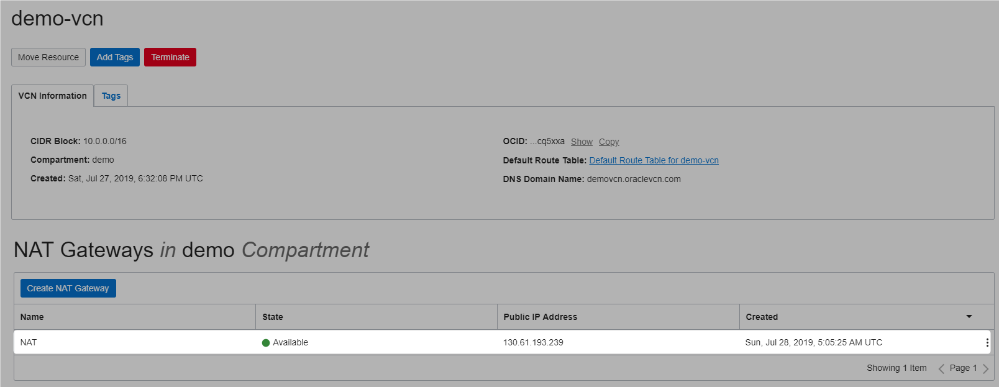

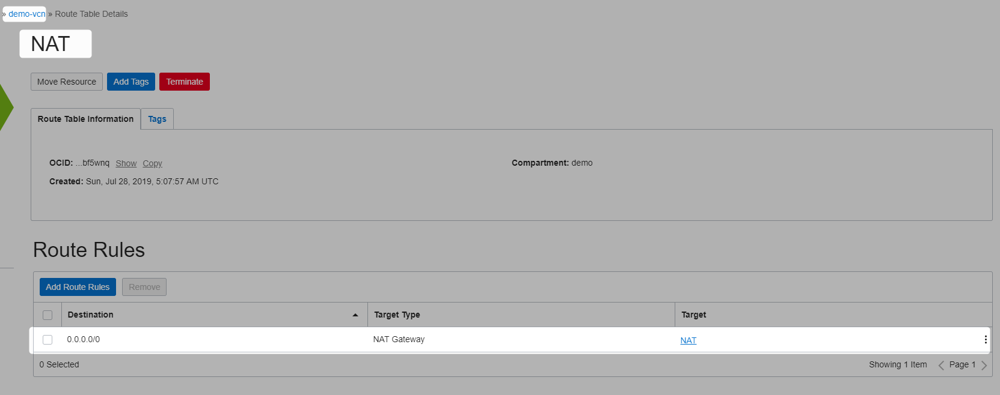

## Create Security List

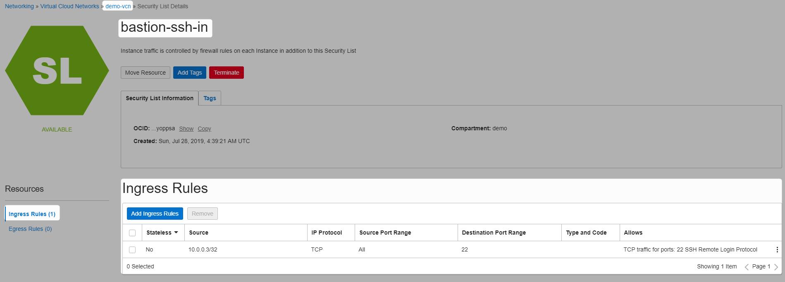

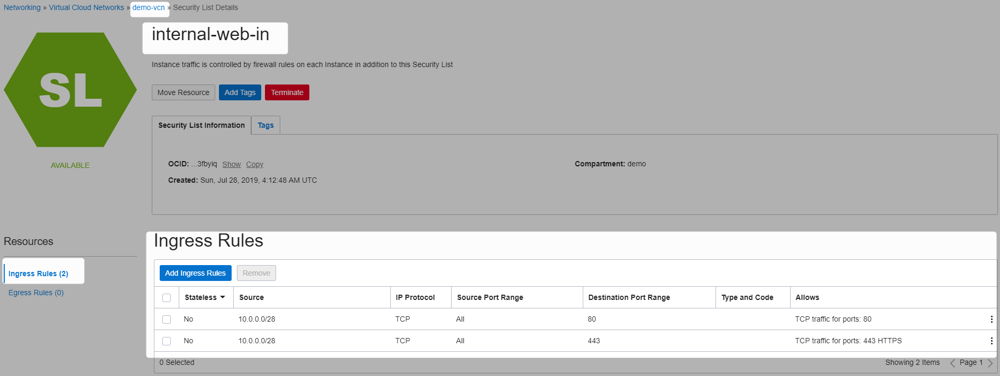


## Create private subnet

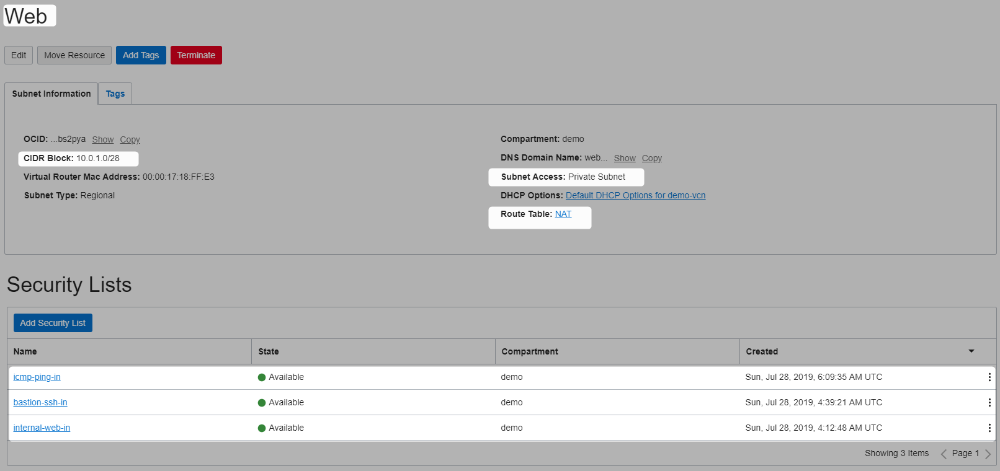


## Create Two Compute Instances In Private subnet

Use the bastion ssh key generate above

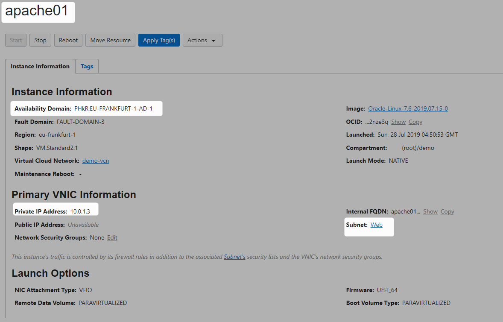


Use the bastion ssh key generate above

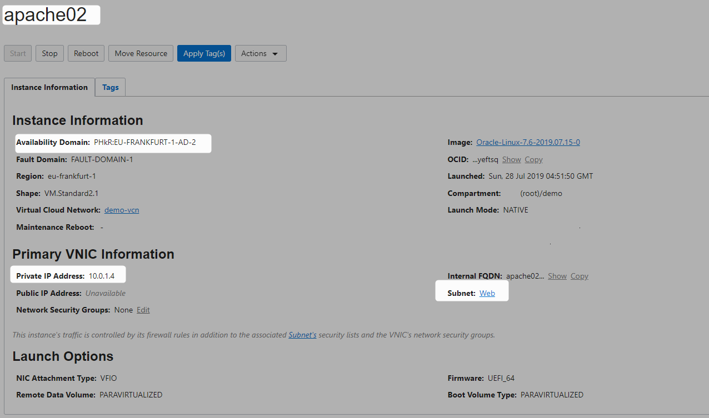


```Powershell
[opc@bastion01-4772 .ssh]$ ssh opc@10.0.1.3
The authenticity of host '10.0.1.3 (10.0.1.3)' can't be established.
ECDSA key fingerprint is SHA256:i3UHcKzhqF4bwt2KKmhRb8u1LtVzIFHtIFRZeAuxNV0.
ECDSA key fingerprint is MD5:40:ae:a8:5b:bd:2c:7c:9f:aa:3e:72:68:48:88:20:7d.
Are you sure you want to continue connecting (yes/no)? yes
Warning: Permanently added '10.0.1.3' (ECDSA) to the list of known hosts.
[opc@apache01 ~]$ exit
logout
Connection to 10.0.1.3 closed.
```

```Powershell
[opc@bastion01-4772 .ssh]$ ping 10.0.1.3
PING 10.0.1.3 (10.0.1.3) 56(84) bytes of data.
64 bytes from 10.0.1.3: icmp_seq=122 ttl=64 time=0.202 ms
64 bytes from 10.0.1.3: icmp_seq=123 ttl=64 time=0.163 ms
64 bytes from 10.0.1.3: icmp_seq=124 ttl=64 time=0.201 ms
64 bytes from 10.0.1.3: icmp_seq=125 ttl=64 time=0.175 ms
64 bytes from 10.0.1.3: icmp_seq=126 ttl=64 time=0.190 ms
64 bytes from 10.0.1.3: icmp_seq=127 ttl=64 time=0.184 ms
64 bytes from 10.0.1.3: icmp_seq=128 ttl=64 time=0.200 ms
64 bytes from 10.0.1.3: icmp_seq=129 ttl=64 time=0.185 ms
64 bytes from 10.0.1.3: icmp_seq=130 ttl=64 time=0.194 ms
64 bytes from 10.0.1.3: icmp_seq=131 ttl=64 time=0.187 ms
```

```Powershell
[opc@bastion01-4772 .ssh]$ ssh opc@10.0.1.4
The authenticity of host '10.0.1.4 (10.0.1.4)' can't be established.
ECDSA key fingerprint is SHA256:NL/nuH6Clk2CR34ojozuLTVrm0yX1UcD/pdWrd1PKac.
ECDSA key fingerprint is MD5:62:fc:54:ab:ac:ac:62:79:be:67:fa:72:7f:39:e5:f7.
Are you sure you want to continue connecting (yes/no)? yes
Warning: Permanently added '10.0.1.4' (ECDSA) to the list of known hosts.
[opc@apache02 ~]$ exit
logout
Connection to 10.0.1.4 closed.
```


```Powershell
[opc@bastion01-4772 .ssh]$ ping 10.0.1.4
PING 10.0.1.4 (10.0.1.4) 56(84) bytes of data.
64 bytes from 10.0.1.4: icmp_seq=1 ttl=64 time=0.299 ms
64 bytes from 10.0.1.4: icmp_seq=2 ttl=64 time=0.267 ms
64 bytes from 10.0.1.4: icmp_seq=3 ttl=64 time=0.258 ms
64 bytes from 10.0.1.4: icmp_seq=4 ttl=64 time=0.275 ms
```

## Final VCN

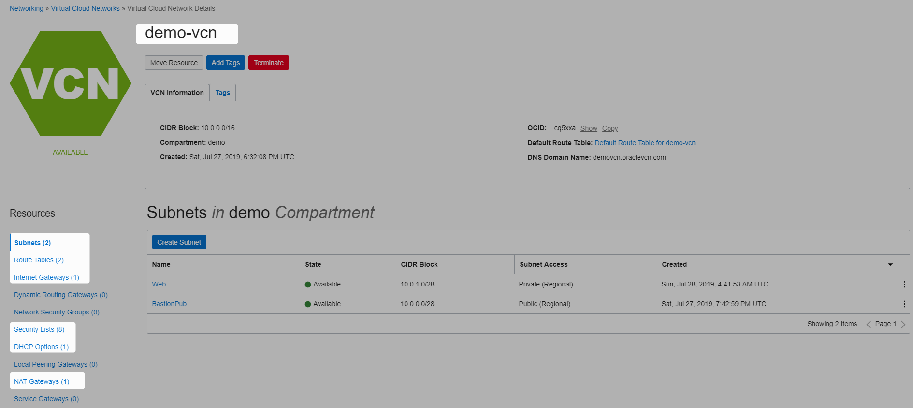

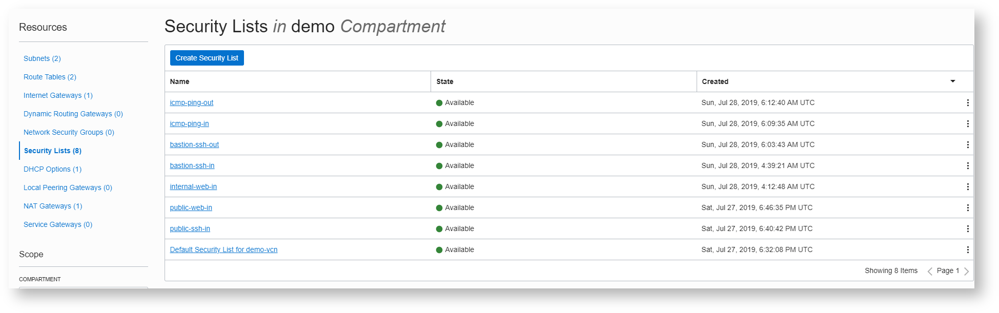


# References

* [OCI Scenario C](https://docs.cloud.oracle.com/iaas/Content/Network/Tasks/scenarioc.htm)
* [NAT Setup](https://blogs.oracle.com/cloud-infrastructure/automate-deployment-nat-instance-in-oracle-cloud-infrastructure-with-terraform)