[Home](../README.md)

# File Storage Service With Kubernetes (OKE) on Oracle Cloud Infrastructure (OCI)

## Design

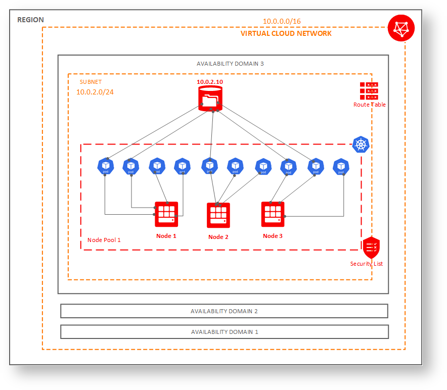


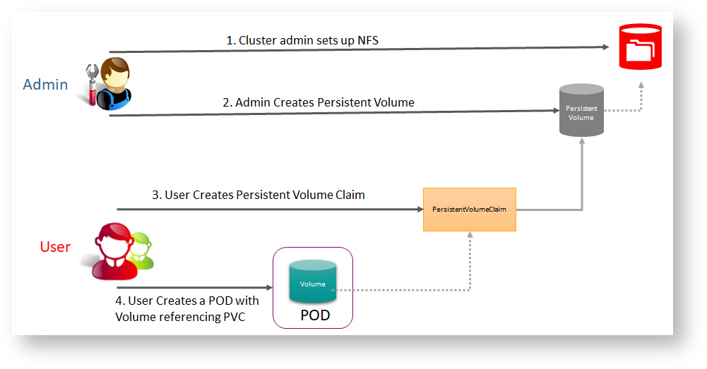

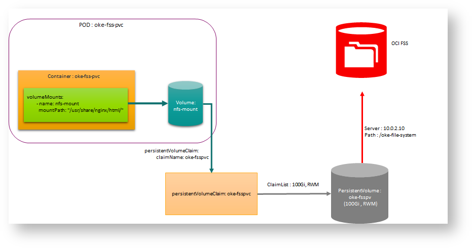


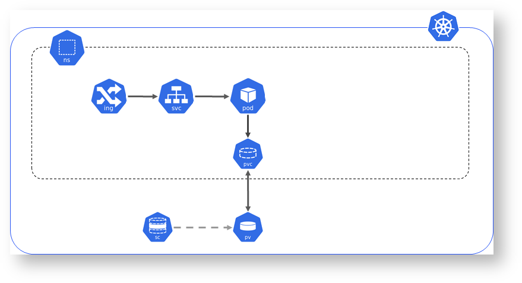


## Implementation

### Create File System

Follow the instructions [here](OCIFileStorage.md) to create one

Here is my configuration, note file system is being created on same subnet, and hence security list modification not required, otherwise we would have to [modify security list](https://docs.cloud.oracle.com/iaas/Content/File/Tasks/securitylistsfilestorage.htm)


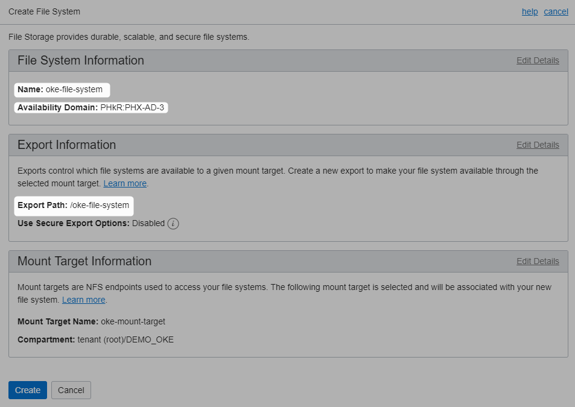


### Create StorageClass

Get the OCID of the mount target

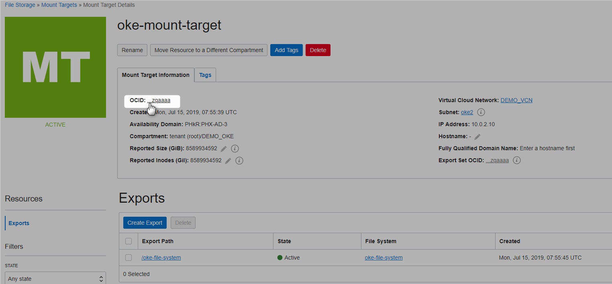

Create the storage class that references the mount target

**storageClass.yml**

```Powershell
kind: StorageClass
apiVersion: storage.k8s.io/v1beta1
metadata:
  name: oci-fss
provisioner: oracle.com/oci-fss
parameters:
  mntTargetId: ocid1.mounttarget.oc1.phx.aaaaaa4np2snz72kobuhqllqojxwiotqnb4c2ylefuzqaaaa
```


```Powershell
D:\practices\kubernetes>kubectl apply -f storageClass.yml
storageclass.storage.k8s.io "oci-fss" created
 
D:\practices\kubernetes>kubectl get storageclass
NAME            PROVISIONER          AGE
oci (default)   oracle.com/oci       9d
oci-fss         oracle.com/oci-fss   14s
 
D:\practices\kubernetes>
```

### Create a Persistent Volume (PV)

Make a note of ip address and export path

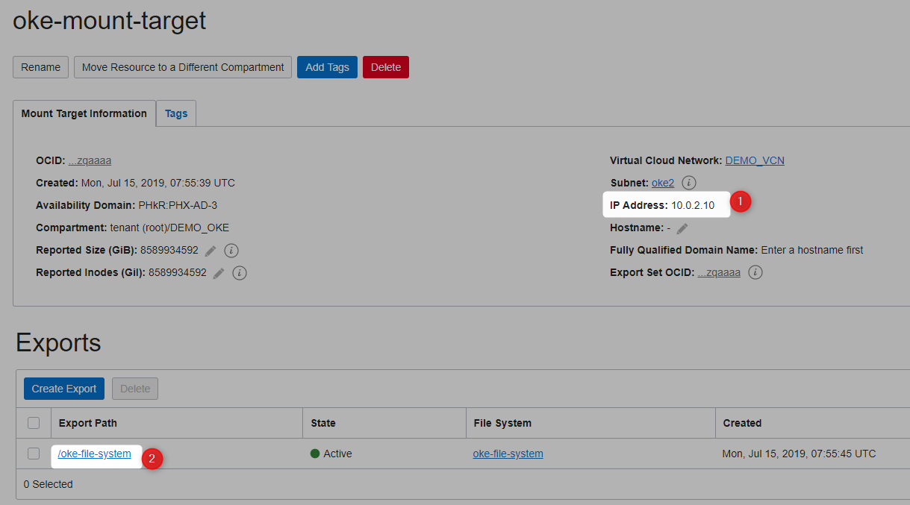


**oke-pv.yml**

```Powershell
apiVersion: v1
kind: PersistentVolume
metadata:
 name: oke-fsspv
spec:
 storageClassName: oci-fss
 capacity:
  storage: 100Gi
 accessModes:
  - ReadWriteMany
 mountOptions:
  - nosuid
 nfs:
  server: 10.0.2.10
  path: "/oke-file-system"
  readOnly: false
```


```Powershell
D:\practices\kubernetes>kubectl apply -f oke-pv.yml
persistentvolume "oke-fsspv" created
```
pv created

```Powershell
D:\practices\kubernetes>kubectl get pv -o wide
NAME        CAPACITY   ACCESS MODES   RECLAIM POLICY   STATUS      CLAIM     STORAGECLASS   REASON    AGE
oke-fsspv   100Gi      RWX            Retain           Available             oci-fss                  37s
 
D:\practices\kubernetes>
```

### Create a Persistent Volume Claim (PVC)

**oke-pvc.yml**

```Powershell
apiVersion: v1
kind: PersistentVolumeClaim
metadata:
 name: oke-fsspvc
spec:
 storageClassName: oci-fss
 accessModes:
 - ReadWriteMany
 resources:
  requests:
    storage: 100Gi
 volumeName: oke-fsspv
```


```Powershell
D:\practices\kubernetes>kubectl apply -f oke-pvc.yml
persistentvolumeclaim "oke-fsspvc" created
```
pvc created

```Powershell
D:\practices\kubernetes>kubectl get pvc -o wide
NAME         STATUS    VOLUME      CAPACITY   ACCESS MODES   STORAGECLASS   AGE
oke-fsspvc   Bound     oke-fsspv   100Gi      RWX            oci-fss        21s
 
D:\practices\kubernetes>
```

Verify that PVC is bound
```Powershell
D:\practices\kubernetes>kubectl get pvc oke-fsspvc
NAME         STATUS    VOLUME      CAPACITY   ACCESS MODES   STORAGECLASS   AGE
oke-fsspvc   Bound     oke-fsspv   100Gi      RWX            oci-fss        1m
 
D:\practices\kubernetes>
```
### Consume the PVC

**consume-pvc.yml**

```Powershell
apiVersion: v1
kind: Service
metadata:
  name: oke-fss-pvc-svc
spec:
  type: LoadBalancer
  ports:
  - port: 80
    protocol: TCP
    targetPort: 80
  selector:
    app: oke-fss-pvc
---
apiVersion: apps/v1
kind: Deployment
metadata:
  labels:
    app: oke-fss-pvc
  name: oke-fss-pvc
spec:
  selector:
    matchLabels:
      app: oke-fss-pvc
  replicas: 3
  template:
    metadata:
      labels:
        app: oke-fss-pvc
    spec:
      containers:
      - name: oke-fss-pvc 
        image: nginx
        ports:
        - containerPort: 80
        volumeMounts:
        - name: nfs-mount
          mountPath: "/usr/share/nginx/html/"
      volumes:
      - name: nfs-mount
        persistentVolumeClaim:
          claimName: oke-fsspvc
          readOnly: false
```

```Powershell
D:\practices\kubernetes>kubectl apply -f consume-pvc.yml
service "oke-fss-pvc-svc" created
deployment.apps "oke-fss-pvc" created
 
D:\practices\kubernetes>
```


```Powershell
D:\practices\kubernetes>kubectl get pods
NAME                               READY     STATUS    RESTARTS   AGE
oke-fss-pvc-6fdf5c767b-4g6gx       1/1       Running   0          23s
oke-fss-pvc-6fdf5c767b-npsdl       1/1       Running   0          23s
oke-fss-pvc-6fdf5c767b-wrwwf       1/1       Running   0          23s
```

```Powershell
D:\practices\kubernetes>kubectl get services
NAME                  TYPE           CLUSTER-IP      EXTERNAL-IP                                    PORT(S)        AGE
oke-fss-pvc-svc       LoadBalancer   10.96.149.248   129.146.147.113                                80:30647/TCP   32s
```

## Testing

no **index.html** file as of now


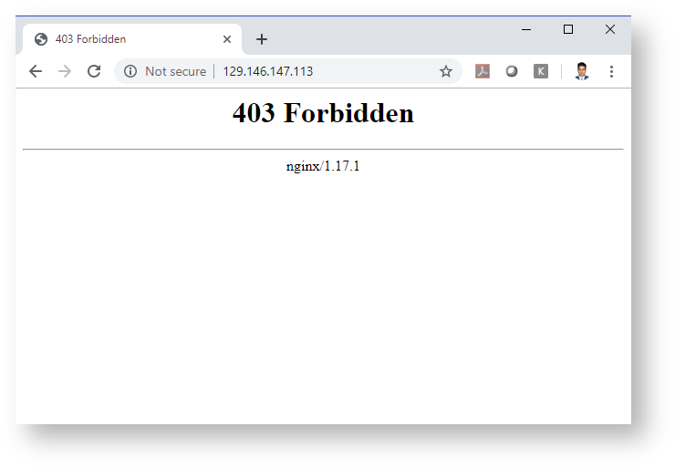


Lets connect to all the pods and write some content from each pods.

Lets write from pod oke-fss-pvc-6fdf5c767b-4g6gx

```Powershell
D:\practices\kubernetes>kubectl exec -it oke-fss-pvc-6fdf5c767b-4g6gx bash
root@oke-fss-pvc-6fdf5c767b-4g6gx:/# cd /usr/share/nginx/html/
root@oke-fss-pvc-6fdf5c767b-4g6gx:/usr/share/nginx/html# echo oke-fss-pvc-6fdf5c767b-4g6gx >> index.html
root@oke-fss-pvc-6fdf5c767b-4g6gx:/usr/share/nginx/html#
```

able to see the content written

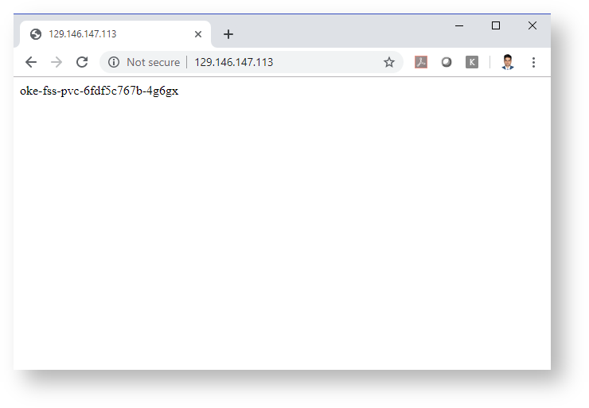

Lets write some content from pod oke-fss-pvc-6fdf5c767b-npsdl

```Powershell
D:\practices\kubernetes>kubectl exec -it oke-fss-pvc-6fdf5c767b-npsdl bash
root@oke-fss-pvc-6fdf5c767b-npsdl:/# cd /usr/share/nginx/html/
root@oke-fss-pvc-6fdf5c767b-npsdl:/usr/share/nginx/html# echo oke-fss-pvc-6fdf5c767b-npsdl >> index.html
root@oke-fss-pvc-6fdf5c767b-npsdl:/usr/share/nginx/html#
```
able to see the content written

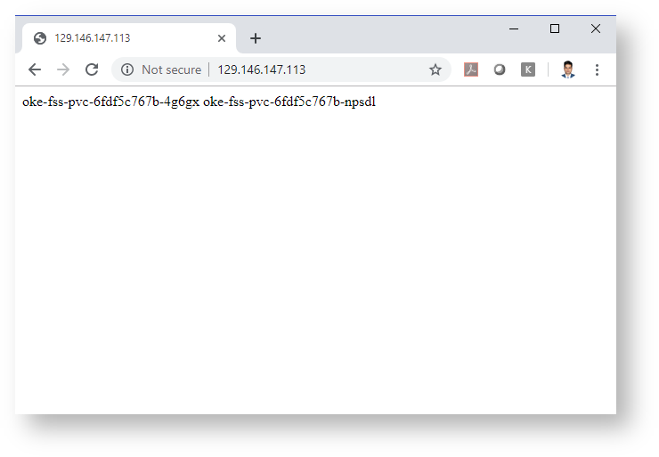

Lets write some content from pod oke-fss-pvc-6fdf5c767b-wrwwf

```Powershell
D:\practices\kubernetes>kubectl exec -it oke-fss-pvc-6fdf5c767b-wrwwf bash
root@oke-fss-pvc-6fdf5c767b-wrwwf:/# cd /usr/share/nginx/html/
root@oke-fss-pvc-6fdf5c767b-wrwwf:/usr/share/nginx/html# echo <br/> oke-fss-pvc-6fdf5c767b-wrwwf >> index.html
bash: br/: No such file or directory
root@oke-fss-pvc-6fdf5c767b-wrwwf:/usr/share/nginx/html# echo "<br/> oke-fss-pvc-6fdf5c767b-wrwwf" >> index.html
root@oke-fss-pvc-6fdf5c767b-wrwwf:/usr/share/nginx/html#
```

able to see the content written

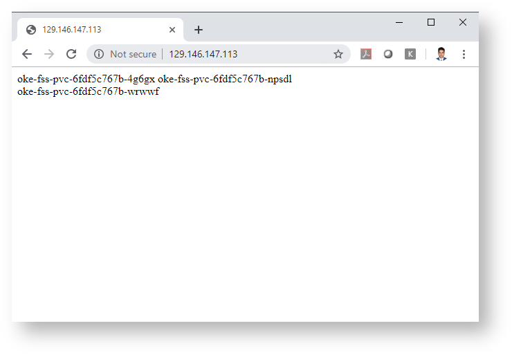

Lets delete all the pods

```Powershell
D:\practices\kubernetes>kubectl delete pods --all
pod "oke-fss-pvc-6fdf5c767b-4g6gx" deleted
pod "oke-fss-pvc-6fdf5c767b-npsdl" deleted
pod "oke-fss-pvc-6fdf5c767b-wrwwf" deleted
```

```Powershell
D:\practices\kubernetes>kubectl get pods
NAME                               READY     STATUS              RESTARTS   AGE
oke-fss-pvc-6fdf5c767b-6676n       1/1       Running             0          29s
oke-fss-pvc-6fdf5c767b-cqhwz       0/1       ContainerCreating   0          30s
oke-fss-pvc-6fdf5c767b-gmgq8       1/1       Running             0          28s
 
D:\practices\kubernetes>
```
Data is persisted

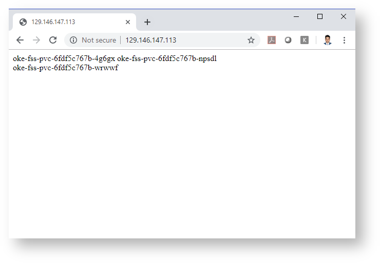

## Also See

* [Creating Dynamic Persistent Volume Claim](https://docs.cloud.oracle.com/iaas/Content/ContEng/Tasks/contengcreatingpersistentvolumeclaim.htm)
* [OCI Volume Provisioner](https://www.slideshare.net/oracledevs/persistent-storage-with-containers-by-kaslin-fields)
* [Overview of File Storage](https://docs.cloud.oracle.com/iaas/Content/File/Concepts/filestorageoverview.htm)
* [File Storage FAQ](https://cloud.oracle.com/storage/file-storage/faq)