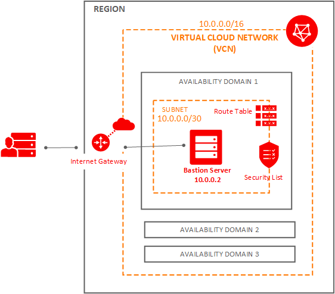
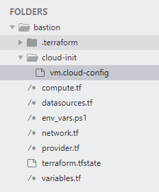
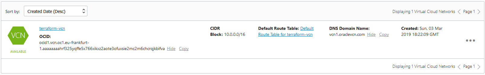
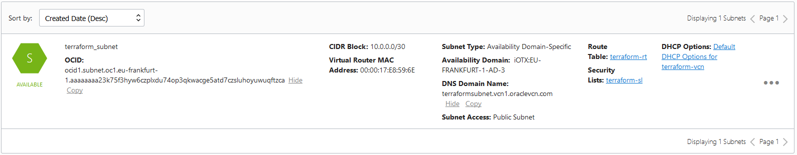
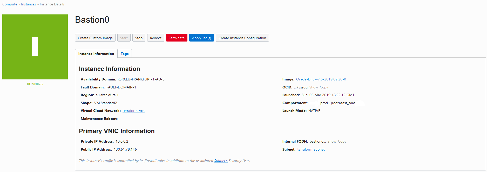
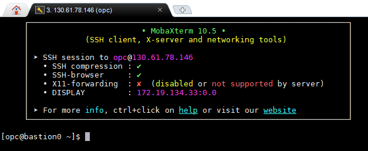

[Home](../README.md)


# Creating Bastion Compute Instance Using Terraform

## Bastion host

* Jump server to access instances in the private subnet
* A specialized computer that is deliberately exposed on a public network
* More on [Bastion host](https://cloud.oracle.com/iaas/whitepapers/bastion_hosts.pdf)

## Design

Lets provision the following infrastructure



## Implementation


### Terraform Project




### Terraform Code

Create **variable.tf** file and add the following


```Powershell
variable "tenancy_ocid" {}
variable "user_ocid" {}
variable "fingerprint" {}
variable "private_key_path" {}
variable "region" {}
variable "compartment_ocid" {}
 
variable "ssh_public_key_file" {
  default = "~/.ssh/id_rsa.pub"
}
 
# Choose an Availability Domain
variable "availability_domain" {
  default = "3"
}
 
variable "internet_gateway_enabled" {
  default = "true"
}
 
variable "instance_shape" {
  default = "VM.Standard2.1"
}
 
# Defines the number of instances to deploy
variable "NumInstances" {
  default = "1"
}
 
variable "BootStrapFile" {
  default = "./cloud-init/vm.cloud-config"
}
 
variable "instance_image_ocid" {
  type = "map"
 
  default = {
    // See https://docs.us-phoenix-1.oraclecloud.com/images/
    // Oracle-provided image "Oracle-Linux-7.5-2018.10.16-0"
    us-phoenix-1 = "ocid1.image.oc1.phx.aaaaaaaahu7hv6lqbdyncgwehipwsuh3htfuxcoxbl4arcetx6hzixft366a"
 
    us-ashburn-1   = "ocid1.image.oc1.iad.aaaaaaaab5l5wv7njknupfxvyynplhsygdz67uhfaz35nsnhsk3ufclqjaea"
    eu-frankfurt-1 = "ocid1.image.oc1.eu-frankfurt-1.aaaaaaaa527xpybx2azyhcz2oyk6f4lsvokyujajo73zuxnnhcnp7p24pgva"
    uk-london-1    = "ocid1.image.oc1.uk-london-1.aaaaaaaap5kk2lbo5lj3k5ff5tl755a4cszjwd6zii7jlcp6nz3gogh54wtq"
  }
}
```

Create **providers.tf** file and add the following

```Powershell
provider "oci" {
  tenancy_ocid     = "${var.tenancy_ocid}"
  user_ocid        = "${var.user_ocid}"
  fingerprint      = "${var.fingerprint}"
  private_key_path = "${var.private_key_path}"
  region           = "${var.region}"
}
```

Refer [this](https://www.terraform.io/docs/configuration/providers.html) for more detail on Providers

Create **env_vars.ps1** file and add the following (Windows)

```Powershell
### Authentication details
$env:TF_VAR_tenancy_ocid = "ocid1.tenancy.oc1..asfdsafsaffsafsadfdsafdsafsda"
$env:TF_VAR_user_ocid = "ocid1.user.oc1..asfdsafdsafdsafdsaf"
$env:TF_VAR_private_key_path = "C:\Users\nadeem.oci\oci_api_key.pem"
$env:TF_VAR_fingerprint = "5d:01:f7:11:95:96:6b:94:a1:90:ae:e8:09:59:b3:b1"
$env:TF_VAR_private_key_path = "C:\Users\nadeem\.oci\oci_api_key.pem"
$env:TF_VAR_ssh_public_key = "C:\Users\nadeem\.oci\oci_api_key.pem"
  
### Region
$env:TF_VAR_region  = "eu-frankfurt-1"
  
### Compartment
$env:TF_VAR_compartment_ocid  = "ocid1.compartment.oc1..asfdsafdsfsf"
```

execute `env_vars.ps1`

```Powershell
PS D:\practices\terraform\bastion> .\env_vars.ps1
PS D:\practices\terraform\bastion> $env:TF_VAR_region
eu-frankfurt-1
PS D:\practices\terraform\bastion> $env:TF_VAR_compartment_ocid
ocid1.compartment.oc1..asfsafsafddsafdsafdsafsafdsaf
PS D:\practices\terraform\bastion> $env:TF_VAR_private_key_path
C:\Users\nadeem.ORADEV\.oci\oci_api_key.pem
PS D:\practices\terraform\bastion> $env:TF_VAR_tenancy_ocid
ocid1.tenancy.oc1..afdsafdsafdsafdsafds
PS D:\practices\terraform\bastion>
```


Create **datasources.tf** file and add the following 

```Powershell
# Gets a list of Availability Domains
data "oci_identity_availability_domains" "ADs" {
  compartment_id = "${var.tenancy_ocid}"
}
 
data "oci_core_images" "oracle_linux_image" {
  compartment_id           = "${var.tenancy_ocid}"
  operating_system         = "Oracle Linux"
  operating_system_version = "7.6"
}
```

Refer [this](https://www.terraform.io/docs/configuration/locals.html) for more details on locals

Refer [this](https://www.terraform.io/docs/providers/oci/d/identity_availability_domains.html) for more details on [datasource](https://www.terraform.io/docs/configuration/data-sources.html) oci_identity_availability_domains


Create **network.tf** file and add the following

```Powershell
resource "oci_core_vcn" "terraform_vcn" {
  #Required
  cidr_block     = "10.0.0.0/16"
  compartment_id = "${var.compartment_ocid}"
 
  #Optional
  dns_label    = "vcn1"
  display_name = "terraform-vcn"
}
```

Refer [this](https://www.terraform.io/docs/providers/oci/r/core_vcn.html) for more details on [resource](https://www.terraform.io/docs/configuration/resources.html) oci_core_vcn

Add the following to **network.tf**

```Powershell
resource "oci_core_security_list" "terraform_sl" {
  #Required
  compartment_id = "${var.compartment_ocid}"
  vcn_id         = "${oci_core_vcn.terraform_vcn.id}"
 
  egress_security_rules = [
    {
      destination = "0.0.0.0/0"
      protocol    = "all"
    },
  ]
 
  ingress_security_rules = [
    {
      protocol = "6"
      source   = "0.0.0.0/0"
 
      tcp_options {
        "max" = 22
        "min" = 22
      }
    },
    {
      protocol = "6"
      source   = "0.0.0.0/0"
 
      tcp_options {
        "max" = 80
        "min" = 80
      }
    },
  ]
 
  #Optional
  display_name = "terraform-sl"
}
```

Refer [this](https://www.terraform.io/docs/providers/oci/r/core_security_list.html) for more detail on oci_core_security_list

Add the following to **network.tf**

```Powershell
resource "oci_core_internet_gateway" "terraform_ig" {
  #Required
  compartment_id = "${var.compartment_ocid}"
  vcn_id         = "${oci_core_vcn.terraform_vcn.id}"
 
  #Optional
  enabled      = "${var.internet_gateway_enabled}"
  display_name = "terraform-gateway"
}
```

Refer [this](https://www.terraform.io/docs/providers/oci/r/core_internet_gateway.html) for more detail on oci_core_internet_gateway

Add the following to **network.tf**

```Powershell
resource "oci_core_route_table" "terraform_rt" {
  #Required
  compartment_id = "${var.compartment_ocid}"
  vcn_id         = "${oci_core_vcn.terraform_vcn.id}"
 
  route_rules {
    destination       = "0.0.0.0/0"
    network_entity_id = "${oci_core_internet_gateway.terraform_ig.id}"
  }
 
  #Optional
  display_name = "terraform-rt"
}
```
Refer [this](https://www.terraform.io/docs/providers/oci/r/core_route_table.html) for more detail on oci_core_route_table

Add the following to **network.tf**

```Powershell
resource "oci_core_subnet" "terraform_subnet" {
  #Required
  cidr_block        = "10.0.0.0/30"
  compartment_id    = "${var.compartment_ocid}"
  security_list_ids = ["${oci_core_security_list.terraform_sl.id}"]
  vcn_id            = "${oci_core_vcn.terraform_vcn.id}"
 
  #Optional
  availability_domain = "${lookup(data.oci_identity_availability_domains.ADs.availability_domains[var.availability_domain - 1], "name")}"
  dhcp_options_id     = "${oci_core_vcn.terraform_vcn.default_dhcp_options_id}"
  display_name        = "terraform_subnet"
  dns_label           = "terraformSubnet"
  route_table_id      = "${oci_core_route_table.terraform_rt.id}"
}
```

Refer [this](https://www.terraform.io/docs/providers/oci/r/core_subnet.html) for more detail on oci_core_subnet


Here is the final **network.tf**

```Powershell
resource "oci_core_vcn" "terraform_vcn" {
  #Required
  cidr_block     = "10.0.0.0/16"
  compartment_id = "${var.compartment_ocid}"
 
  #Optional
  dns_label    = "vcn1"
  display_name = "terraform-vcn"
}
 
resource "oci_core_security_list" "terraform_sl" {
  #Required
  compartment_id = "${var.compartment_ocid}"
  vcn_id         = "${oci_core_vcn.terraform_vcn.id}"
 
  egress_security_rules = [
    {
      destination = "0.0.0.0/0"
      protocol    = "all"
    },
  ]
 
  ingress_security_rules = [
    {
      protocol = "6"
      source   = "0.0.0.0/0"
 
      tcp_options {
        "max" = 22
        "min" = 22
      }
    },
    {
      protocol = "6"
      source   = "0.0.0.0/0"
 
      tcp_options {
        "max" = 80
        "min" = 80
      }
    },
  ]
 
  #Optional
  display_name = "terraform-sl"
}
 
resource "oci_core_internet_gateway" "terraform_ig" {
  #Required
  compartment_id = "${var.compartment_ocid}"
  vcn_id         = "${oci_core_vcn.terraform_vcn.id}"
 
  #Optional
  enabled      = "${var.internet_gateway_enabled}"
  display_name = "terraform-gateway"
}
 
resource "oci_core_route_table" "terraform_rt" {
  #Required
  compartment_id = "${var.compartment_ocid}"
  vcn_id         = "${oci_core_vcn.terraform_vcn.id}"
 
  route_rules {
    destination       = "0.0.0.0/0"
    network_entity_id = "${oci_core_internet_gateway.terraform_ig.id}"
  }
 
  #Optional
  display_name = "terraform-rt"
}
 
resource "oci_core_subnet" "terraform_subnet" {
  #Required
  cidr_block        = "10.0.0.0/30"
  compartment_id    = "${var.compartment_ocid}"
  security_list_ids = ["${oci_core_security_list.terraform_sl.id}"]
  vcn_id            = "${oci_core_vcn.terraform_vcn.id}"
 
  #Optional
  availability_domain = "${lookup(data.oci_identity_availability_domains.ADs.availability_domains[var.availability_domain - 1], "name")}"
  dhcp_options_id     = "${oci_core_vcn.terraform_vcn.default_dhcp_options_id}"
  display_name        = "terraform_subnet"
  dns_label           = "terraformSubnet"
  route_table_id      = "${oci_core_route_table.terraform_rt.id}"
}
```

Create **compute.tf** file and add the following

```Powershell
resource "oci_core_instance" "Bastion" {
  #Required 
  availability_domain = "${lookup(data.oci_identity_availability_domains.ADs.availability_domains[var.availability_domain - 1],"name")}"
  compartment_id      = "${var.compartment_ocid}"
  shape               = "${var.instance_shape}"
 
  #Optional
  count        = "${var.NumInstances}"
  display_name = "Bastion${count.index}"
 
  create_vnic_details {
    #Required 
    subnet_id = "${oci_core_subnet.terraform_subnet.id}"
 
    #Optional
    display_name     = "primaryvnic"
    assign_public_ip = true
    hostname_label   = "Bastion${count.index}"
    private_ip       = "10.0.0.2"
  }
 
  source_details {
    source_type = "image"
    source_id   = "${"${var.instance_image_ocid[var.region]}"}"
 
    # Apply this to set the size of the boot volume that's created for this instance.
    # Otherwise, the default boot volume size of the image is used.
    # This should only be specified when source_type is set to "image".
    #boot_volume_size_in_gbs = "60"
  }
 
  # Apply the following flag only if you wish to preserve the attached boot volume upon destroying this instance
  # Setting this and destroying the instance will result in a boot volume that should be managed outside of this config.
  # When changing this value, make sure to run 'terraform apply' so that it takes effect before the resource is destroyed.
  #preserve_boot_volume = true
 
  metadata {
    ssh_authorized_keys = "${file(var.ssh_public_key_file)}"
    user_data           = "${base64encode(file(var.BootStrapFile))}"
  }
  timeouts {
    create = "60m"
  }
}
```

Refer [this](https://www.terraform.io/docs/providers/oci/r/core_instance.html) for more detail on oci_core_instance

create file **cloud-init/vm.cloud-config** as follows

```Powershell
#!/bin/bash
yum update -y
```

Couple of more cloud-init sample files

* [Apache](https://github.com/wildahunden/saltdemo/blob/master/oci/webserver-cloud-init)
* [Saltstack app](https://github.com/wildahunden/saltdemo/blob/master/oci/salt-minion-cloud-init)


## Execution

Lets execute `terraform init`

```Powershell
PS D:\practices\terraform\bastion> terraform init
 
Initializing provider plugins...
 
The following providers do not have any version constraints in configuration,
so the latest version was installed.
 
To prevent automatic upgrades to new major versions that may contain breaking
changes, it is recommended to add version = "..." constraints to the
corresponding provider blocks in configuration, with the constraint strings
suggested below.
 
* provider.oci: version = "~> 3.16"
 
Terraform has been successfully initialized!
 
You may now begin working with Terraform. Try running "terraform plan" to see
any changes that are required for your infrastructure. All Terraform commands
should now work.
 
If you ever set or change modules or backend configuration for Terraform,
rerun this command to reinitialize your working directory. If you forget, other
commands will detect it and remind you to do so if necessary.
PS D:\practices\terraform\bastion>
```

Lets execute `terraform validate`

```Powershell
PS D:\practices\terraform\bastion> terraform validate
```

Lets execute `terraform plan`

```Powershell
PS D:\practices\terraform\bastion> terraform plan
```

output

```Powershell
PS D:\practices\terraform\bastion> terraform plan
Refreshing Terraform state in-memory prior to plan...
The refreshed state will be used to calculate this plan, but will not be
persisted to local or remote state storage.
 
data.oci_core_images.oracle_linux_image: Refreshing state...
data.oci_identity_availability_domains.ADs: Refreshing state...
 
------------------------------------------------------------------------
 
An execution plan has been generated and is shown below.
Resource actions are indicated with the following symbols:
  + create
 <= read (data resources)
 
Terraform will perform the following actions:
 
 <= data.oci_core_images.oracle_linux_image
      id:                                                                  <computed>
      compartment_id:                                                      "ocid1.tenancy.oc1..sadfsadfdsafdsafdasdaf"
      images.#:                                                            <computed>
      operating_system:                                                    "Oracle Linux"
      operating_system_version:                                            "7.6"
 
  + oci_core_instance.Bastion
      id:                                                                  <computed>
      availability_domain:                                                 "iOTX:EU-FRANKFURT-1-AD-3"
      boot_volume_id:                                                      <computed>
      compartment_id:                                                      "ocid1.compartment.oc1..asfsafdsafsafsadf"
      create_vnic_details.#:                                               "1"
      create_vnic_details.0.assign_public_ip:                              "true"
      create_vnic_details.0.display_name:                                  "primaryvnic"
      create_vnic_details.0.freeform_tags.%:                               <computed>
      create_vnic_details.0.hostname_label:                                "Bastion0"
      create_vnic_details.0.private_ip:                                    "10.0.0.2"
      create_vnic_details.0.skip_source_dest_check:                        <computed>
      create_vnic_details.0.subnet_id:                                     "${oci_core_subnet.terraform_subnet.id}"
      display_name:                                                        "Bastion0"
      freeform_tags.%:                                                     <computed>
      image:                                                               <computed>
      ipxe_script:                                                         <computed>
      is_pv_encryption_in_transit_enabled:                                 <computed>
      launch_mode:                                                         <computed>
      launch_options.#:                                                    <computed>
      metadata.%:                                                          "2"
      metadata.ssh_authorized_keys:                                        "ssh-rsa AAAAB3NzaC1yc2EAAAADAQABAAABAQC0qDKiM8iX0iz3jUXZwf2AFwKNs0UNelq6ValCYRI7nr6yyBclQDRvBP88Lyqm6Umhtu8N0qMftdjcC7rgoUXl18mDHzeEq/k2mklzT+vuzYFgbuj50mNM6YoNzucqxNIRp49Zvav2BA2oIH8XE1pZwnX7Cfu2FSxRB9Udi68nQQR6KIyzBOCmZKxvP1u+kPzJssp/wTbggHQfsRfdtJQloU10m04yHJC5uzoHOtGEVgjuXktykAzvX3bhac1NCVPc2U6xZEMTMfmb3ornYqv1w3wN49dXtmYpvIpK4HZ+ai02F4n3lN3Jy0SejJPDMoYJWsFySDas59SOxw/rD1Vp nadeem@nadeem-LAP\n"
      metadata.user_data:                                                  "IyEvYmluL2Jhc2gNCnl1bSB1cGRhdGUgLXk="
      private_ip:                                                          <computed>
      public_ip:                                                           <computed>
      region:                                                              <computed>
      shape:                                                               "VM.Standard2.1"
      source_details.#:                                                    "1"
      source_details.0.boot_volume_size_in_gbs:                            <computed>
      source_details.0.kms_key_id:                                         <computed>
      source_details.0.source_id:                                          "ocid1.image.oc1.eu-frankfurt-1.aaaaaaaa527xpybx2azyhcz2oyk6f4lsvokyujajo73zuxnnhcnp7p24pgva"
      source_details.0.source_type:                                        "image"
      state:                                                               <computed>
      subnet_id:                                                           <computed>
      time_created:                                                        <computed>
      time_maintenance_reboot_due:                                         <computed>
 
  + oci_core_internet_gateway.terraform_ig
      id:                                                                  <computed>
      compartment_id:                                                      "ocid1.compartment.oc1..asfsadfsadfsafsf"
      display_name:                                                        "terraform-gateway"
      enabled:                                                             "true"
      freeform_tags.%:                                                     <computed>
      state:                                                               <computed>
      time_created:                                                        <computed>
      time_modified:                                                       <computed>
      vcn_id:                                                              "${oci_core_vcn.terraform_vcn.id}"
 
  + oci_core_route_table.terraform_rt
      id:                                                                  <computed>
      compartment_id:                                                      "ocid1.compartment.oc1..asfsadfsadfsafsf"
      display_name:                                                        "terraform-rt"
      freeform_tags.%:                                                     <computed>
      route_rules.#:                                                       "1"
      route_rules.~1282495351.cidr_block:                                  <computed>
      route_rules.~1282495351.destination:                                 "0.0.0.0/0"
      route_rules.~1282495351.destination_type:                            <computed>
      route_rules.~1282495351.network_entity_id:                           "${oci_core_internet_gateway.terraform_ig.id}"
      state:                                                               <computed>
      time_created:                                                        <computed>
      time_modified:                                                       <computed>
      vcn_id:                                                              "${oci_core_vcn.terraform_vcn.id}"
 
  + oci_core_security_list.terraform_sl
      id:                                                                  <computed>
      compartment_id:                                                      "ocid1.compartment.oc1..asfsadfsadfsafsf"
      display_name:                                                        "terraform-sl"
      egress_security_rules.#:                                             "1"
      egress_security_rules.1582479153.destination:                        "0.0.0.0/0"
      egress_security_rules.1582479153.destination_type:                   <computed>
      egress_security_rules.1582479153.icmp_options.#:                     "0"
      egress_security_rules.1582479153.protocol:                           "all"
      egress_security_rules.1582479153.stateless:                          <computed>
      egress_security_rules.1582479153.tcp_options.#:                      "0"
      egress_security_rules.1582479153.udp_options.#:                      "0"
      freeform_tags.%:                                                     <computed>
      ingress_security_rules.#:                                            "2"
      ingress_security_rules.3861548008.icmp_options.#:                    "0"
      ingress_security_rules.3861548008.protocol:                          "6"
      ingress_security_rules.3861548008.source:                            "0.0.0.0/0"
      ingress_security_rules.3861548008.source_type:                       <computed>
      ingress_security_rules.3861548008.stateless:                         "false"
      ingress_security_rules.3861548008.tcp_options.#:                     "1"
      ingress_security_rules.3861548008.tcp_options.0.max:                 "80"
      ingress_security_rules.3861548008.tcp_options.0.min:                 "80"
      ingress_security_rules.3861548008.tcp_options.0.source_port_range.#: "0"
      ingress_security_rules.3861548008.udp_options.#:                     "0"
      ingress_security_rules.47193274.icmp_options.#:                      "0"
      ingress_security_rules.47193274.protocol:                            "6"
      ingress_security_rules.47193274.source:                              "0.0.0.0/0"
      ingress_security_rules.47193274.source_type:                         <computed>
      ingress_security_rules.47193274.stateless:                           "false"
      ingress_security_rules.47193274.tcp_options.#:                       "1"
      ingress_security_rules.47193274.tcp_options.0.max:                   "22"
      ingress_security_rules.47193274.tcp_options.0.min:                   "22"
      ingress_security_rules.47193274.tcp_options.0.source_port_range.#:   "0"
      ingress_security_rules.47193274.udp_options.#:                       "0"
      state:                                                               <computed>
      time_created:                                                        <computed>
      vcn_id:                                                              "${oci_core_vcn.terraform_vcn.id}"
 
  + oci_core_subnet.terraform_subnet
      id:                                                                  <computed>
      availability_domain:                                                 "iOTX:EU-FRANKFURT-1-AD-3"
      cidr_block:                                                          "10.0.0.0/30"
      compartment_id:                                                      "ocid1.compartment.oc1..aaaaaaaawbggxfhsizoqfpctlcubqi7hu63xiwzpxyyant625526x3zgxlga"
      dhcp_options_id:                                                     "${oci_core_vcn.terraform_vcn.default_dhcp_options_id}"
      display_name:                                                        "terraform_subnet"
      dns_label:                                                           "terraformSubnet"
      freeform_tags.%:                                                     <computed>
      prohibit_public_ip_on_vnic:                                          <computed>
      route_table_id:                                                      "${oci_core_route_table.terraform_rt.id}"
      security_list_ids.#:                                                 <computed>
      state:                                                               <computed>
      subnet_domain_name:                                                  <computed>
      time_created:                                                        <computed>
      vcn_id:                                                              "${oci_core_vcn.terraform_vcn.id}"
      virtual_router_ip:                                                   <computed>
      virtual_router_mac:                                                  <computed>
 
  + oci_core_vcn.terraform_vcn
      id:                                                                  <computed>
      cidr_block:                                                          "10.0.0.0/16"
      compartment_id:                                                      "ocid1.compartment.oc1..aaaaaaaawbggxfhsizoqfpctlcubqi7hu63xiwzpxyyant625526x3zgxlga"
      default_dhcp_options_id:                                             <computed>
      default_route_table_id:                                              <computed>
      default_security_list_id:                                            <computed>
      display_name:                                                        "terraform-vcn"
      dns_label:                                                           "vcn1"
      freeform_tags.%:                                                     <computed>
      state:                                                               <computed>
      time_created:                                                        <computed>
      vcn_domain_name:                                                     <computed>
 
 
Plan: 6 to add, 0 to change, 0 to destroy.
 
------------------------------------------------------------------------
 
Note: You didn't specify an "-out" parameter to save this plan, so Terraform
can't guarantee that exactly these actions will be performed if
"terraform apply" is subsequently run.
```

Lets execute `terraform apply`

```Powershell
PS D:\practices\terraform\bastion> terraform apply
```

## Testing












# References
* [Terraform OCI provider Compute Instance](https://github.com/terraform-providers/terraform-provider-oci/tree/master/docs/examples/compute/instance)
* [Cloud init script formats](https://cloudinit.readthedocs.io/en/latest/topics/examples.html#including-users-and-groups)
* [Compute instance overview](https://docs.cloud.oracle.com/iaas/Content/Compute/Concepts/computeoverview.htm)
* [VCN deployment guide](https://cloud.oracle.com/iaas/whitepapers/vcn-deployment-guide.pdf)